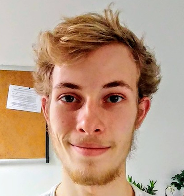
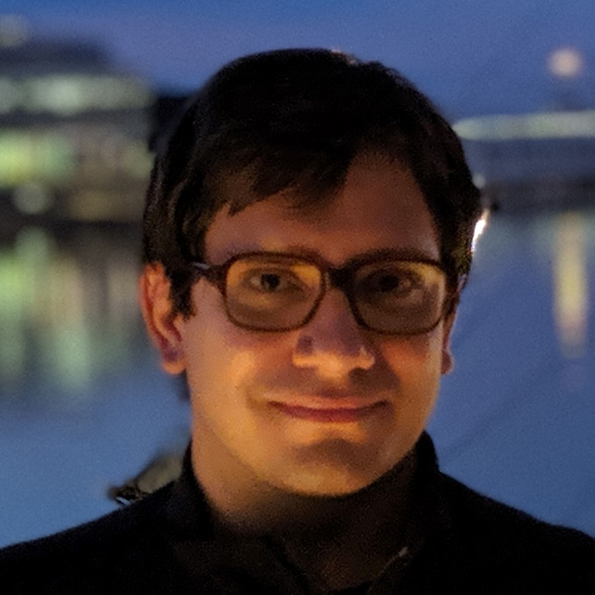
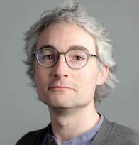

## :wave: Welcome

Welcome to the home of COMS20007: Programming Languages and Computation.  

This 20cp unit introduces you to some of the fundamentals of programming languages and the theory of computation.  Using mathematical techniques, we will study:
  * *Syntax*: how to describe what constitutes a valid program in the given programming language.
  * *Semantics*: how to describe how valid programs in the given language behave when executed.
  * *Computability*: how to show that certain functions are or are not possible to implement in the given language, or in any programming language. 

This unit gives you a taster of several important topics in theoretical computer science: [Programming Language Theory](https://en.wikipedia.org/wiki/Programming_language_theory), [Theory of Formal Languages](https://en.wikipedia.org/wiki/Formal_language) and [Computability Theory](https://en.wikipedia.org/wiki/Computability_theory). It prepares you for courses in the programming languages theme in your third and fourth year, especially *COMS30040: Types and Lambda Calculus* and *COMSM0067: Advanced Topics in Programming Languages*.

## :mortar_board: Academic Staff

The unit is run by Eddie Jones, Alex Kavvos and Steven Ramsay (UD).

{: .invisitable }
| | |  |
| [Eddie Jones][1] | [Alex Kavvos][2] | [Steven Ramsay][3] |

[1]: https://ec-jones.github.io/
[2]: https://www.lambdabetaeta.eu
[3]: https://sjrsay.github.io

Outside of lectures and labs, please reach out to us via the unit [Team](https://teams.microsoft.com/l/channel/19%3ApSxhf5hViQtLxNM7SJLv6Aqlkpn8YxymXy2xg7ekFR41%40thread.tacv2/General?groupId=9454975e-2a9a-4d4c-be14-4d889c7936b0&tenantId=b2e47f30-cd7d-4a4e-a5da-b18cf1a4151b) rather than by email.  Feel free to ask questions about the unit material, how the units runs, or anything at all to do with programming language theory, formal language theory or computability right in the General channel.  We love to hear what you are thinking!

## :date: Schedule

*See [Course Materials](schedule.html) for a more detailed schedule.*

The unit is divided into three parts, each of which is run by one of the three lecturers.

{: .pure-table-striped .pure-table}
| Period | Lecturer | Topic |
|:------:|:--------:|:------| 
| Weeks 1-4    | Steven Ramsay | Syntax        |
| Weeks 5,7,8  | Eddie Jones   | Semantics     |
| Weeks 9-11   | Alex Kavvos   | Computability |

 

You should expect to spend around *12 hours per week* working on this unit.  *Most of this time should be spent giving a serious attempt to each problem sheet and getting help when you are stuck.*

<!-- There are 5 main activities (approximate time in parentheses, overall there is some slack):

  * __Lectures (2 hr).__ There are two lectures each week, *Mondays at 3pm* and *Tuesdays at 10am*, both in Physics G42 Powell*. 

  * __Labs (2 hr).__  Labs run every Thursday from 3-5pm in MVB 2.11 and MVB 1.15.  There are both pen and paper problems and programming tasks to complete.  We have an excellent selection of teaching assistants on this unit, and their sole responsibility in each lab is to *help you*.  Some of the problems are not designed to be solved by a single person in a short amount of time, so you will need the help of the TAs and/or the help of your peers in order to solve them. 

  * __Office Hours (1 hr).__ Each of the lecturers will advertise office hours each week, where you can drop-in if you have some question that is best answered in person.

  * __Problem sheets / programming tasks in your own time (2-6 hr).__ You will only learn on this unit by completing the problem sheets and programming tasks.  You will spend time working in labs, but you will likely need longer to complete them fully in your own time.

  <!-- * __Office hours (<1 hr).__ Each week there will be office hours with the lecturer, either online or in their office in MVB.  These will be irregular and advertised separately in each week.

  * __Reading (2 hr).__  You will often benefit from alternative explanations of the same concepts, which would not fit into the time available for lectures.  You will need to spend time revising and rethinking topics before you can solve the associated problems. -->

