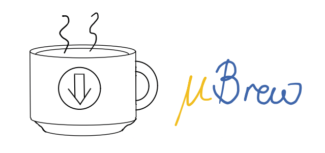
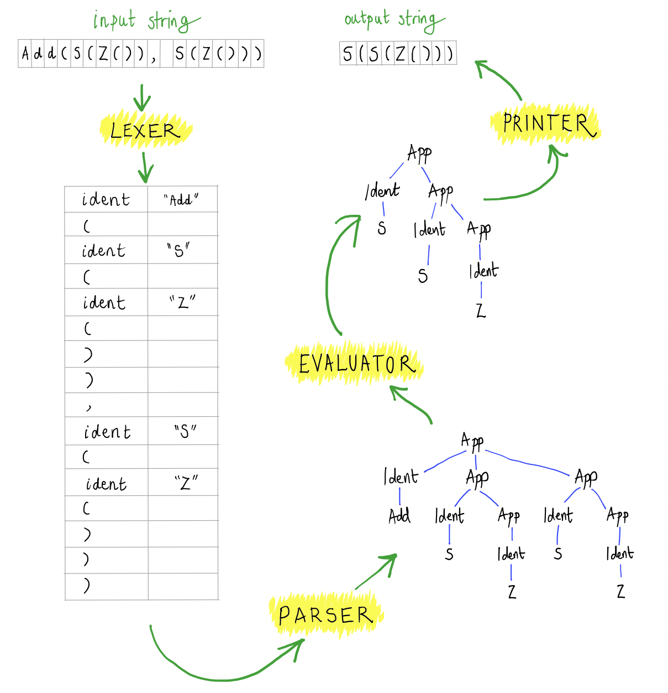

# Language Frontend and the Lexer

There are many software tools that process some kind of programming language.  Compilers and interpreters are perhaps the most obvious, but also program analysis tools (e.g. Facebook Infer, GitHub CodeQL, Google's Go Vet, Amazon CodeGuru),  documentation generators (e.g. Doxygen, Javadoc).  In fact, any software that has to read some kind of non-trivial configuration file (e.g. JSON, XML) needs to be able to process a formal language from a textual input.

Typically, the part of the software that is responsible for reading the text and constructing some internal representation of its structure is called a *frontend*.  There is no one way to organise a front-end but, in practice, most frontends adopt a certain architecture which makes this complicated task a bit easier.

The aim of this lecture is to illustrate this architecture and its first component using our Microbrew interpreter frontend as an example.

# The Microbrew Language



Microbrew, or the Little Bristol Rewriting language, is an extremely simple, yet Turing powerful programming language (the meaning of this latter term will become clear in the third part of the course), created this year for PLC.  The language is based on first-order term rewriting, that is, computation proceeds by rewriting a function call using the definition of the function.

The Microbrew interpreter provides a Read Eval Print Loop (REPL) in which you can define functions and evaluate expressions.

Functions can be defined using the keyword ``def`` and giving an equation that, functional programming style, describes the behaviour of the function over a given shape of input.  For example, the following clauses defines the first and second projection functions which, given a pair of arguments, returns the first or second one, respectively.
```
  > def Fst(x,y) = x
  > def Snd(x,y) = y
```
The equations consist of a function call on the left, then an equals symbol, then an expression on the right constructed from function calls and variables.  Function symbols start with an uppercase letter and variables (function parameters) start with a lowercase letter.

Expressions can be evaluated simply by writing them at the REPL:
```
  > Fst(Foo(),Bar())
  Foo()
```
The system matches the expression ``Fst(Foo(),Bar())`` with the first function clause above and replaces it by the body of the function (the expression on the RHS of the equals symbol), i.e. ``x``, but with formal parameters appropriately replaced by actual parameters.

And that's it.  There are no datatypes in Microbrew, no numbers, no strings, no lists, arrays or dictionaries.  

However, all of these datatypes can, in priciple, be simulated using uninterpreted function symbols (UF).  By UF I mean function names that we have not given any defining equations for.  If we ask the interpreter to evaluate a call of an UF, then no computation will occur (except possibly in evaluating the arguments to the function call) because there are no defining equations for the function.  For example, continuing the current REPL session:
```
  > Who(Fst(Foo(),Bar()))
  Who(Foo())
```
Here, the interpreter is able to evaluate the call to ``Fst`` because we have a defining equation, but not the call to ``Who`` because we don't.  Incidentally, ``Foo()`` and ``Bar()`` are also examples of calls to UF.

We can use UF like constructors for datatypes (in the sense of functional programming).  For example, although there are no numbers in Microbrew, we can encode the natural numbers using two UF, say ``Z`` for "zero" and ``S`` for "successor" (or "plus-1").  The idea is that the number n will be encoded by n-applications of the successor to zero.  E.g. the number 0 will be encoded by zero applications of ``S`` to ``Z()``:
```
  > Z()
  Z()
```
And the number 3 will be encoded by three applications of ``S`` to ``Z()``:
```
  > S(S(S(Z())))
  S(S(S(Z())))
```

Using this encoding it is straightforward to define addition on natural numbers:
```
  > def Add(Z(),y) = y
  > def Add(S(x),y) = S(Add(x,y))
```
The first equation says that, when adding zero to any number ``y``, the result is just ``y``.  The second says that, when adding a number of shape ``S(x)``, i.e. the successor of some other number ``x``, to some number ``y``, the result can be obtained by recursively adding ``x`` and ``y`` and then adding one more successor on top.

This is a standard recursive definition of addition, but I guess you may not be familiar with unary encodings of natural numbers, so you will either have to think about it for a while or just take my word for it.  Anyway, it must work because when we add 2 and 2 we get 4:
```
  > Add(S(S(Z())),S(S(Z())))
  S(S(S(S(Z()))))
```

Multiplication follows a similar pattern:
```
  > def Mult(Z(),y) = Z()
  > def Mult(S(x),y) = Add(y,Mult(x,y))

  > Mult(S(S(Z())),S(S(S(Z()))))
  S(S(S(S(S(S(Z()))))))
```

Similarly you could choose two UF symbols, say ``T`` and ``F``, and use ``T()`` and ``F()`` to represent Booleans, and define all the usual Boolean functions on them.  You could choose UF symbols ``C`` and ``N`` to represent lists, with ``C(x,xs)`` for the cons of ``x`` and ``xs`` and ``N()`` for the empty list, e.g. the list consisting of the first three natural numbers would be written ``C(Z(),C(S(Z()),C(S(S(Z())),N())))``.

## Microbrew Formal Syntax

Anyway, what you can build on top of this language is not important, the important thing is that the syntax and semantics of the language are extremely simple.  

### Grammatical Structure

The following is an LL(1) grammar for the syntax of Microbrew:

$$
  \begin{array}{rcl}
    \nt{Cmd} &\Coloneqq& \tm{\$}\\[2mm]
    &\mid& \nt{Exp}\ \tm{\$}\\[2mm]
    &\mid& \tm{def}\ \tm{ident}\ \tm{(}\ \nt{ExpList}\ \tm{)}\ \tm{=}\ \nt{Exp}\ \tm{\$}\\[4mm]
    \nt{Exp} &\Coloneqq& \tm{var} \\[2mm]
    &\mid& \tm{ident}\ \tm{(}\ \nt{ExpList}\ \tm{)}\\[4mm]
    \nt{ExpList} &\Coloneqq& \epsilon\\[2mm]
    &\mid& \nt{Exp}\ [\tm{,}\ \nt{Exp}]^{*}\\[4mm]
  \end{array}
$$

The distinguished starting nonterminal is $$\nt{Cmd}$$.  The grammar is formed over seven terminal symbols:

$$
  \tm{var} \qquad \tm{ident} \qquad \tm{(} \qquad \tm{)} \qquad \tm{,} \qquad \tm{def} \qquad \tm{=} \qquad \tm{\$}
$$

The terminal symbol $$\tm{var}$$ stands for variables (function parameters) and the terminal symbol $$\tm{ident}$$ stands for function names (IDENTifiers).  The terminal symbol $\tm{\$}$ is used as a marker to represent the end of the input string.    Intuitively, the nonterminals can be thought of as follows: 
  * $$\nt{Exp}$$ is the nonterminal that describes Microbrew expressions, it derives strings of terminal symbols such as:

  $$
    \begin{array}{l}
      \tm{var}\\
      \tm{ident}(\tm{var})\\
      \tm{ident}(\tm{ident}(),\tm{ident}())
    \end{array}
  $$

  * $$\nt{ExpList}$$ is the nonterminal that describes possibly empty, comma-separated lists of expressions, which are used to describe function parameters and the arguments at call sites.  An example is:
  
  $$
    \tm{var},\tm{ident}(\tm{var}),\tm{ident}(\tm{ident}(),\tm{ident}())
  $$
  
  * $$\nt{Cmd}$$ is the nonterminal that describes REPL commands, which can either simply be an expression, as above, or the definition of a new function equation, such as:

  $$
    \tm{def}\ \tm{ident}(\tm{ident}(\tm{var}),\tm{var})\ \tm{=}\ \tm{ident}(\tm{ident}(\tm{var},\tm{var}))
  $$


### Lexical Structure

You might be surprised that $$\tm{var}$$ and $$\tm{ident}$$ are terminal symbols and not nonterminals that _derive_ every possible variable and identifier name respectively.  However, this is actually very common in the definition of programming languages.  It represents a certain level of abstraction: as far as the language grammar is concerned, variables and identifiers are abstract, black-box entities.  The grammar can't distinguish different identifiers apart - ``Z``, ``S``, ``Add`` and so on all appear to the grammar simply as a single terminal symbol $$\tm{ident}$$, though it can distinguish variables from identifiers since they are separate terminal symbols.

There are two good reasons for this.  

* The first is that there is some conceptual advantage to reasoning about a programming language at this higher level of abstraction.  Typically, to determine if a given string really is a valid program in some programming language, there is simply no need to distinguish between identifiers.  If there is some structure in the language that can contain an identifier ``Foo``, then the structure does not become syntactically invalid by replacing ``Foo`` by ``Bar``.  For example, the syntactically valid Java class definition ``class Foo{}`` remains valid when replacing ``Foo`` by ``Bar`` to obtain ``class Bar{}``.
* The second reason is that there is usually a lot of overlap between the structure of program identifiers (or variables) and program keywords.  Trying to tease out this overlap in an LL(1) grammar, although it may be possible, will usually be quite painful.  For example, consider the C-language keyword ``for`` and the C-language identifier ``fortitude``.  A grammar that operates character-by-character (i.e. where the terminal symbols are just individual characters) would need to bake in a bunch of rules that factor out the common prefix ``for``.  A similar clash occurs in Microbrew between the keyword ``def`` and variable names like ``definitely``.

So for these reasons the Microbrew grammar understands all identifiers simply as the terminal symbol $$\tm{ident}$$ and all variables simply as the terminal symbol $$\tm{var}$$.  Of course, a Microcode program is actually written as text, a string, so at some point someone needs to say which sequences of characters actually constitute a valid identifer and which constitute a valid variable name.  More generally, the language designer must specify how to recognise each terminal symbol as some substring of the input.  This is called the __lexical__ structure of the language, and for Microbrew it is as follows:

* The definition keyword, terminal symbol __def__, is just the substring "def".
* A variable, terminal symbol __var__, is any substring consisting of letters or digits and starting with a lowercase letter, except the substring "def".
* An identifier, terminal symbol __ident__, is any sequence of letters or digits starting with an upper-case letter.
* The terminal symbols for left parenthesis, right parenthesis, comma, and equals are just substrings consisting of exactly those characters.

Sometimes a programming language will just describe the lexical structure informally, as I have done here for Microbrew, see also [Python](https://docs.python.org/3/reference/lexical_analysis.html).  Many languages use a separate grammar to present the lexical structure, e.g. [Rust](https://doc.rust-lang.org/reference/lexical-structure.html), [OCaml](https://ocaml.org/manual/5.5/lex.html), [Java](https://docs.oracle.com/javase/specs/jls/se27/html/jls-3.html).  However it is described, there is usually an implicit rule that each mention of "substring" in the description really means "maximal substring".  That is, if we have a C program substring like "fortitude" then this must be an identifier and not the keyword "for" followed by an identifier "titude".  This implicit rule is called _maximal munch_.

## The Microbrew Frontend

The Microbrew interpreter is a tool for reading Microbrew code line-by-line and executing it.  The problem sheet this week will involve you implementing your own version of the interpreter.

The interpreter has four components, the _lexer_, the _parser_, the _evaluator_ and the _printer_.  You can see an example of the data flow through the interpreter below.



The input to the interpreter is some code in textual form, i.e. a string.  The output is also a string - if the input string described an expression, then the output string will be the value resulting from evaluating that expression.

The lexer, parser, evaluator and printer implement the processing from input to output.  In this part of the unit we are interested in syntax, so we will only look in detail at the first two components.  Together these components, the lexer and the parser, form the _frontend_ of the interpreter.

### The Lexer

* Input: Program text given as a string of characters.
* Output: Sequence of tokens.

Conceptually, the lexer is responsible for taking the input string of characters and turning it into a string of terminal symbols, according the lexical structure of the language.  

If our only goal for the frontend was to check whether a given input string was a valid Microbrew program, then this would be enough.  However, in reality, whenever the input string is a valid Microbrew program, we want to construct an in-memory representation of its structure so that we can then evaluate (execute) it. 

To build this structured representation of the program, we can't afford to simply forget the names of variables and identifiers- if we want to evaluate the program, it really is important to know which identifier occurs at a particular program point and not only that it is an identifier.  So, in reality, the lexer actually produces a string of terminal symbols that is annotated with the original variable and identifier names.  This combination of a terminal symbol optionally annotated with some substring of the program text (e.g. a variable name) is called a __token__, and the optional substring component is called a __lexeme__.

You can see in the picture above that the lexer has recognised that the first three characters constitute an identifier, so the first token in the output is the terminal symbol ``ident`` annotated with the substring ``Add``.  The fourth character in the input string is a left parenthesis and so the next token in the output sequence is the left parenthesis terminal symbol (here it is not useful to annotate it with a lexeme).  The fifth character of the input was another identifier with name "S", and so the next token output is the terminal symbol ``ident`` annotated with the substring ``S``; and so on.  

Incidentally, you can see from character 12 of the input string that the lexer makes good on our assumption that whitespace is not relevant when giving the grammar for a programming language.  In most programming languages whitespace is essential in the original program text - the input string - to separate different entities:  imagine some C code like ``intx=3;`` which has the whitespace stripped away, we don't know if it is meant to be ``int x = 3;`` or ``intx = 3;`` (the assignment of three to the variable called ``intx``).  However, our grammars have so far all assumed that whitespace is irrelevant, the input is just a sequence of terminal symbols.  The lexer bridges this gap, it uses whitespace in the input string to help recognise where one terminal symbol ends and another begins, but it also strips it away - once we have converted the input string to a sequence of tokens, whitespace is no longer useful.

### The Parser

* Input: Sequence of tokens.
* Output: Abstract syntax tree.

The parser is responsible for taking the sequence of tokens and recognising the higher-level, grammatical structure of the programming language, according to the language grammar.  There are two aspects to the parser:
  - It is responsible for checking that the given list of terminal symbols describes a valid Microbrew program.  For this, the parser only requires the sequence of terminal symbols but not their annotatations (the lexemes).  The particular names of variables and identifiers are not necessary (since they are anyway indistinguishable in the grammar).  
  - Whenever the string of terminals is a valid program, it outputs a tree representation of the structure of that program, which will be passed along to the evaluator component to be executed.  For this, the parser _does_ require the particular names of variables and identifiers (the lexemes), because whether you are calling function ``F`` or function ``G`` is important when evaluating the program.
    
  In the picture above you can see a tree representation of the structure of the program.  We will discuss this in more detail later, but the idea is that the tree shows you that, at its root, the expression that was described by the input string is actually a call - we use the node label ``App`` which is traditional in programming language theory and stands for "function APPlied to some arguments" or simply "function APPlication".  Then the children of the each ``App`` node describe the key components of the function call: the subtree in the left-most child is the function that is being applied (called), all children to the right of it constitute the arguments of that function.  So, in this example, we can see that the first argument to the call to ``Add``, i.e. the middle child of the root, is itself a call to ``S``, and the argument to this call to ``S`` is itself a call to ``Z``, and so on. 

  These kinds of trees are called __abstract syntax trees__ or ASTs for short.  We will discuss them in more detail in a later lecture, but for now I hope it's clear that: 
    
  - It's a _tree_ structure 
  - It's still just a representation of the _syntax_ of the program: there is nothing in the tree that explains what happens when you make a call to ``Add`` (semantics), only where the call occurs and what its arguments are.
  - The tree representation is, in a sense, more _abstract_ than the string version of the program code because we have forgotten certain syntactic details like whitespace and superfluous bracketing.  For example, the strings ``Add(S(Z()),S(Z()))`` and ``(Add(((S (Z()))),   S(Z())))`` will both result in the same abstract syntax tree (which is the one picured).

## Implementation of the Lexer

The Microbrew interpreter happens to be written in OCaml, which is an _impure_ functional programming language.  The qualifier _impure_ means that functions do not only return a value, like in Haskell, but can have other _side effects_ such as mutating local state, opening file handles, throwing exceptions and so on.

Since it is a functional programming language, the most natural way to represent tokens is with an algebraic datatype (also called a _variant_ type in OCaml).  The following piece of OCaml defines a datatype called ``token`` which has seven constructors.  

```ocaml
type token =
  | TkIdent of string
  | TkVar of string
  | TkLParen
  | TkRParen
  | TkDefine
  | TkComma
  | TkEquals
```

Each of the constructors corresponds to one of the terminal symbols, and those terminal symbols that require an annotation have a string argument.  For example, the token that consists of the terminal symbol for the left parenthesis is represented simply as ``TkLParen``, this is a value of type ``token``.  The token that consists of terminal symbol ident annotated with the string "Add" is encoded by the value ``TkIdent "Add"``. 

Now that we have a type for tokens, our objective is to implement the lexer as a function ``lex : string -> token list``.  I.e. that takes a string as input and transforms it into a list of tokens as output.

### Input String State

This idea of this lex function is as follows.  It will proceed character by character through the input string, consuming each character in turn and outputing a token whenever a complete terminal symbol is recognised.  

Some consideration of the lexical structure of the language leads to the following observation.  There are some characters where the lexer can immediately output the corresponding token (terminal symbol + optional lexeme), irrespective of which characters have been seen so far, and there are some characters where the lexer needs more context in order to know what to do.

For example, when encountering the left parenthesis character ``'('`` in the input string the lexer can immediately output the token ``TkLParen`` into the output list, no matter which characters have been seen before it.  Similarly, when encountering the equals character ``'='`` in the input string, the lexer can immediately output the token ``TkEquals``.

However, when encountering the character ``'e'`` the lexer cannot know how to proceed without more information.  This 'e' could be part of a identifier ``MkTree``, or part of a variable `me`, or part of a keyword `def`.  So here, the lexer needs to know that it is in the middle of reading in a variable, identifier or keyword (though it does not necessarily yet know which), and remember the relevant sequence of characters that came before it.  It can't take action - that is output a token - until it has reached the end of the identifier, variable or keyword. 

This leads to a state machine style architecture in which there are two states:

* The "initial" state, in which there is no need to remember anything.
* The "identifier, variable or keyword" state, in which the lexer knows that it is in the middle of scanning either an identifier, variable or keyword, and so should remember the constituent characters in some variable in order to create the lexeme once it determines which it is.

The lexer begins in the "initial" state.  In this state, reading in a left parenthesis, right parenthesis, comma or equals character takes the lexer back to the "initial" state and outputs the corresponding terminal symbol as a side effect.  The lexer switches from the "initial state" to the "identifier, variable, or keyword" state upon reading a lower or uppercase letter.  It stays in the "identifier, variable or keyword" state so long as the next character is a lower or uppercase letter or a number. It switches back to the "initial" state when the next character is not a letter or a digit, because this signals that it has finished reading the identifier, variable or keyword. 

The implementation is in an imperative style, with the input string and progress through it tracked by the some internal state.

```ocaml
  (* Input string state *)
  let idx = ref 0
  let input = ref ""
```

Here, `input` is a reference (mutable variable) of type `string ref` and it will store the input string which is to be lexed.  The reference `idx` of type `int ref` is used to keep track of how far through the input string we have lexed so far.

To avoid dependence on the particular choice of input string state representation, there is a small API which is used by the rest of the lexer:

* `is_more ()` returns `true` just if there is still more input to consider and `false` otherwise.
* `peek ()` returns the current character under consideration.
* `drop ()` discards the current character from the input (once it has been considered).
* `raise_lex_error exp` aborts the lex with a failure exception.
* `eat c` discards the current character just if it is `c` and aborts the lex otherwise.

### Character Class Utilities

We also assume we have the following utility functions available for recognising character classes (these are written directly in the implementation, but they could also be imported from external libraries).

  * `is_digit c` returns `true` just if `c` is in the range `0..9` and `false` otherwise.
  * `is_lower c` returns `true` just if `c` is in the range `a..z` and `false` otherwise.
  * `is_upper c` returns `true` just if `c` is in the range `A..Z` and `false` otherwise.
  * `is_wspace c` returns `true` just if `c` is the space character or a newline, and `false` otherwise.
  * `is_punctuation c` returns `true` just if `c` is `!`, `?` or `_`, and `false` otherwise.
  * `is_id_char c` returns `true` just if `c` is lowercase, uppercase, a digit or punctuation, and `false` otherwise.

### Lexer Main Loop

The heart of the lexer is a loop which is responsible for recognising the next lexeme from the input string and outputting it with its classification as a token.  Any intervening whitespace is silently discarded.  

```ocaml
(** 
    [lex s] returns the token list obtained by scanning [s].
    @raises [Failure] if [s] fails to scan.
*)
let lex (s:string) : token list =
  input := s;
  idx := 0;
  let output = ref [] in
  while is_more () do 
    if is_wspace (peek ()) then
      drop ()
    else
      let tk = lex_init () in
      output := tk :: !output
  done;
  List.rev (!output)
```

The recognising process is contained in the function `lex_init` which is responsible for consuming characters from the input string one-by-one until a complete lexeme is discovered.  For example, when `lex_init` sees that the next character in the input string is `=` then it can drop it and immediately return the token `TkEquals`, when it sees the next character of the input string is `,`, it can drop it and immediately return the token `TkComma`, and so on.

```ocaml
let lex_init () =
  match peek () with
  | '=' -> 
    drop (); 
    TkPrimOp Eq
  | '<' ->
    drop ();
    TkPrimOp Less
  | '+' ->
    drop ();
    TkPrimOp Plus
  | '-' ->
    drop ();
    TkPrimOp Minus
  | '*' ->
    drop ();
    TkPrimOp Times
  | '/' ->
    drop ();
    TkPrimOp Divide
  | '(' ->
    drop ();
    TkLParen
  | ')' ->
    drop ();
    TkRParen
  | '#' -> lex_bool ()
  | c when is_digit c -> lex_number ()
  | c when is_lower c -> lex_kw_or_id ()
  | _ -> raise_lex_error "valid character"
```

However, consider what should happen when the lexer encounters the character `t`.  Here, it depends what comes before.  For example, if the previous character was whitespace or the letter `s`, then this `t` must be part of an identifier.  On the other hand, if the previous character was `#` then this `t` is part of the boolean literal `#t`.  Similarly, what should happen when the lexer encounters `_`.  If it is right at the start of a lexeme, then this is an invalid program, because no lexeme can start with `_`.  However, if the lexer is in the middle of reading an identifier, then the `_` can be consumed and become part of the identifier lexeme.

Thus to carry out the recognition correctly, the implementation must have some memory of what has come before and its behaviour depends on that memory.  We could add some additional internal state to remember, e.g. the _previous_ character that was considered.  However, some consideration reveals that this is really too much information - we don't care whether the previous character was `a` or `b`, and only that it was a valid character for an identifier.  In fact, we can identify three situations we care about:

  * When the current lexeme starts with `#`, which indicates we are trying to lex a boolean literal and so we should allow only the characters `t` and `f` to follow next and abort the whole lex in all other cases.
  * When the current lexeme starts with a digit, which indicates we are trying to lex a number.  Any subsequent digits should form part of the current lexeme, and any other character indicates we have already reached the end of this lexeme.
  * When the current lexeme starts with a lowercase character, which indicates we are trying to lex an identifier or a keyword (`not`, `or`, `lambda` etc.).  In this case, we should continue consuming identifier characters until we meet a non-identifier character, and then we can classify the resulting lexeme as either an identifier or a keyword depending on the content of the string.
  * When there is no previous non-whitespace character, which indicates we are starting a new lexeme.

In this situation, where the behaviour of the program depends on a small number of characterisations of what has happened so far, an elegant approach is to organise the implementation as a _state machine_.  There will be three states, `lex_bool`, `lex_num`, `lex_kw_or_id` and `lex_init` corresponding the three bullets above, respectively.

Each state corresponds to a function in the code of the same name.  We have already seen `lex_init`, the others are implemented as follows:

```ocaml
let lex_bool () : token =
  (* Assumes [peek () = '#'] *)
  drop (); 
  match peek () with
  | 't' -> 
      drop (); 
      TkLit (LBool true);
  | 'f' -> 
      drop ();
      TkLit (LBool false);
  | _ -> 
      raise_lex_error "t or f"

let lex_number () : token  =
  let lexeme = ref "" in
  while is_more () && is_digit (peek ()) do
    let c = peek () in
      drop ();
      lexeme := !lexeme ^ String.make 1 c
  done;
  TkLit (LNum (int_of_string !lexeme))

let lex_kw_or_id () : token =
  let lexeme = ref "" in
  (* assumes the first char is correctly lowercase *)
  while is_more () && is_id_char (peek ()) do
    let c = peek () in
    drop ();
    lexeme := !lexeme ^ String.make 1 c
  done;
  (* Check if the lexeme is a keyword, 
     otherwise it's an identifier. *)
  match !lexeme with
  | "define" -> TkDefine
  | "if"     -> TkPrimOp If
  | "not"    -> TkPrimOp Not
  | "and"    -> TkPrimOp And
  | "or"     -> TkPrimOp Or
  | "lambda" -> TkLambda
  | _        -> TkIdent !lexeme
```