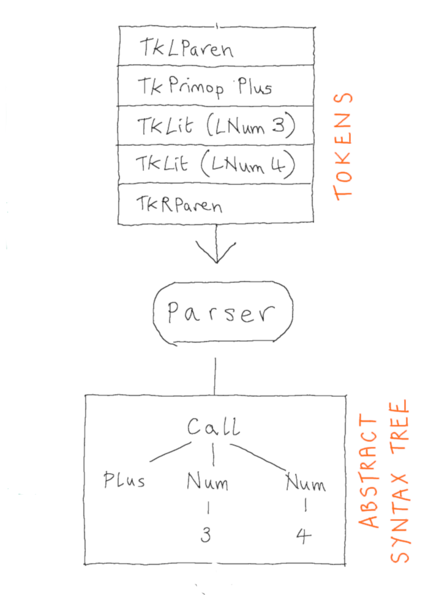

$$
\newcommand{\andop}{\mathrel{\&\!\&}}
\newcommand{\orop}{\mathrel{\|}}
\newcommand{\ff}{\mathsf{false}}
\newcommand{\tt}{\mathsf{true}}
\newcommand{\tm}[1]{\mathsf{#1}}
$$


# Predictive Parsing

Once you have an LL(1) parsing table, it is straightforward to implement a kind of parser called a _predictive parser_.  It is _predictive_ in the sense that it can predict what rule to use at every step - due to the grammar being LL(1).  

In the Microbrew interpreter, the parser is responsible for converting a list of tokens into an abstract syntax tree, according to the grammar of the language.  

<!--  -->

Recall that a token combines a terminal symbol along with, optionally, a lexeme (string) that describes the data associated with the terminal symbol.  The tokens for Microbrew were defined as follows in the OCaml implementation:

```ocaml
type token =
  | TkIdent of string
  | TkVar of string
  | TkLParen
  | TkRParen
  | TkDefine
  | TkComma
  | TkEquals
  | TkEnd
```

The parser takes a list of tokens as input, from which it must deduce whether or not the sequence of terminal symbols within this list of tokens is a valid Microbrew program and, if so, construct an in-memory representation of the structure of program.  

## LL(1) Grammar for Microbrew

When the structure of a programming language is split into a description of the lexical elements and a separate grammar describing valid combinations of the lexical elements, the latter is sometimes known as the _phrase structure_ of the language.  Recall the grammar we use for Microbrew is the following:

$$
  \begin{array}{rcl}
    \nt{Cmd} &\Coloneqq& \tm{\$}\\[2mm]
    &\mid& \nt{Exp}\ \tm{\$}\\[2mm]
    &\mid& \tm{def}\ \tm{ident}\ \tm{(}\ \nt{ExpList}\ \tm{)}\ \tm{=}\ \nt{Exp}\ \tm{\$}\\[4mm]
    \nt{Exp} &\Coloneqq& \tm{var} \\[2mm]
    &\mid& \tm{ident}\ \tm{(}\ \nt{ExpList}\ \tm{)}\\[4mm]
    \nt{ExpList} &\Coloneqq& \epsilon\\[2mm]
    &\mid& \nt{Exp}\ \nt{ExpList'}\\[4mm]
    \nt{ExpList'} &\Coloneqq& \epsilon\\[2mm]
    &\mid& \tm{,}\ \nt{Exp}\ \nt{ExpList'}\\[4mm]
  \end{array}
$$

Following the definitions in the [fourth lecture](ll.html), we can construct a parsing table for this grammar.  It is a bit large, so I suggest using a tool to do it for us, like the following:
<https://jsmachines.sourceforge.net/machines/ll1.html>.

<table class="pure-table pure-table-bordered" border="1">
  <thead><tr id="llTableHead"><th>Nonterminal</th><th>def</th><th>ident</th><th>(</th><th>)</th><th>=</th><th>var</th><th>,</th><th>$</th></tr></thead>
  <tbody id="llTableRows"><tr></tr>
  <tr><td nowrap="nowrap">Cmd</td><td nowrap="nowrap">Cmd ::= def ident ( ExpList ) = Exp</td><td nowrap="nowrap">Cmd ::= Exp</td><td nowrap="nowrap"></td><td nowrap="nowrap"></td><td nowrap="nowrap"></td><td nowrap="nowrap">Cmd ::= Exp</td><td nowrap="nowrap"></td><td nowrap="nowrap">Cmd ::= ''</td></tr>
  <tr><td nowrap="nowrap">Exp</td><td nowrap="nowrap"></td><td nowrap="nowrap">Exp ::= ident ( ExpList )</td><td nowrap="nowrap"></td><td nowrap="nowrap"></td><td nowrap="nowrap"></td><td nowrap="nowrap">Exp ::= var</td><td nowrap="nowrap"></td><td nowrap="nowrap"></td></tr>
  <tr><td nowrap="nowrap">ExpList</td><td nowrap="nowrap"></td><td nowrap="nowrap">ExpList ::= Exp ExpList'</td><td nowrap="nowrap"></td><td nowrap="nowrap">ExpList ::= ''</td><td nowrap="nowrap"></td><td nowrap="nowrap">ExpList ::= Exp ExpList'</td><td nowrap="nowrap"></td><td nowrap="nowrap"></td></tr>
  <tr><td nowrap="nowrap">ExpList'</td><td nowrap="nowrap"></td><td nowrap="nowrap"></td><td nowrap="nowrap"></td><td nowrap="nowrap">ExpList' ::= ''</td><td nowrap="nowrap"></td><td nowrap="nowrap"></td><td nowrap="nowrap">ExpList' ::= , Exp ExpList'</td><td nowrap="nowrap"></td></tr></tbody>
</table>

This tool creates the parsing table for you, but it also adds a the end-of-input marker `$` onto the end of each of the rules for the starting non-terminal (which is the first non-terminal given, by its own convention), so you must manually remove the `$` from our grammar before putting it into this tool.  Also, it uses -&gt; instead of ::= as separator.  [This](../../assets/syntax/grammar.txt) is the input I actually used to generate the table.

The parse table contains at most one rule per cell, so we are sure that this grammar is LL(1) and therefore can be used to create a predictive parser (or recogniser).  

## A Predictive Recogniser from an LL(1) Grammar

We'll start by implementing a recogniser for the Microbrew language.  Given a string as input, the recogniser will return `true` if the string is in the language and `false` otherwise.  Later we will show how to upgrade the recogniser to a parser (i.e. to return a structured representation of the program represented by the string, when the string is in the language).

We're going to implement the recogniser in an imperative style (but using OCaml), so we'll need some internal state to keep track of which tokens from the input we have already derived (starting from the left) and which are left.  In the reference implementation, I just use a reference to a list of tokens for this, which always contains the sequence of not-yet consumed tokens.  However, it is simpler to just describe the API:

Much like in our lexer, we will use a small API to interface with the internal state.  We need a way to peek at the next element of the input (in this case, the next token), a way to consume tokens (actually remove tokens from the head of the list).  So we will assume we have five functions:

* `peek ()` returns the next unconsumed token
* `drop ()` consumes the next unconsumed token (i.e. discards it)
* `eat tk` consumes the next unconsumed token if it is exactly `tk` and otherwise fails
* `eat_ident tk` consumes the next unconsumed token if it is an identifier token and returns the lexeme, otherwise fails
* `eat_var tk` consumes the next unconsumed token if it is a variable token and returns the lexeme, otherwise fails

Then, to implement the recogniser, we simply make one new function for each non-terminal in the grammar.  Each of these parsing functions takes no input (because it will access the next token from the mutable reference instead) and returns no output (actually, in OCaml, this is simulated by returning unit (aka void) `()`).  However, as a _side effect_, they will consume some prefix of the list of tokens given as input.  If the parsing functions eventually consume the whole list of tokens, then we  conclude that the string is in the Microbrew language, but if they get stuck somewhere (and fail) then we conclude that the string is not in the Microbrew language.

Each of the parsing functions will be responsible for recognising those strings that are derivable from the corresponding nonterminal in the grammar.  So, for example, `pExp` will recognise expressions, `pCmd` will recognise commands, and so on.

```ocaml
let rec pCmd () =
  match peek () with
  | TkEnd ->  ()
  | TkVar _ 
  | TkIdent _ -> 
      pExp ()
  | TkDefine ->
      eat TkDefine;
      let _ = eat_ident () in
      eat TkLParen;
      pExpList ();
      eat TkRParen;
      eat TkEquals;
      pExp ();
      eat TkEnd
  | _ -> raise_parse_error "Cmd"

and pExp () =
  match peek () with
  | TkIdent _ ->
      let _ = eat_ident () in
      eat TkLParen;
      pExpList ();
      eat TkRParen
  | TkVar _ -> 
      let _ = eat_variable () in ()
  | _ -> raise_parse_error "Exp"

and pExpList () =
  match peek () with
  | TkIdent _ 
  | TkVar _ -> 
      pExp ();
      pExpList' ()
  | TkRParen -> ()
  | _ -> raise_parse_error "ExpList"

and pExpList' () =
  match peek () with
  | TkRParen -> ()
  | TkComma -> 
      eat TkComma;
      pExpList ()
  | _ -> raise_parse_error "ExpList'"
```

The implementation strategy is straightforward, for each non-terminal $X$ we perform a case analysis on the next token $a$ of the input, and then we "execute" the unique parsing rule that is listed in the parsing table with row $X$ and column $a$.  Otherwise, if that cell of the table is empty, we raise an exception.  

What is meant by "execute" a parsing rule?  The idea is to view the RHS $\beta$ of a rule $X \Coloneqq \beta$ as a strategy for parsing $X$ things.  The RHS $\beta$ is a sentential form, a sequence of terminals and non-terminals, and the idea is that: 
  - a terminal $a$ is interpreted as an instruction to consume exactly that token from the input
  - a nonterminal $Y$ is interpreted as an instruction to call the parsing function for $Y$

For example, consider the nonterminal $\nt{Exp}$ which is used to derive expressions such as `Add(Z(),x)`.  We define a corresponding parsing function `pExp` of type unit to unit (i.e. takes no input and returns no output).  To see how this function should behave, we consult the parsing table for the grammar.  The row for $\nt{Exp}$ has only two nonempty cells, in the columns for terminal symbols $\tm{ident}$ and $\tm{var}$.  Here is an extract of the table:

$$
  \begin{array}{|c|c|c|}\hline
    \text{Nonterminal} & \tm{ident} & \tm{var} \\\hline
    \nt{Exp} & \nt{Exp} \Coloneqq \tm{ident}\ \tm{(}\ \nt{ExpList}\ \tm{)} & \nt{Exp} \Coloneqq \tm{var} \\\hline
  \end{array}
$$

Each parsing function begins by analysing the next terminal symbol, say $a$, of the input to work out which column to look at.  Then cell indexed by $(\nt{Exp},\,a)$ explains which sequence of actions to execute in order to derive a string starting with $a$ when the leftmost nonterminal is $\nt{Exp}$.  

```ocaml
and pExp () =
  match peek () with
  | TkIdent _ ->
      let _ = eat_ident () in
      eat TkLParen;
      pExpList ();
      eat TkRParen
  | TkVar _ -> 
      let _ = eat_variable () in ()
  | _ -> raise_parse_error "Exp"
```

So, we first peek at the next token in order to understand which is the next unconsumed terminal symbol.  If it is an ident, then according the cell indexed by row $\nt{Exp}$ and column $\tm{ident}$, we ought to behave according to the RHS of the rule:

$$
  \nt{Exp} \Coloneqq \tm{ident}\ \tm{(}\ \nt{ExpList}\ \tm{)}
$$

Interpreting the symbols of the RHS as actions, as described above, this means:
1. Check that the next token of the input is an `ident` and consume it,
2. then check that the next token of the input is a `(` and consume it,
3. then call the parsing function `pExpList` in order to recognise (and consume) a string derivable from $\nt{ExpList}$ (i.e. a list of expressions),
4. then check that the next token of the input is a `)` and consume it.

Thus, we arrive at the code on lines 4-7 of the snippet above.  Note, we use the construction `let _ = eat_ident () in` on line 4 because `eat_ident ()` not only checks that the next letter of the input is a ident (and consumes it) but also returns the associated lexeme.  However, since we are only recognising valid programs and not parsing, we do not need it, and this construction is a way to simply discard it.

The next case to consider is when the next letter of the input is a $\tm{var}$ token.  In this case, we consult the cell of the table indexed by $(\nt{Exp},\,\tm{var})$, which determines that the parsing function should behave as specified by the RHS of the rule:

$$
  \nt{Exp} \Coloneqq \tm{var}
$$

Interpreting the RHS of this rule as a list of actions to perform gives us simply that the recogniser should check that the next letter of the input is indeed a $\tm{var}$ token (which we already knew in this case) and consume it.  This gives us the code on line 9 of the snippet above.

Finally, if the next unconsumed token is any other terminal symbol, say $a$, when we look up the corresponding cell it will be empty.  This signals that it is not possible to derive a string starting $a$ when the leftmost nonterminal is $\nt{Exp}$ and so, in this case, we should signal failure, which we do by throwing an exception in line 10.

Exactly the same pattern is used to implement all of the other parsing functions.  

Then, to use these functions, we simply need to take the input string, lex it to obtain a list of tokens and then "call" the start symbol `pCmd ()`:

```ocaml
let recognise (s:string) : bool =
  tokens := lex s;
  try 
    pCmd ();
    true
  with
  | _ -> false
```

## A Predictive Parser 

A recogniser answers the true/false question "Is the given string in the language?", but a parser must also construct a structured representation of the program in the case of a true answer.  In the Microcode interpreter, this structured representation is an abstract syntax tree (AST).  We'll look at ASTs in more detail in the last lecture, but for now just think of them as some, in this case, OCaml datatype that represents the program in a more (tree-) structured form.  For example, the string `def Add(Z(),y) = y` is a valid Microbrew program, and will be represented by the following AST:


Tree structured datatypes are very natural to define in functional programming languages using variant/algebraic datatypes.  We use two to represent Microbrew programs:

```ocaml
type exp =
  | Var of string              (* A variable *)
  | App of string * exp list   (* A function call *)

type cmd =
  | Skip                       (* The empty command - a no-op *)
  | Eval of exp                (* Evaluate the given expression *)
  | Define of exp * exp        (* Assert a new function equation *)
```

The idea is that each constructor of the datatype represents a different kind of tree node, and the arguments to the constructor correspond to the children of the node.  So the AST above can be written in OCaml as:

```ocaml
  Define (App ("Add", [App ("Z", []), Var "y"]), Var "y")
```

To upgrade our recogniser to a parser, we just need to have each parsing function output the abstract syntax tree that corresponds to the given program fragment that it has consumed.  To do this, we interleave tree construction steps with the actions specified by the production rule.  For example, we would modify `pExp` as follows.

```ocaml
and pExp () : exp =
  match peek () with
  | TkIdent _ ->
      let f = eat_ident () in
      eat TkLParen;
      let es = pExpList () in
      eat TkRParen;
      App (f, es)
  | TkVar _ -> 
      let x = eat_variable () in
      Var x
  | _ -> raise_parse_error "Exp"
```

First and foremost, the parsing function now outputs a syntax tree of type `exp` instead of returning nothing (unit).  The `exp` that is output is constructed in each case, assuming that the other parsing functions also return ASTs of the appropriate kinds.  Consider the $\tm{ident}$ case on lines 4 to 8.  In this case, the parser must behave according to the production rule:

$$
  \nt{Exp} \Coloneqq \tm{ident}\ \tm{(}\ \nt{ExpList}\ \tm{)}
$$

but now, in addition to verifying that a prefix of the given input is derivable from $\nt{Exp}$ we must additionally construct an AST of type `exp`.  To do this we not only confirm that the next unconsumed token is an $\tm{ident}$ but we also remember its name (lexeme) `f` for output in the AST.  The left and right parentheses don't appear in the AST explicitly, they are part of the way we describe the tree structure in a flat representation like a string, so we next just check and consume the `(` as before.  Next, we call out to `pExpList` which we now assume returns a list of expression ASTs `es`, i.e. a list of values of type `exp`, which we remember for output in the AST.  Finally we confirm that the next unconsumed token is a right parenthesis and then we can output the AST, which is just `App (f, es)`.

Similarly in the case the next token is a variable.  Whereas the recogniser discarded the name of the variable, now we remember it so that it can be inserted into the `exp` AST that we output on line 11 `Var x`.

After modifying all of the other parsing functions in the same way, all that remains is to define a wrapper, which simply lexes the input string, as before, and then calls `pCmd` to parse a command.  If the input string is not a valid Microbrew program, one of the parsing functions will fail with a parse error which will be propagated out of this `parse` function. 

```ocaml
let parse (s:string) : cmd =
  tokens := lex s;
  pCmd ()
```