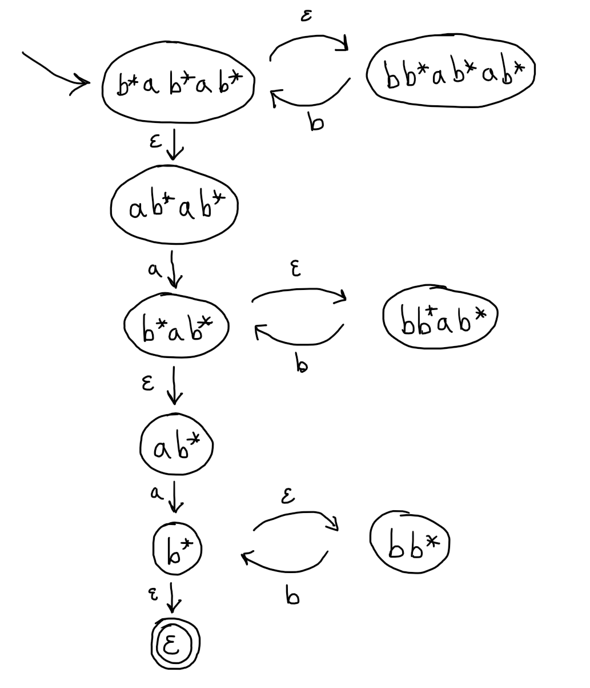
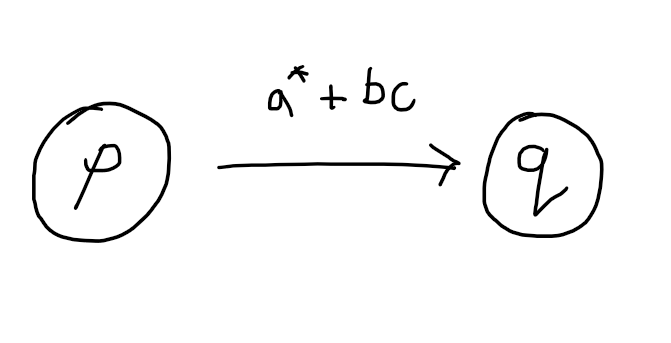
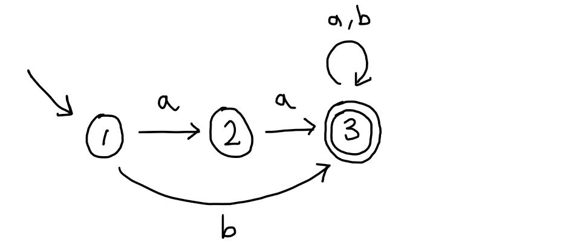
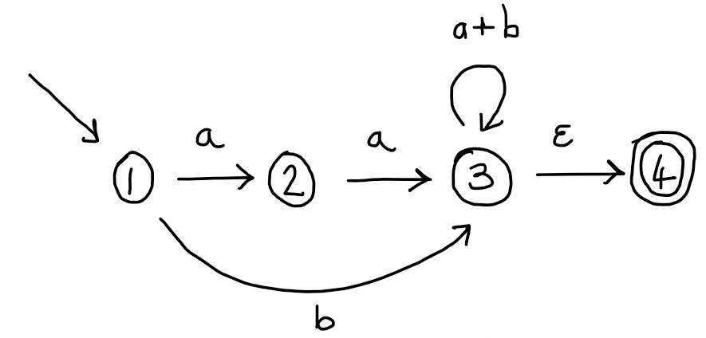
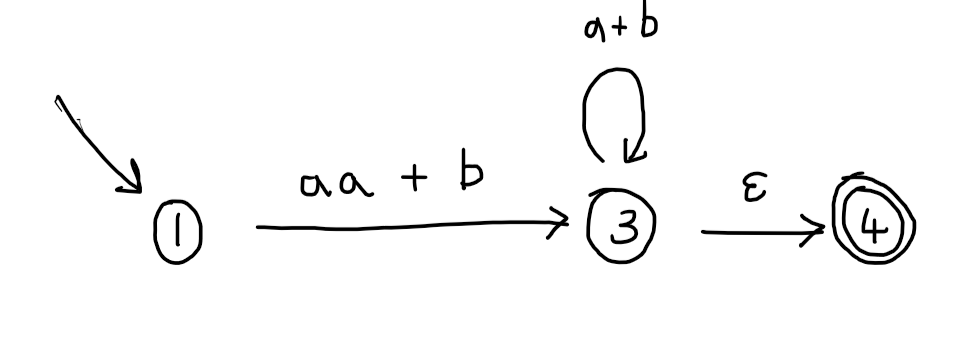
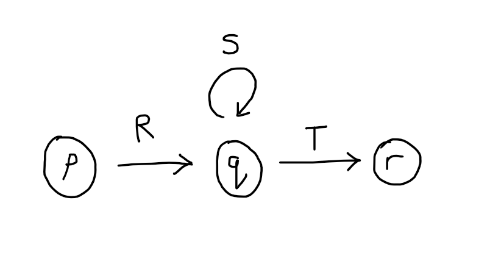
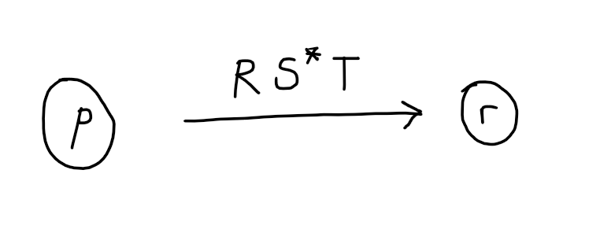
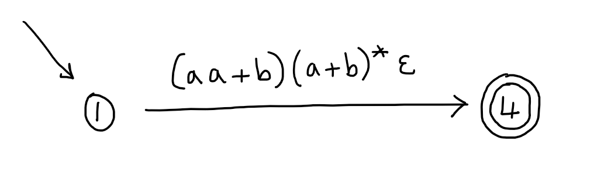

# Kleene's Theorem

In this lecture we are going to see an important result due to Stephen Cole Kleene, which shows that regular expressions and finite automata are essentially the same.

We want to compare regular expressions and finite automata.  They look kind of different - one is a programming language and the other is a machine model, but there is clearly some kind of comparison that can be made since they are both somehow about describing patterns in  strings.  

One way to do it is to view them both as finite representations of languages (sets of strings).  In the case of a finite automaton, we already said that there is such a thing as *the language recognised by a finite automaton* which consists precisely of the strings that the automaton accepts.  We can also associate a language with a regular expression:



For example $$L(b^*ab^*ab^*) = \{w \in \{a,b\}^* \mid \text{$w$ has exactly two $a$}\}$$.

The language recognised by a finite automaton is a statement about what a particular automaton can do - it can correctly classify strings as either being in this language (accepted) or not (rejected).  Similarly, the language denoted by a regular expression is a statement about what a particular regular expression can do - it can match any strings that are in this language.

However, now we want to get a bit more meta and think about what regular expressions and finite automata can do *in general*.  For example, is there anything we can do with a finite automaton that cannot be done with a regular expression?  According to the above, we can think of regular expressions and finite automata as expressing languages, so a simple way to measure the power of each of these formalisms is via the collection of all languages that each of them can express.  We will call this their *expressive power*.

For example, we know that regular expressions and finite automata can both express the language $$\{w \in \{a,b\}^* \mid \text{$w$ has an even number of $a$}\}$$.  One the one hand, this language is denoted by the regular expression $$b^* + (b^*ab^*ab^*)$$ and, on the other, it is recognised by the beautifully rendered finite automaton [here](../assets/automata/odd-even.png).

However, if there is some language $$X$$ that can be expressed by a regular expression but not by any finite automaton, then that would show that there is a real difference in their expressive power - if we want to match exactly the strings in $X$ then we need to use a regular expression because no finite automaton will do.  However, Kleene showed that there are no such differences.



We will show this by illustrating how you can transform a given regular expression into a (language-) equivalent finite automaton and vice versa.

## From Regular Expressions to Finite Automata

Perhaps you can already guess how to obtain a finite automaton from a regular expression, it is just what you did in the Week 2 problem sheet, Q5.



In other words, the states of the automaton are just all regular expressions that can be reached by executing the operational semantics of $R$.  The transitions of the automaton correspond exactly to the transitions that these regular expressions can make.  The initial state is the original expression $R$ and there is at most one final state, which is the regular expression $\epsilon$ if that is reachable by some computation.

Now, this construction only makes sense if we know that there are only finitely many regular expressions that can be reached from $R$ by making computation steps, because the key restriction on a finite state automata is that, well, it has only finitely many states.  This is not too difficult to prove, but formulating a nice invariant really requires a couple of additional tools that we don't have time to cover, so for now you will just have to take my word for it (but I am very trustworthy on these matters).

The easiest way to actually carry out the construction for some regex $R$ is just to explore the graph of all computations of $R$ and then mark up the initial and final state (if any).  This is what it looks like for $$b^*ab^*ab^*$$ (exactly two $a$):

Of course, the whole point of this construction is that the language recognised by this automaton is exactly the same as the language denoted by the original regular expression.  Again, we will not prove that here but, intuitively, one can see that the accepting runs of the automaton are exactly the complete traces of the regular expression that end in $\epsilon$ (and hence witness a match).

## From Finite Automata to Regular Expressions

The previous construction shows that every regular expression has a corresponding finite automaton, but how about in the other direction?  On the face of it, it seems like there are are lots of automata that are not derived from regular expressions - we can choose any set as the set of states in a finite automaton, but the previous construction shows that every regular expression gives rise to a finite automaton with states being regular expressions.  What about all the other automata, the ones with states that are numbers or smileys or pairs of regular expressions or combinations of the above.  Well, it turns out, no matter what we use as our states, we can always find an equivalent regular expression, and the key to the construction is really the transitions of the automaton.

Since this construction is a little bit more involved and we won't really rely on it later, I am just going to illustrate it with an example.  You won't be assessed on it (you may be asked to give a regular expression equivalent to a given automata, but you can do that on a case-by-case basis by first working out what language the automaton recognises and then designing a regular expression accordingly).  If you want to, you can read the details in Sipser's book *Introduction to the Theory of Computation* (Lemma 1.60 in the third edition).

The procedure I'm going to show you uses a generalised kind of finite automaton called a GNFA.  In our finite automata each transition is labelled either by a letter of the alphabet or by epsilon.  But, in a GNFA, each transition is labelled by a regular expression.  So, we will have transitions like:

and the machine can change state from $p$ to $q$ whilst consuming any prefix of the remaining input that matches $$a^*b + c$$.  For example, supposing the remaining input to process is $aaabcccb$ and the machine is in state $p$.  Then the machine can consume $aaa$ (leaving $bcccb$) and change to state $q$.  However, it could instead consume $aa$ (leaving $abcccb$), or $a$ or $\epsilon$ and, in each case, move to state $q$.

Now suppose we are given a finite automaton and we want to systematically build a regular expression that denotes the same language.  For example:

First observe that every finite automaton can be seen as a GNFA because the labels on the transitions of a finite automaton are just particularly simple regular expressions.  Next we are going to use the extra flexibility of having regular expression labels and do a little preprocessing to put the GNFA in a more convenient shape.  
1. It will be useful to ensure that the initial state does not have any incoming transitions.
2. It will be useful to ensure there is exactly one accepting state and to ensure this accepting state does not have any outgoing transitions.  
3. It will also be useful to ensure there is at most one transition between any two states.

If the given automaton does not satisfy 1., then we can demote the given initial state, say $q$, to a mere ordinary state, and add a new initial state, say $p$, and a single transition from $p$ to $q$ on $\epsilon$.

If the given automaton does not satisfy 2., then we can demote the given final states, say $f_1,\ldots,f_k$ to mere ordinary states and add a single new final state, say $q$, and, for each of the $f_i$, a single transition from $f_i$ to $q$ on $\epsilon$.

Finally, if there is a pair of states $p$ and $q$ (possibly the same state) that have more than one transition from $p$ to $q$, say $k$ transitions labelled by $\ell_1,\ldots,\ell_k$, then we can replace them by a single transition labelled $\ell_1 + \cdots{} + \ell_k$.

I hope it is clear that these modifications to the original automaton do not change the language recognised.

In our example, we satisfy point 1. already, but 2. and 3. are violated.  To repair 2 we demote state 3, add an extra state 4 and a single $\epsilon$ transition from 3 to 4.  To repair 3. we replace the two transitions (here abbreviated as $a,b$) by a single transition $a+b$.  This gives the GNFA:

Please convince yourself that the language of this automaton is not different from our original.  Therefore, if we can convert this GNFA to a regular expression with the same language, we will have obtained a regex whose language is the same as our original automaton.

Now the construction begins in earnest.  The idea is to remove one state at a time until only the single initial state and the single accepting state are left.  Each time we pick a state to remove, say $p$, we will collapse all pairs of consecutive transitions that have $p$ as their mid-point into a single transition.  The regular expression that labels the new transition will incorporate the labels of the original pair of transitions in such a way that no information is lost.

For example, let's choose to start by removing state 2 from our GNFA.  If we remove state 2, then the transitions from 1 to 2 on $a$ and 2 to 3 on $a$ will no longer make sense, since they are missing one of their endpoints.  So we replace them by a single transition from 1 to 3 with label $aa$.  Now we have two transitions that go from state 1 to state 3, our new one on $aa$ and an old one on $b$, so let's also collapse them into a single transition labelled $aa + b$.  This gives:

Next let's remove state 3, this is the only state left to remove since our aim is to get down to just the initial and accepting state.  If we remove state 3, then the transitions from 1 to 3 and from 3 to 4 will no longer make sense, because they will be missing one of their endpoints.  So, we will add a new transition from 1 to 4 whose label has the same effect (matches the same strings) as a computation starting at state 1 and ending in state 4.  This time the situation is a little more complicated because we also have a self-loop on state 3.  

If you think about the possible computations that the automaton can do when going from state 1 to state 4, they are of the form: first consume a prefix of the string matching $aa+b$, then consume a prefix of the remainder of the string matching $a+b$ as many times as you like, then finally consume a prefix of the remainder matching $\epsilon$.  This can be written as the regex: $$(aa+b)(a+b)^*\epsilon$$.  In general, we are replacing:

by:

but note that you may have to perform several such replacements as part of removing state $q$, since there may be states other than this $p$ and $r$ that are also incident to $q$.

In our case, only states 1 and 4 are involved, so we are left with:

Now, since these replacements all preserve the language recognised, we can just read off the regular expression we are looking for from the only transition, which is (equivalent to):

$$
  (aa + b)(a + b)^*
$$

