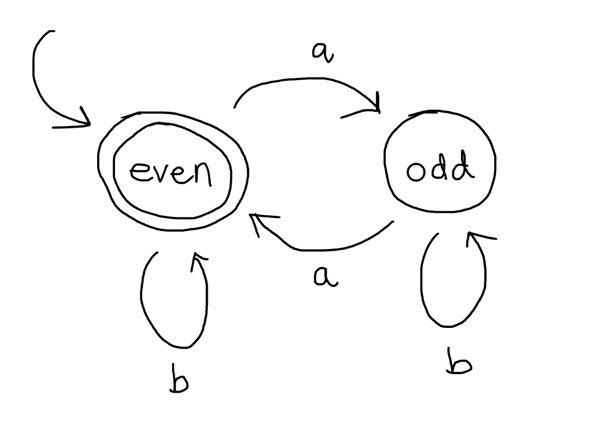
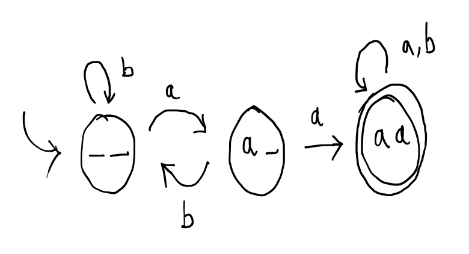
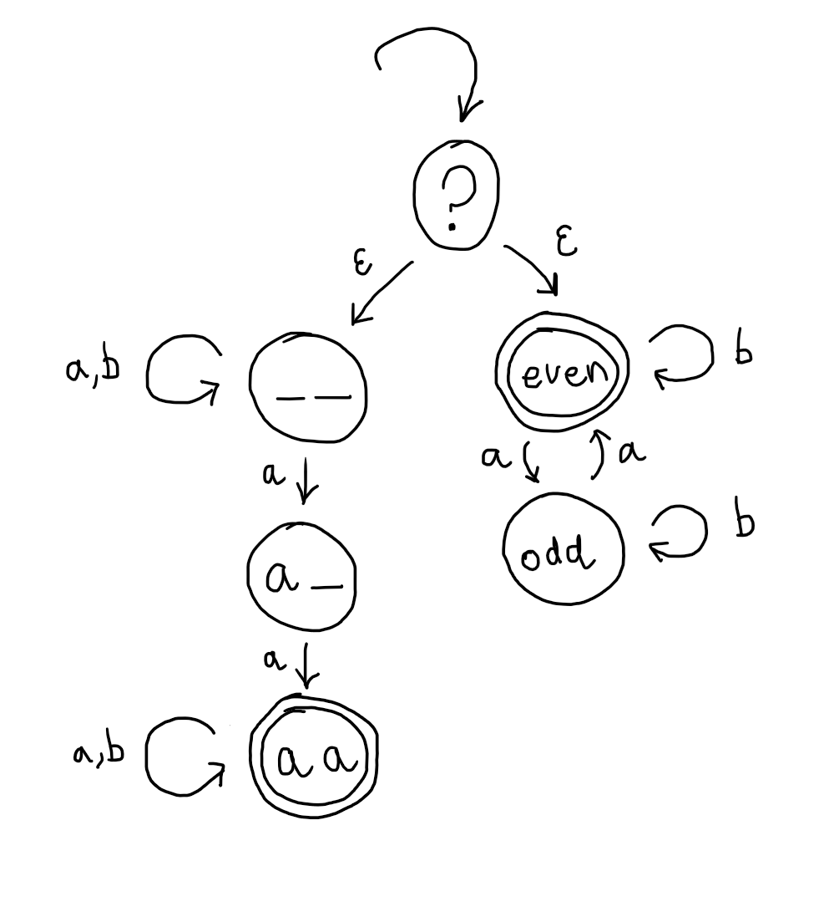
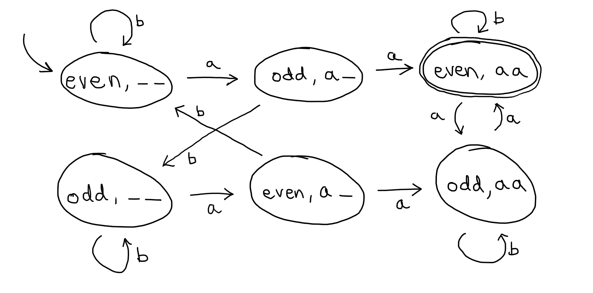

# Finite Automata

In the next two lectures we are looking at a particular class of computational systems, called finite automata.  The role of finite automata is to compute the classification of strings.    Their key feature is that they have a fixed amount of memory.  More specifically, there is some associated notion of internal state, and there are only finitely many possible different states that they can be in over their lifetime. 

## Motivation via physical machines

One way to understand finite automata (and finite state systems more broadly) is as a kind of model of the computation that can be performed by physical machines - some kind of hardware.

Physical machines are finite objects, they are made from a finite amount of material, and a finite amount of material can only be configured in finitely many ways (at least that we can distinguish on the mortal plane).  Say your machine is built from three cogs and a lever, then there are only a fixed number of ways that the cogs can become intermeshed and the lever can either be up or down.

A consequence of this is that, if your computing machine has some kind of discernible "memory", somewhere where it makes a record of data, then there will be a definite upper limit on how much data it can remember.  Remember data - writing to the memory - requires reconfiguring the machine, setting the cogs differently or changing the configuration of the memory bits, and we know there are only finitely many ways in which the machine can be configured.  We say that such machines have a fixed amount of memory - the upper limit is fixed, e.g. 5 bits, or 10kB, or 100MB or 678TB or some other particular number.

Now, if , as we are used to, we require that an input to such a machine is first fully consumed by the machine before processing begins - for example - is first written to the machine's memory before any actions are taken - then the restriction to a fixed amount of memory is very severe.  We simply wouldn't be able to process any inputs that are larger than the available memory.

So, instead, our machines - our *finite automata* - will take in their input bit by bit and process it on the fly.  In particular, since automata are a kind of specialised class of machines that only perform string classification computations, the input will be a string and the automaton will examine it character by character.  Once they have processed the string, they output a classification which is just a Boolean: YES the string belongs to the class or NO it doesn't.

So in summary, these finite automata:

* Have some notion of internal state, but abstract and limited to a fixed number
* Process their input, a string, letter-by-letter
* Classify the string as either being in some class or not.

## Even/Odd Example

The clearest way to describe such machines is to draw a picture, so let's do that:



This machine consists of the following parts:
* It has two *states*, "even" and "odd".
* There is a *transition* from even to odd labelled by $a$, a transition from odd to even labelled by $a$, a transition from odd back to itself labelled by $b$ and a transition form even back to itself labelled by $b$.
* The even state is circled twice, which distinguishes it as an *accepting* or *final* state.
* There is a unlabelled arrow pointing at the even state without any source node, which distinguishes "even" as the *inital* or *starting* state.

The idea is that we think of this hypothetical machine processing some string, built over $$\{a,b\}$$, that it given to it as input letter-by-letter, and then making a decision about how to classify it, either ACCEPT or REJECT.  For example, take the string $aababa$.  When processing this string, the machine begins in its starting state, even, and reads in the first letter.  The first letter is the left-most letter of the string, so it is $a$.  It then transitions to a new state according to the possible transitions listed in the diagram.  In this case, when in state even, there is only one possible transition upon reading $a$, which is to put itself in state odd.  

Now, in state odd, it reads the next letter of the string, which is $a$ again.  The machine makes a transition according to the transitions available to it that are lablled with $a$ in the diagram, so in this case, it is only allowed to change state back to state even.  

Back in state even, it reads the next letter of the string, which is $b$.  According to the available transitions, the only possibility is for the machine to remain in state even and await the next letter of the input.

The next letter of the input is $a$ again, which will cause the machine to transition to state odd, and so on, until the machine gets stuck (because there are no more applicable transitions available) or the machine has read the whole input.

Since finite automata have no way to "go back" and rexamine parts of the word that they already looked at, we often think of them as *consuming* the word letter-by-letter, chomp chomp.

If, *after consuming the entire input string*, the machine finds itself in an accepting state, such as this "even" state, then the input string is said to be *accepted*.  Here, the string $aababa$ is accepted by this automaton.  We can write down a kind of trace of the computation involved:

$$
  \begin{array}{rcl}
    \mathsf{even} &\xrightarrow{a}& \mathsf{odd}\\
	                &\xrightarrow{a}& \mathsf{even}\\
									&\xrightarrow{b}& \mathsf{even}\\
									&\xrightarrow{a}& \mathsf{odd}\\
									&\xrightarrow{b}& \mathsf{odd}\\
									&\xrightarrow{a}& \mathsf{even}\\
	\end{array}
$$

In automata theory, complete traces are sometimes called *runs*, and so we call this an *accepting run* on the word $aababa$.

On the other hand, this automaton does not accept the string $bba$ because through consuming the whole string, the automaton ends its processing in state "odd", which is not an accepting state (not double circled).  The trace of the computation looks like:

$$
\begin{array}{rcl}
    \mathsf{even} &\xrightarrow{b}& \mathsf{even}\\
		              &\xrightarrow{b}& \mathsf{even}\\
	                &\xrightarrow{a}& \mathsf{odd}\\
\end{array}
$$

Since the run of this automaton on input $bba$ ends in a non-accepting state, we will say that $bba$ is *rejected*, or just: *not accepted*.

The set of all strings that are accepted by an automaton is called the language *recognised* by the automaton.  I hope that you can start to see that the only strings that will cause this automaton to end processing in state "even" are those strings that contain an even number of 1s.  Hence, the language recognised by this automaton is the set of all strings that contain an even number of 1s.

## Substring Example

Let's consider another example:



This automaton has three states: $$\_\,\_$$, $$a\,\_$$ and $$a\,a$$.  The initial state is $$\_\,\_$$ and there is one accepting state, which is $$a\,a$$.  The self-loop on state $$a\,a$$ is labelled by $$a,b$$ which is an abbreviation for two separate transitions with the same start and end point, one labelled $$a$$ and the other labelled $$b$$.  

Suppose we feed $$baaab$$ into this machine, what will happen?  Well, the machine begins in state $$\_\,\_$$ by reading in the first letter, which is $b$.  According to the available transitions, its only option is to consume this $b$ and remain in state $$\_\,\_$$.  

Next, it reads the second letter, which is $a$, according to the transitions, it consumes the $a$ and changes to state $$a\,\_$$.

In state $$a\,\_$$, the next letter is another $a$, and it transitions to state $a\,a$.  In state $a\,a$ it reads the next letter, which is the third $a$, and the transition tells it to remain in the same state after reading this letter.  Finally, it will read the last letter, which is $$b$$ and remain in state $a\,a$.  Since $a\,a$ is an accepting state, $baaab$ is accepted by the automaton.  

This accepting run (complete trace that ends in an accepting state) is:

$$
  \begin{array}{rcl}
	  \_\,\_ &\rred{b}& \_\,\_\\
		       &\rred{a}& a\,\_\\
					 &\rred{a}& a\,a\\
					 &\rred{a}& a\,a\\
					 &\rred{b}& a\,a
	\end{array}
$$

<!-- Now, in this automaton, there are other runs on the same word $$baaab$$ and not all of them are accepting.  For example, after consuming the second $a$ we could instead choose again to remain in state $$\_\,\_$$:

$$
  \begin{array}{rcl}
	  \_\,\_ &\rred{b}& \_\,\_\\
		       &\rred{a}& \_\,\_\\
					 &\rred{a}& a\,\_\\
					 &\rred{a}& a\,a\\
					 &\rred{b}& a\,a
	\end{array}
$$

This is not an accepting run since, although the whole word was consumed, the machine did not end in an accepting state.  So, in the case of the word $$baaab$$ there are some runs that are accepting and some runs that are not.  However, because there is *at least one* accepting run, we will say that the automaton accepts the word.  So $baaab$ is in the language of this automaton.   -->

On the other hand, $$ababa$$ is *not* in the language of this automaton since the run of the automaton on this input looks like:

$$
  \begin{array}{rcl}
	  \_\,\_ &\rred{a}& a\,\_\\
		       &\rred{b}& \_\,\_\\
					 &\rred{a}& a\,\_\\
					 &\rred{b}& \_\,\_\\
					 &\rred{a}& a\,\_
	\end{array}
$$

This run ends in state $$a\,\_$$, which is not an accepting state, and so the word $ababa$ is rejected, it is not in the language of this automaton.

By inspection, for the machine to reach the only accepting state $$a\,a$$, it must have consumed two $a$ letters consecutively.  Hence, the language of this automaton only contains words that contain the substring $$aa$$.  Indeed, the language of this automaton is all such words.

## Definitions

I hope you now have a reasonable idea of what finite automata look like and how they compute.  Let's make it a bit more precise.  

The pictures we have drawn are essentially a kind of (labelled) directed graph with extra bits, so that is how we will define an automaton.  



Recall from basic set theory that a function $f$ of type $$A \times B \to C$$ is a mapping from pairs $(a,b)$, with $a \in A$ and $b \in B$, to elements $f(a,b)$ of $C$.  Every possible pair $(a,b)$ has to be mapped to an element $f(a,b)$ of $C$ and no pair can be mapped to two different elements of $C$.

Hence, the even/odd automaton consists of:
* states: $$\{\mathsf{even},\mathsf{odd}\}$$
* alphabet: $$\{a,b\}$$
* transitions: 
    $$
		  \{ \begin{array}{rcl}
			  (\mathsf{even}, a) \mapsto \mathsf{odd},
				(\mathsf{even}, b) \mapsto \mathsf{odd},
				(\mathsf{odd}, a) \mapsto \mathsf{even},
				(\mathsf{odd}, b) \mapsto \mathsf{odd}
			\end{array} \}
		$$
* initial state: $$\mathsf{even}$$
* accepting states: $$\{\mathsf{even}\}$$

The requirement that the transitions of the automaton form a function from $Q \times \Sigma$ to $Q$ amounts to requiring, in the diagram of the automaton, that there is exactly one transition edge out of each node for each letter in $\Sigma$.



<!-- Note that we don't count traces that get stuck somewhere whilst processing a word $w$ as a run on $w$.  For example, consider the $aa$-substring automaton again.  Then we can trace out a computation on $babaa$:

$$
  \_\,\_ \rred{b} \_\,\_ \rred{a} a\,\_ 
$$

However, at this point we are stuck, since the next letter is $b$, but there are no $b$-labelled transitions out of state $$a\,\_$$.  So, this is a not a run on $babaa$, although it is a run on $ba$. -->


<!-- Notice the implicit existential quantification in the definition of acceptance - just if *there is* an accepting run - the machine may have choices to make when it processes the word, and we just need the choices to "work out" (lead to an accept state) one time to be able to declare the word accepted.  

It leads to a real asymmetry between accepting words and rejecting words (not accepting them).  Given an automaton $M$ and a word $w$, for you to convince me that $w$ is accepted by $M$, you just need to show me one accepting run on $w$; but for you to convince me that it is not accepted, you need to argue about all possible runs over $w$ - namely that none of them can ever end in an accepting state.

This is the essence of *nondeterministic* computation, which we will return to discuss more abstractly in later lectures. -->

## Further example

Let's consider another example, with a view to getting some intuition about how to design an automaton that recognises a certain language.

<!-- We saw in the definition that automata may have transitions that are labelled by $\epsilon$.  $\epsilon$-transitions represent a kind of *internal* move by the automaton in which no letters are consumed.  In practice, $\epsilon$-transitions can be useful to offer choices.  For example, the following automaton recognises the language of all strings that *either* contain $aa$ as a substring *or* contain an even number of $a$.



We can think that, when presented with a word that either contains $aa$ or that contains an even number of $a$, the automaton first guesses which it believes is the case, and then it continues by verifying that it's guess was correct.  Formally, to see that e.g. $abaa$ is accepted we only need to exhibit a single accepting run, and we can find the run by following the left-hand choice at the first $\epsilon$-transition. -->

Suppose, we want to recognise all strings that *both* contain $aa$ as a substring *and* have an even number of $a$.

Whenever you are tasked with designing an automaton to recognise a given language, you should first ask yourself: what should the states of the automaton be?  And, to answer this question, you need to ask yourself further: if I wanted to design an algorithm that checks if a word is in this language, and my algorithm is restricted to looking at just one letter at a time (it cannot write the whole input into memory), then what does the algorithm need to remember as it executes?  This will correspond to the states of the automaton.  

In this case, an algorithm for checking if a string contains both $aa$ as a substring and an even number of $a$ and which proceeds one letter at a time would be as follows:

```ocaml
    even := true
    consecutive_as := 0

    while there is another letter to read do
         read the next letter x
         if x = a then
           even := not even
           consecutive_as := min(consecutive_as + 1, 2)
         else
           if consecutive_as = 1 then
             consecutive_as := 0

    if even = true && consecutive_aa = 2 then
      ACCEPT
    else
      REJECT
```

In other words, it would need to remember two things in between finishing reading in one letter and reading in the next: the parity of the number of $a$ and how far through finding the substring $aa$ it is.  In the above algorithm, these were represented concretely by a Boolean variable "even" and an integer variable "consecutive_a", but this number variable will only take on 3 values: 0, 1 and 2.  In our automaton, we will have one state for each of the possible combinations of values of these variables (but we will label them with our more intuitive names from before).



The idea is that, e.g. the state (even,a_) is the state of the automaton after it has read in an even number of a and it has so far seen one consecutive a.  Hence, if it sees another a in this state, it will transition to (odd, aa) because it will now have seen an odd number of a and it will have seen two consecutive a.  It has one accepting state, which is the state (even,aa), because the idea is that the automaton reaches that state only after reading in an even number of a and after seeing two a consecutively.

However, note that the way you label the states has no effect on the computation, there is nothing in the definition of accepting run that asks you to "look inside" a state or see what it is "named".  How you choose to name your states (which objects you choose to represent your states) is purely a way to help reader understand what is the key idea of your automaton (and it will help you a lot when you design a finite automaton).

