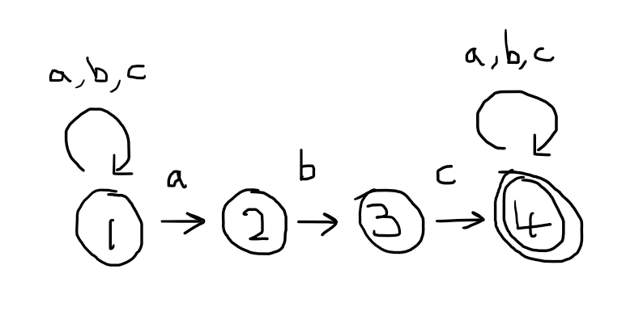
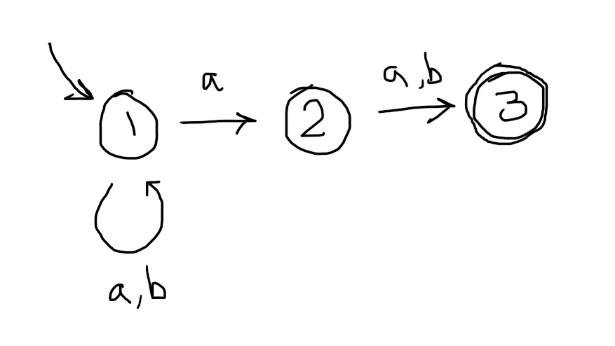
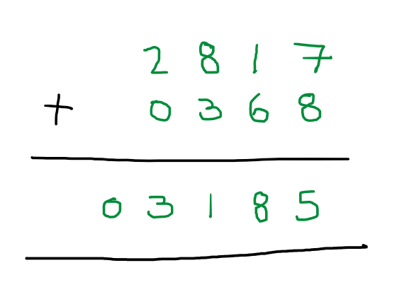
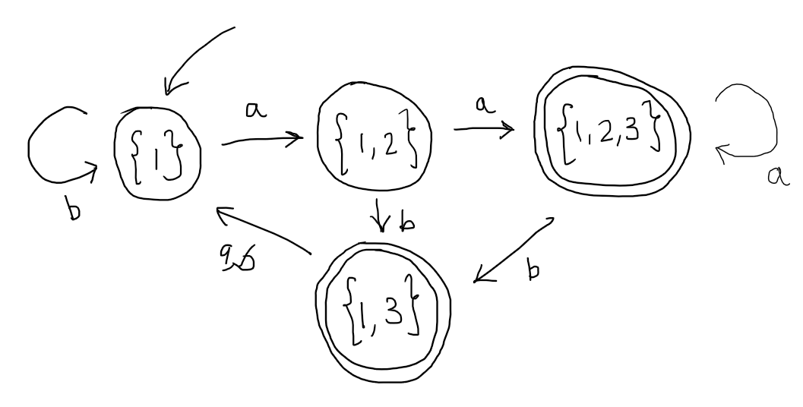
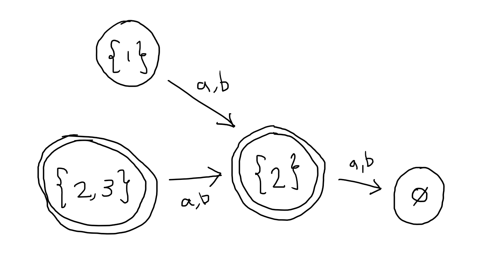

# Determinism

We have sometimes called the computations that can performed by regular expressions or finite automata *non-deterministic*.  Intuitively, it means that there are arbitrary choices that the computation can make, and that we consider a computation to have *succeeded* (e.g. that a word is accepted) just if there is *some* way to make the right choices.

Strictly speaking, it should be called *existential* (referring to *some* above) or *angelic* non-determinism, because there is another dual, kind of non-determinism: in *universal* nondeterminism we only consider a computation to have succeeded if all choices lead to success. However, we will not examine universal non-determinism in this unit.  

Finite automata that *do not* have arbitrary choices to make are called *deterministic*.  At any point in time, their behaviour is uniquely *determined* by their current state and the next letter of the input.  This is guaranteed by the following definition.

{: .defn }
A finite automaton $$(Q,\,\Sigma,\,\Delta,\,q_0,\,F)$$ is called __deterministic__ just if there are no $\epsilon$-transitions and, for each pair $(q,a) \in Q \times \Sigma$ of state and letter, there is exactly one state $p$ that the machine can transition to, i.e. $$(q,a,p)$$ is the only element of $\Delta$ with first two components being $q$ and $a$ respectively.

It is easy to check the diagram of a finite automaton to see if it is deterministic, you just need to check that, for each state, there is exactly one transition coming out of that state for each letter of the alphabet, and no others.  

The following automaton, which recognises the language of words over $\{a,b,c\}$ that contain $abc$ as a substring.  It is deterministic because, if we put our finger on any state, we will find exactly three outgoing transitions, one labelled $a$, one labelled $b$ and the other labelled $c$.

Deterministic finite automata (DFA) have some great properties.  First and foremost, if we fix a word to give to the automaton as input, there is exactly one run over that word.  On the one hand, the automaton never gets stuck whilst processing a word: suppose it is in some state $q$ and the next letter is $a$, well the definition says that there is a transition out of state $q$ labelled by letter $a$, so progress can be made by taking that transition.  On the other hand, there are no choices, there is only one transition out of each state labelled with a given letter.

This means that deciding whether a deterministic automaton accepts a given word is easier.  We no longer have to *find* an accepting run, we just follow the only applicable transition in each state until we have consumed the whole word and check that the state we reach at the end is accepting.  Conversely, we no longer have to reason about all possible runs over a given word $w$ to show that $w$ is *not accepted*, because there is only one possible run.

A consequence of this is that it is very easy to express the complement of a language when the original language is expressed as a deterministic finite automaton.  All we need to do is to take the original automaton and swap the status of accepting and non-accepting states.



If $M$ accepts a word $w$ then, since $M$ is deterministic, there is a unique run over $w$ and it must end in an accepting state, say $q \in F$.  The automaton $\bar{M}$ has the same states and the same transitions, so it will have the same run over $w$ but, in $\bar{M}$, $q$ is now a non-accepting state.  Since $\bar{M}$ must also be deterministic, this is the only run over $w$, so $w$ is rejected.

## Non-determinism as a programming paradigm

So, then why do we not just restrict our attention to DFA?  Non-determinism is a feature that we can use to make designing automata (and programs) easier.  For example, the DFA given above recognises the language $$\{w \in \{a,b,c\} \mid \text{$w$ contains $abc$ as a substring} \}$$, but it is rather complicated.  Compare with a non-deterministic finite state automaton (NFA) that recognises the same language:

If you are comfortable with the idea of non-determinism, then I would argue that this second automaton is a much clearer expression of the language of words containing a substring $abc$.

The conceptually difficult part of understanding non-determinism is grasping that you cannot necessarily tell if a word is accepted from a single run of the machine: in an non-deterministic finite automata (NFA) if a particular run is not accepting (does not end in an accepting state, or does not even consume the whole word), you cannot know for certain that the word is rejected, because there may be another run over the same word that *is* accepting.  So, it does not fit with our everyday experience of machines, which is that they take an input, do some processing and, on the basis of this processing, make a decision (in this case ACCEPT or REJECT).

However, there is an informal but popular way to understand non-determinism that does fit with our model of machines described in the previous sentence.  According to this, we think of the machine performing a single run and making the decision at the end of the run, but the machine has the special power of being able to *correct guesses*.  What this means is that, when presented with a choice of transition due to nondeterminism, the machine will always take a transition that leads eventually to an accepting state.  Of course, this power to seemingly see into the future also does not accord with our everyday understanding of machines, but we will resolve this shortly.

For now, I want you to know that this special power of making *correct guesses* leads to a new tool that you can use in the design of finite automata.  If you can rephrase the property of strings that you are looking to express as *guess X, then verify X*, it becomes amenable to non-determinism.  For example, the property of having $abc$ as a substring can be reformulated as "guess where the substring $abc$ starts, then verify that the next three letters are $abc$".  This is the strategy employed by the previous automaton.

Earlier, we saw the automaton that accepts words that either have an even number of $1$ or contain the substring $aa$.

The design of this automaton is based on "guess whether the word contains $aa$ or has an even number of $1$s, then verify that".

Suppose we want to design an automaton to recognise the language $$\{wa\ell \mid w \in \{a,b\}^*, \ell \in \{a,b\} \}$$ of words over $$\{a,b\}$$ that have an $a$ in the second to last position.  A DFA for this language requires some serious thought, but an NFA is quite straightforward: whenever we see an $a$, we guess whether or not we have come to the second to last letter, and if we guess so, then verify it is second to last.

More advanced general purpose programming languages, like Haskell, also allow you to program with non-determinism.  In Haskell, non-determinism is treated as an effect, so it can be implemented using the Monad interface.

To see an example of what it looks like, consider the old constraint satisfaction puzzle:

The problem is to find an assignment of *distinct* digits $0$--$9$ to the letters $S$, $E$, $N$, $D$, $M$, $O$, $R$ and $Y$ such that the equation is satisfied.  For example, one solution is to assign as follows:

$$
  \begin{array}{c}
    S = 2\\
    E = 8\\
    N = 1\\
    D = 7\\
    M = 0\\
    O = 3\\
    R = 6\\
    Y = 5
  \end{array}
$$

Since then the equation is satisfied:

I discovered this solution using the following Haskell program:

~~~ haskell
digits = [0..9]

sendMoreMoney =
  do s <- digits
     e <- digits \\ [s]
     n <- digits \\ [s,e]
     d <- digits \\ [s,e,n]
     m <- digits \\ [s,e,n,d]
     o <- digits \\ [s,e,n,d,m]
     r <- digits \\ [s,e,n,d,m,o]
     y <- digits \\ [s,e,n,d,m,o,r]
     guard (y == (d + e) `mod` 10)
     let c1 = (d + e) `quot` 10
     guard (e == (n + r + c1) `mod` 10)
     let c2 = (n + r + c1) `quot` 10
     guard (n == (e + o + c2) `mod` 10)
     let c3 = (e + o + c2) `quot` 10
     guard (o == (s + m + c3) `mod` 10)
     guard (m == (s + m + c3) `quot` 10)
     return (s,e,n,d,m,o,r,e,m,o,n,e,y)
~~~

I am not going to explain this Haskell program in detail, but if you understand how Monads work, then you can look up the list monad in order to see the nuts and bolts of what is going on.  However, at a conceptual level, the program first non-deterministically *guesses* the digit that should be assigned to $s$, which can be any digit, the digit that should be assigned to $e$, which can be any digit other than the digit assigned to $s$, the digit assigned to $n$, which can be any digit except that chosen for $s$ or $e$ and so on.  Then it simply *verifies* that the equation is satisfied by those choices, i.e. that the digit assigned to $y$ is the sum of the two digits assigned to $d$ and $e$ modulo $10$ and so on.  Finally, we just return the assignment.

## Determinisation

Of course, in the end we must run this Haskell program on a real machine, and we will want to run our finite automata on a real machine too in order to match strings.  Unfortunately, real machines do not have the power to make magic *correct guesses*.  Luckily, we can always compile finitary non-determinism down into something more mundane (and deterministic), just by exploring all the possibilities at once.  This process is called *determinisation*.

I will describe the determinisation of finite automata.  Given any finite automaton $M$, we can mechanically (by an algorithm) construct a new, *deterministic* finite automaton $N$ which recognises the same language as $M$, i.e $L(N) = L(M)$.  It can be done in one step, but we will do it in two so that the explanation is a bit clearer.  

First we remove any epsilon transitions from $M$.  We could use the $\epsilon$-closure operator that you saw in the previous problem sheet for this, or we can just compute, for each pair of states $p$ and $q$ of $M$, whether it is possible to reach $q$ from $p$ whilst reading in a single letter $a$.  Using this idea, we can create a new automaton as follows:



This automaton $$\epsilon^*(M)$$ recognises the same language as $M$: $$L(\epsilon^*(M)) = L(M)$$, but does not use any $\epsilon$-transitions.  So, since we can always construct an automaton $$\epsilon^*(M)$$ that is equivalent to the automaton $M$ we are interested in, we may as well assume that the automaton we are interested in does not have $\epsilon$-transitions.

Given an automaton $N$ without $\epsilon$-transitions, we can determinise the automaton by constructing a new automaton $$\pow(N)$$ which simulates a version of $N$ running all non-deterministic choices simultaneously.

As usual, the first step in designing $$\pow(N)$$ is to think about what the automaton will need to remember in between reading in each letter.  Take a look at the automaton above again, reproduced here for convenience:

Imagine a kind of parallel version of this automaton, in which all non-deterministic choices can be taken simultaneously.  We would start in state 1 as usual, then if we see an $a$, the machine would somehow take both $a$ transitions simultaneously, and be in *both* state $1$ and state $2$.  Now suppose it sees another $a$ after that.  From state $1$ it can again stay in state $1$ or go to state $2$, and from state $2$ (remember, it took two transitions simultaneously, so it was in both state $1$ and state $2$ at the same time) it can only go to state $3$.  So, if we take all these transitions simultaneously, the automaton will be in states $1$, $2$ and $3$ at the same time.  

It seems like what we need is for $\pow(N)$ to remember the *set of possible states* that $N$ can be in after reading in any prefix of the word.  The idea of the automaton will be that $\pow(N)$ is in state $$\{q_1,...,q_k\}$$ after reading in $w$ just if $N$ could be in any $q_1$, or $q_2$, or ... or $q_k$ after reading in $w$, depending on which choices it made.  

Formally, the construction is as follows.  It is helpful to use the following notation.  If $\Delta$ is a set of transitions, $p$ is a state and $a$ a letter, then we write $\Delta(p,a)$ for the set $$\{q \mid (p,a,q) \in \Delta \}$$.



Although $\pow(N)$ has a state for *every* subset of state of $N$, in most cases it will not use all of them: some subsets will not be correspond to the possible choices in any computation, and so will not be readable from the initial state.  So, in practice, a good way to compute $\pow(N)$ - to carry out this construction - is to create the sets of states on demand based on a simulation of $N$.  

Let's do this on the automaton above, which I will temporarily refer to as $N$ for short.  We start by putting down the initial state of $\pow(N)$, which is the singleton set $$\{1\}$$.  Then we ask ourselves, what is the set of all states that can be reached by starting in state $1$ and reading in an $a$?  An inspection of $N$ reveals that this is the set $$\{1,2\}$$, so we add this set as a new state of $\pow(N)$ and add a transition from $$\{1\}$$ to $$\{1,2\}$$ on $a$.  Next, we ask ourselves, what is the set of all states that can be reached by starting in state $1$ and reading in a $b$?  Inspection of $N$ tells us this is just $$\{1\}$$ again, so we place a self-loop on $$\{1\}$$ labelled $b$.

Now we have covered all the possibilities for state $\{1\}$, because we know what happens on reading and $a$ and what happens on reading a $b$.  We next turn to the new state, $$\{1,2\}$$ and ask: what is the set of all states that can be reached by $N$ when it starts from any state in the set $$\{1,2\}$$ by reading an $a$.  To answer this we have to sum up (union) the states that $N$ can reach starting in $1$ and the states that $N$ can reach starting in $2$.  From state $1$, we already know that $N$ can reach states $1$ and $2$ by reading an $a$, and from state $2$, $N$ can reach only state $3$.  We take the union $$\{1,2\} \cup \{3\}$$ to obtain a new state $\{1,2,3\}$ which tells us all the states that $N$ can reach when starting from any state in $$\{1,2\}$$ by reading in an $a$.  We ask the same question again for letter $b$, and obtain the set $$\{1,3\}$$ because $N$ can transition from state $1$ to itself on $b$ and $N$ can transition from $2$ to $3$ on $b$.  

Continuing in this way, we obtain $\pow(N)$:

And this automaton has the property that (a) it is deterministic and (b) the state $X$ it ends at after reading in a word $w$ is exactly the set of all possible states that $N$ can end at after reading in the same word $w$.  For example, a run of this automaton on word $aab$ ends in state $$\{1,3\}$$.  You can verify that these are exactly the states that $N$ can end in after reading in $aab$, depending on what choices are made.  

Therefore, if, after processing the word $w$, $\pow(N)$ ends in a state that contains an accepting state of $N$, this means that there is a possible run of $N$ that ends in this accepting state, and hence $N$ would accept this word.  That is why the accepting states of $\pow(N)$ are those sets of states that contain an accepting state of $N$.

However, the automaton above, although satisfying all the properties we desired of it, is not exactly as I have described in the formal description of the construction.  As mentioned earlier, the formal description says that there is a state of $\pow(N)$ for *every* set of states of $N$.  So really, we are missing this piece:

However, this piece is completely disconnected from the initial state $$\{1\}$$, so typically we do not bother to include it, even though the formal description would have us do so.  Intutively, the reason it is disconnected is because each of the sets involved, e.g. $$\{2,3\}$$ do not represent possible non-deterministic computations of $N$: there are no words that have runs in $N$ that end in either state 2 or 3 but not state 1.

## Applications

Since we have a way, via the proof of Kleene's Theorem, to convert between regular expressions and finite automata, determinsation has a couple of useful consequences for our language of regular expressions.

1. We now have a way to implement regular expressions on a machine, by compiling them down to a deterministic automaton.  A deterministic automaton can be implemented just using a loop that, on each iteration, reads the next letter of the input and keeps track of the current state in a variable.  For example, if we number the states of the automaton above as: $$1 := \{1\}$$, $$2 := \{1,2\}$$, $$3 := \{1,2,3\}$$, $$4 := \{1,3\}$$, then we can code:

        q := 1

        while input is not empty do
          x := next letter of input
          if q = 1 and x = a then 
            q := 2
          else if q = 1 and x = b then
            q := 1
          else if q = 2 and x = a then
            q := 3
          else if q = 2 and x = b then
            q := 4
          else if q = 3 and x = a then
            q := 3
          else if q = 3 and x = b then
            q := 4
          else if q = 4 then
            q := 1

        if q = 3 or q = 4 then
          return ACCEPT
        else
          return REJECT

    This can be made more generic by storing the transitions in a list of pairs or a 2d array and doing lookups.

2. We can use the fact that deterministic automata can be negated to add a negation operator $\sim$ to our language of regular expressions.  To compile $\mathord{\sim}\,R$ we would first compile $R$ to a deterministic automaton, then exchange its accepting and non-accepting states.
