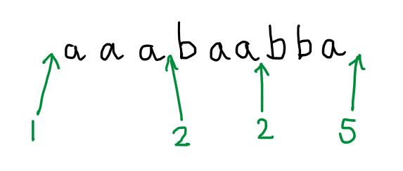
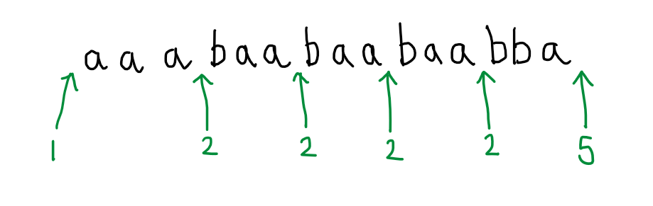
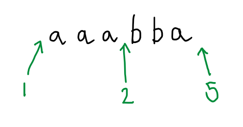
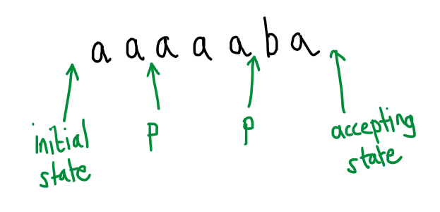
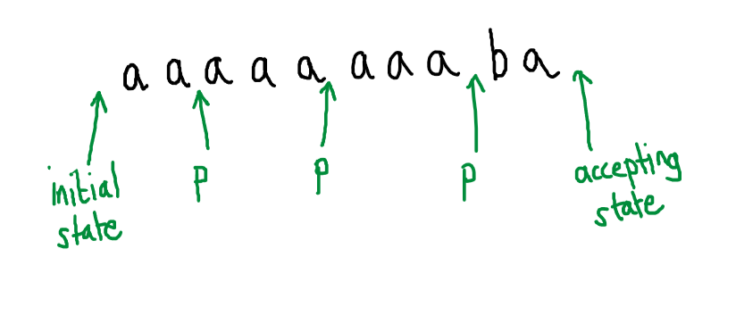
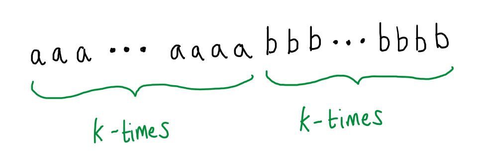
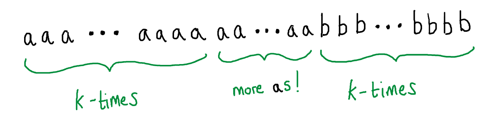

# Inexpressibility of Matched Parentheses

<!-- I started our study of regular expressions by showing you [this](https://stackoverflow.com/questions/1732348/regex-match-open-tags-except-xhtml-self-contained-tags/1732454#1732454) StackOverflow post, in which a well-educated computer scientist descends into despair at the prospect of telling yet another hacker that what they are trying to do is a mathematical impossibility.  We are now in a position to understand this poor fellow's predicament.   -->

We will do some theory to show that it not possible to parse arbitrary HTML using only regular expressions.  

Exploring the limitations of a concept, deriving negative results, is one place where theory really shines.

Think of it this way, if you want to convince me that something is possible - it's possible to write an algorithm to solve some problem, it's possible to compute some quantity, it's possible to perform some computational task, well, to convince me you can just do it.  You can write the algorithm or design the program or whatever it is.  But if you want to convince me that something is impossible, what can you do?  You can show me that a particular approach doesn't work, you can show me that this particular algorithm doesn't always solve the problem, but I won't be convinced by that, because I will say, well, maybe you just need to be a bit more imaginative and come up with a cleverer algorithm.

One of the great things about theory is that we can use it to reason about all possibilities at once, even if there are infinitely many, and in a convincing way.  So we can actually prove that there simply cannot exist an algorithm that solves a certain problem (which you will look at with Alex in the last part) or, in this case, to show that there cannot possibly exist a regular expression that expresses a particular language.

Although we are primarily interested in regular expressions, we know from Kleene's Theorem that finite automata can express all the same languages.  So, if we can show that there is no finite automaton that recognises HTML, then we can deduce that there cannot be any regular expression that denotes HTML either (matches exactly the well-formed HTML strings).  Also, rather than look at HTML specifically, we will effectively show that any language that allows for arbitrary nesting of matched "parentheses" is not recognisable by a finite automaton.

I have quoted "parentheses" because I mean something more general than just "(" and ")".  For example, in HTML we can view opening and closing tags as a generalised kind of parentheses, in the sense that we have to match every opening tag, like &lt;td&gt; (= opening paren), with a corresponding closing tag, like &lt;/td&gt; (= closing paren) in order for the HTML to be well formed.  Just like parentheses in an arithmetic expression, some pairs of tags can be nested without limit.  For example, the following nested list: 

<ul>
  <li>a</li>
  <li>more:
     <ul>
       <li>b</li>
       <li>c</li>
       <li>more:
         <ul>
            <li>d</li>
            <li>more:
              <ul>
                <li>e</li>
                <li>f</li>
              </ul>
            </li>
         </ul>
       </li>
       <li>g</li>
       <li>h</li>
       <li>more:
         <ul>
           <li>i</li>
           <li>j</li>
         </ul>
       </li>
     </ul>
  </li>
  <li>k</li>
  <li>l</li>
</ul>

Is generated by the nested &lt;ul&gt; &lt;/ul&gt; "parentheses":

    <ul>
      <li>a</li>
      <li>more:
        <ul>
          <li>b</li>
          <li>c</li>
          <li>more:
            <ul>
                <li>d</li>
                <li>more:
                  <ul>
                    <li>e</li>
                    <li>f</li>
                    <li>more...</li>
                  </ul>
                </li>
            </ul>
          </li>
          <li>g</li>
          <li>h</li>
          <li>more:
            <ul>
              <li>i</li>
              <li>j</li>
            </ul>
          </li>
        </ul>
      </li>
      <li>k</li>
      <li>l</li>
    </ul>

<!-- The argument we will use has the following shape.  First we will show that the languages expressible by finite automata *all* satisfy a certain property - without exception they *all* share a particular characteristic.  Then we will show that a language of matched parentheses does not have this characteristic, therefore it must not be expressible by a finite automaton.

So we will want to say something about all the infinitely many languages expressible by finite automata (equivalently regular expressions) but, to warm up, I want to take a look at one specific language expressed by a finite automaton, so that we can make an observation.  So, here's an automaton, it doesn't do anything interesting I just made it up to give us something to look at. -->

To warm up to the argument, I want us to look at one particular automaton.  It doesn't do anything interesting I just made it up to give us something to look at.

Now, one word accepted by this automaton is $baaa$.  How do I know that?  Because there is an accepting run over this word: a trace that starts in the initial state, consumes the whole word and ends in an accepting state.

$$
  \begin{array}{rcl}
    1 &\rred{b}& 2\\
      &\rred{a}& 3\\
      &\rred{a}& 4\\
      &\rred{a}& 5
  \end{array}
$$

Now, if we view an automaton as a kind of directed graph (with states as vertices and transitions as labelled edges), then an accepting run like this is nothing but a path through the graph that starts in the initial state and ends in an accepting state.  We can discover other words that are accepted by this automaton by taking a different path through its graph, so long as we start at state 1 and end in either state 4 or state 5.  For example, we could take the path that starts at state 1, cycles there three times, then moves to state 2, from there to state 3, then state 4, then cycles between state 4 and state 2 twice before ending in state 5:

$$
  \begin{array}{rcl}
    1 &\rred{a}& 1\\
      &\rred{a}& 1\\
      &\rred{a}& 1\\
      &\rred{b}& 2\\
      &\rred{a}& 3\\
      &\rred{a}& 4\\
      &\rred{b}& 2\\
      &\rred{b}& 4\\
      &\rred{a}& 5
  \end{array}
$$

Ok, so much for this automaton.  I want to take a step away from this particular automaton now - after all we are aiming to say something that should be common to all automata.  So I invite you to imagine that I didn't show you the automaton pictured above.  Suppose I just told you that this is an accepting run of an automaton, but I didn't tell you which automaton it was.  Even though we no longer have access to the diagram from which to trace out new paths, we can nevertheless deduce other words that are accepted by this mystery automaton.  In fact, infinitely many of them.

To see this, I'm going to abbreviate the accepting run by just recording certain important changes of state:

Even though (we are pretending that) we have not seen the details of the automaton for which this is an accepting run, we can deduce that there is a path in that automaton that goes from the initial state (state 1) to state 2, from state 2 back to state 2 again, and from state 2 to an accepting state (state 5).  

A feature of this path is that it includes a repeated state: the automaton visits state 2 once and then revisits it later in the run.  This is important.  A consequence of this is that we can immediately infer that other paths exist, and therefore that other words are accepted.  For example, it must be possible to go from the initial state to state 2, from state 2 back to state 2 again (as was done above), then from state 2 back to state 2 a second time, even a third time and then, after revisiting state 2 for the third time, to head from there to state 5 and accept.

In other words, the fact that the specimen run that we are given includes a repeated state indicates that there is a loop in the automaton, that this loop lies on a path between the initial state and the final state, and hence we can imagine the automaton choosing to go around that loop any number of times as part of accepting a word.  This includes the possibility of going round the loop zero times:

Ok, now I want to take another step away from the particular features of this particular automaton.  Imagine now that I didn't give you the picture of the automaton and neither did I give you the accepting run.  This time I *only give you an accepted word*, but additionally, I also tell you *how many states* the automaton has, here 5.  I am feeling generous, so the accepted word I give you is $aaaaaba$.  Can you deduce any other words that must be accepted?

Well, not exactly, but we do know the rough shape of infinitely many other words that are accepted.  

This time you don't know exactly where important state changes happen, but you do know that there *must* be a state that is repeated within the processing of the first 5 characters of this word.  It cannot be otherwise, since I told you that there are only 5 different states in this automaton.  Therefore, the automaton has a loop.  From the information we have, we don't know how many states are involved in this loop, the automaton might be cycling between 2 states or going round a 3-cycle or maybe just going round and round a self-loop from one state back to itself (this is the truth in the case of our automaton and this word).  Suppose for arguments sake that 3 $a$s are read as a result of going around this loop and that the start of the loop is some state $p$:

In this case, we would know that there must be another path through this automaton that starts at the initial state, ends in an accepting state (and hence accepts the word that labels the path) and passes through the loop twice: 

Note: *the rest of the run after exiting the loop is unchanged*.  Thus we know that $aaaaaaaaba$ is also an accepted word, so is $aaaaaaaaaaaba$ and so on... we can deduce infinitely many more accepted words in this case.  

However, even if we don't know how many letters are read during the loop (it may not be 3, it could have been 2 or 1 or...), we do know it involves reading in at least 1 $a$ letter, and so we know there are infinitely many more words that are accepted by the automaton each of the form $aaaa...aaaba$.

Hold that thought.

{: .defn }
__No Matched Parentheses Theorem:__ The language $$\{a^nb^n \mid n \in \mathbb{N}\}$$ is not recognised by any finite automaton.

This language $$\{a^nb^n \mid n \in \mathbb{N}\}$$ can be thought of as matched parentheses if we think of $a$ as being the opening parenthesis and $b$ as being the closing one.  Words in this language follow the pattern:

$$
\epsilon, ab, aabb, aaabbb, aaaabbbb, aaaaabbbbb, ...
$$

We are going to prove that this language is not recognisible by a finite automaton, by first supposing that it is recognisible and then arguing that this leads to nonsense, i.e. that we would be able to deduce something that we know to be false.

So suppose that this language *is* recognisible by a finite automaton.  Then, by definition, there is a particular finite automaton that we can use to recognise it, say $M$.  We don't know what that finite automaton $M$ looks like, it may have 5 states or it may have 25 or 255, but it has some definite number of states and some transitions between them and so on.  Since we don't know its exact number of states, let's just call that number $k$: it has some number $k$ of states.  

Well whatever particular number $k$ turns out to be, I can always find a word from the language of matched parentheses that is much longer than $k$, like $$a^kb^k$$, which is of length $2k$:

This word is long enough that an automaton with $k$ states must revisit one of those states when reading in the initial prefix of $a$s - i.e. the automaton is already going round a loop before any $b$ has been read in at all.  But, that means, by our previous reasoning, that we could find more paths through the automaton that differ from the accepting run for $$a^kb^k$$ just in that they go around this $a$-labelled loop more times.  But that would mean that this automaton $M$, that is supposed to accept only words from the matched parenthesis language, must also accept words that are not properly matched, i.e. with more $a$ than $b$:

 

This is nonsense, the whole point of this automaton $M$ is that it recognises $$\{a^nb^n \mid n \in \mathbb{N}\}$$, so we are forced to conclude something we know to be simply untrue, namely that there are words of unmatched parentheses - with more $a$ than $b$ - in $$\{a^nb^n \mid n \in \mathbb{N}\}$$.  

So where did our reasoning go wrong that we are led to this absurd conclusion.  The whole argument rests on the very first step, where we assumed (or supposed) that $$\{a^nb^n \mid n \in \mathbb{N}\}$$ could be recognised by a finite automaton.  Everything after that is an inescapable consequence, it follows logically.  Therefore, we must accept that we were wrong to suppose that there is an automaton that recognises this language, in other words: *the language is not recognisible by any finite automaton*.
