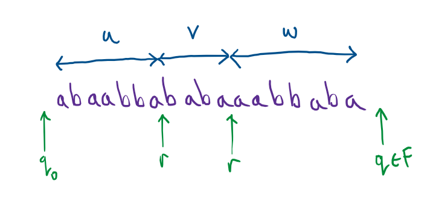

# Regular Languages

We have seen, through Kleene's Theorem, that Regular Expressions and Finite Automata express exactly the same languages.  In fact, it is known that this same class of languages is expressible using many other natural mathematical devices too.  So, there is a sense in which this class of languages is special and has a life of its own quite apart from the particular mechanism that defines it.  We call this class of languages *regular*.



## Pumping Lemma

The argument we used in showing that $$\{a^nb^n \mid n \in \mathbb{N}\}$$ is *not* recognisible by any finite automaton rested on a certain observation about the behaviour of small automata that accept long words: namely that they must loop, and by going through the loop more or less often we can deduce other words that they also accept.

Now we will turn this into an observation about all regular languages.  It is called the *pumping lemma*.  Recall that $\lvert w \rvert$ is the length of the word $w$ and $v^k$ is the word $v$ concatenated with itself $k$-times.



The pumping lemma is really just a restatement of our observation about automata but with all the automata specific parts removed.  The lemma is a statement about any regular language $A$.  We know that a language is called regular when there it is expressible by a finite automaton, so we know that there is a finite automaton, say $M$, that recognises this language $A$.  Then that finite automaton has some particular number of states, although we don't know how many, say $p$.  We observed that, if an automaton with $p$ states accepts a word $w$ whose length is at least $p$ - the number of states, then the accepting run must have revisited a state, i.e. gone round a loop (depicted in green below).

This naturally splits the word into three pieces, the bit before visiting the repeated state the first time, say $u$, the bit where the automaton goes round the loop, say $v$, and then the rest, say $w$.  We don't know exactly where the split occurs because we don't know exactly when the automaton is on the loop.  However we do know:
* __(P1)__ The automaton reads in at least one letter during this loop, i.e. the piece $v$ is not empty.
* __(P2)__ The loop must occur somewhere within the first $p$ letters, since a state must be revisited in that time.  That means that the length of the first two pieces is at most $p$: $\lvert uv \rvert \leq p$.
* __(P3)__ We can deduce that other words are accepted by the automaton going round the loop more or less often.  In other words, for every number $i$ of times going round the loop, we can deduce another word $$uv^iw$$ that is accepted (the word has the same first and last piece, but the loop piece is repeated $i$ times).

We turned this observation into an argument for the non-recognisibility, we might now say the *non-regularity* of the simple language of matched parentheses $$\{a^nb^n \mid n \in \mathbb{N}\}$$.  First we suppose the opposite, that it is true, then we show that an inevitable consequence is that we end up contradicting something we know to be true.  Let's do that again, this time using the pumping lemma.

{: .defn }
__Theorem:__ $$\{a^nb^n \mid n \in \mathbb{N}\}$$ is not regular

Proof:
1. We suppose $$\{a^nb^n \mid n \in \mathbb{N}\}$$ *is* regular and aim to find a contradiction: to show that something absurd follows from this.
2. Then, by the pumping lemma, there is some number $p \geq 1$ and, for strings of this language of length at least $p$, they can be split into three pieces $uvw$ that satisfies properties (P1), (P2) and (P3).
3. A string in this language of length at least $p$ is $$a^pb^p$$, and so there is a splitting of $a^pb^p$ as $uvw$.  We don't know exactly where the splits occur, but we do know from (P2) that $$\lvert uv \rvert \leq p$$, so $uv$ is a string of $a$s and the remaining part, $w$, consists of any remaining $a$ and then the $b$s.  Therefore $w$ is of shape $a^{p-\lvert uv \rvert}b^p$.
4. From (P3) we can conclude that $$uv^2w \in \{a^nb^n \mid n \in \mathbb{N}\}$$.  However: $$uv^2w = a^{\lvert u \rvert}a^{2\lvert v \rvert}w$$ and, from what we deduced about $w$ above, this is $$a^{\lvert u \rvert}a^{2\lvert v \rvert}a^{p-\lvert uv \rvert}b^p$$. If we add up how many $a$ we have: $$\lvert u \rvert + 2\lvert v \rvert + p - \lvert uv \rvert = \lvert v \rvert + p$$.  By (P3), $$\lvert v \rvert > 0$$, so $\lvert v \rvert + p > p$.  So we have concluded that there is a string in $$\{a^nb^n \mid n \in \mathbb{N}\}$$ with more $a$s than $b$s.  This is the absurdity that we were looking for.  
5. Therefore, our supposition in step 1 must have been incorrect and we conclude that $$\{a^nb^n \mid n \in \mathbb{N}\}$$ *is not* regular.

The argument is a standard shape for showing that some proposition $A$ is *not* true, in this case that the language is *not* recognisable.  We first suppose that $A$ *is* true, and then show this leads to something we know to be false - an absurdity.  So, intuitively, something has gone wrong in our reasoning.  Since $A$ being true was the only unjustified assumption we made, and everything followed logically from that -- including the absurdity -- we are forced to point the finger at this as fault, and thus we conclude the opposite, that $A$ must be false.  

It's a pattern of reasoning we use, informally, quite frequently.  Suppose I claim to you that half of your cohort already have computer science degrees from another university.  I guess you doubt this and probably you say to yourself: "If that was true, then they would not be here doing a computer science degree again, but they are here, so that is absurd.  Therefore, it must be false."  By analogy, our proof is saying: "If language L were regular, then it would be pumpable (you would be able to find infinitely many words with a repeated sections early in the word), but there are words of this form that do not belong to this language, so $L$ cannot be regular."

## Using the pumping lemma

Let's see another example of the pumping lemma.  This time we will show that the language of words that can be split into two identical pieces is not regular.

{: .defn }
__Theorem:__ $$\{ww \mid w \in \{0,1\}^*\}$$ is not regular.

Proof:
1. Suppose $$\{ww \mid w \in \{0,1\}^*\}$$ *is* regular.
2. Then, by the pumping lemma, there is some number $p \geq 1$ and, for strings of this language of length at least $p$, they can be split into three pieces $uvw$ that satisfies properties (P1), (P2) and (P3).
3. An example of a string of this language of length at least $p$ is $$0^p10^p1$$, and so we are guaranteed a splitting $uvw$ that satisfies (P1), (P2) and (P3).  We don't know where the splits occur, but (P2) tells us that $\lvert uv \rvert \leq p$, so $uv$ consists entirely of $0$s.  Therefore, $w$ consists of the remaining $0$s, followed by a $1$ and then $$0^p1$$, i.e. $$w = 0^{p - \lvert uv \rvert}10^p1$$.
4. Using (P3), we can pump the $v$ part to obtain other words in this language.  So we conclude that, e.g. $$uv^0w = uw \in \{ww \mid w \in \{0,1\}^*\}$$.  But this is nonsense, because $$uw = 0^{\lvert uv \rvert - \lvert v \rvert}0^{p-\lvert v \rvert}10^p1$$.  If we add the number of $0$ in the initial segment, then we have that this word is $$0^{p-\lvert v \rvert}10^p1$$, which cannot be of the form $ww$ for any $w$ since, by (P1), $$p - \lvert v \rvert \neq p$$.
5. Therefore, we conclude that our initial supposition was wrong and $$\{ww \mid w \in \{0,1\}^*\}$$ *is not* regular.

We use the pumping lemma as a tool to show that certain languages are not regular.  Hopefully you can begin to see that, in many cases, the proofs  follow a similar pattern: 

1. First suppose that a given language $A$ is regular.
2. Then use the pumping lemma to give a guarantee about sufficiently long words, namely that they can be split as $uvw$ satisfying (P1), (P2) and (P3).  
3. We then choose a particular example of a word from the language and deduce something about what the split must look like based on (P1) and (P2). 
4. Then we show that "pumping" this word using (P3) -- using the word as a kind of template for deducing other words in the language -- leads to us deducing that some word is in the language which is actually excluded by definition of the language.
5. Since we obtained an absurdity, we get to conclude that our original supposition was false, and thus $A$ must not be regular.

We can be on autopilot during 1, 2, 5 and often also during 4, but step 3 requires some ingenuity.  We have to choose just the right sort of long word that will allow us to pump it and obtain a word not in our language.  We have to be mindful of the fact that we don't get to choose the split $uvw$, we can only rely on certain properties - (P1), (P2) and (P3) of it.

Another example:

{: .defn }
__Theorem:__ The language $$\{a^{n!} \mid n \in \mathbb{N}\}$$ is not regular.

Proof:
1. Suppose $$\{a^{n!} \mid n \in \mathbb{N}\}$$ *is* regular.
2. Then, by the pumping lemma, there is some number $p \geq 1$ and, for strings of this language of length at least $p$, they can be split into three pieces $uvw$ that satisfies properties (P1), (P2) and (P3).
3. An example of a string of this language of length at least $p$ is $$a^{p!}$$, and so we are guaranteed a splitting $uvw$ that satisfies (P1), (P2) and (P3).  We don't know where the splits occur, but since there is only one letter in the alphabet, $a$, we have that all three pieces $u$, $v$ and $w$ are just some sequences of $a$ with (P1) and (P2) together giving us that $1 \leq \lvert v \rvert \leq p$.
4. Using (P3), we can pump the $v$ part to obtain other words in this language.  This part is a little more difficult.  We deduce that, e.g. $$uv^{(p+1)! + 1}w = a^{p!+(p+1)! \cdot \lvert v \rvert} \in \{a^{n!} \mid n \in \mathbb{N}\}$$.  But this is nonsense, because $$p!+(p+1)!\cdot\lvert v \rvert$$ cannot have the form $n!$ for any natural number $n$.  To see why, we observe that $$p! + (p+1)!\cdot\lvert v \rvert = p!(1 + \lvert v \rvert(p+1))$$.  Suppose this is equal to $$n!$$ for some $$n$$.  Necessarily this $n$ is at least $p+1$ since this expression is strictly larger than $p!$. Then we have $$n!/p! = 1 + \lvert v \rvert (p+1)$$ by dividing both sides by $p!$, but the LHS has $p+1$ as a factor, whereas the RHS does not.  So they cannot be equal.

5. Therefore, we conclude that our initial supposition was wrong and $$\{a^{n!} \mid n \in \mathbb{N}\}$$ *is not* regular.

## Not using the pumping lemma

The pumping lemma only tells us a property that is shared by all regular languages, namely that sufficiently long strings in those languages can be "pumped" to generate new strings in the same language.  However, this property does not *characterise* regularity.  In other words, there are languages that are not regular that may also be pumped in this way.  

The upshot of this is that we cannot use the pumping lemma to deduce that some language *is* regular, only that it *is not* regular.  So, if you are asked to prove that some language *is* regular, don't look to the pumping lemma!

