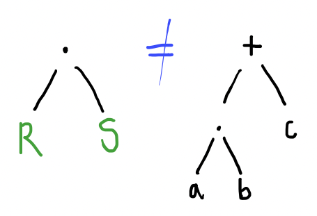

# Operational Semantics of Regular Expressions

We gave an informal explanation in [Regex Syntax](syntax.html) of how to understand a regular expression in terms of the strings that are matched by each of its pieces.  For example, we said that an expression $a$ matches the string consisting just of $a$ and $R + S$ will match every string that is either matched by $R$ or matched by $S$.  We are now going make that precise.

<!-- The understanding we already have is already good enough for the purpose of designing regular expressions as string matchers, and I recommend you use the knowledge you already have when asked to construct a regular expression that matches a certain class of strings.  So why bother with an alternative perspective?  We introduce the following, *operational semantics*, for a few different reasons.  
  * It will give us an analysis of regular expressions that allows us to explore their computational properties more easily.
  * It will give us some insight into how we could implement a regular expression language ourselves on a computer. 
  * It will be a useful prelude to the more complex operational semantics of the general-purpose imperative programming language that we will see in a few weeks time. -->

*Operational semantics* is a way of giving meaning to programs by explaining precisely how they will compute.  It traditionally comes in two forms, *small-step*, which describes how the program makes a single computational step, and *big-step*, which describes the whole computation in one go.

<!-- There are two main questions one has to ask when giving an operational semantics for a programming language: 
  * If I took a snapshot of the computation at a particular instant in time, what would it look like?  This is the notion of *configuration* (it is sometimes also called the "state of the computation", but we will use "state" in more specific ways later).
  * What is involved in a making single computational step?  In other words, how does a program get from one configuration to another?  This notion is sometimes called *transition* (but *step* works just as well). -->

## Big Step Semantics of Regex

Here we shall work with the big-step, operational semantics of regular expressions.  The semantics consists of a number of rules that describe precisely when a given string matches a given regular expression.  Formally, we are defining a relation between regular expressions and strings over a given alphabet $$\Sigma$$, which is called *matches*.  When a regular expression $$R$$ and a string $$w$$ is in this relation, we will write:

$$
  R \matches w
$$

Note: once we have given the rules below, this becomes a precise mathematical statement, which does not rely in any way on the informal description we gave whilst defining the syntax.  The rules below will allow us to conclude, for example, that $$a(a+b)^* \matches ababa$$ and that $$0+1 \matches 0$$, but the rules will not allow us to conclude that $$a(a+b)^* \matches babab$$.



There is a lot to say about this definition in order to understand it, and we will use a similar definition when we discuss the semantics of the While programming language later, so it is worth going through it in detail.  First, let's discuss the anatomy of one of these rules:



The statements listed above the line are called the *hypotheses* or *premises* of the rule.  Any condition to the side is called the *side condition* and the single statement that appears under the line is called the *conclusion*.  The rule name is just an identifier we can use when we talk amongst ourselves about the rules.



So the rules are there to help you deduce when it is valid to say that $$R \matches w$$, which you will typically conclude by first showing that some subpart of $R$ matches some subpart of $w$, according to the recipe contained in the rule.  Some of the most basic rules will not have any premises and so you can know they are valid in an absolute sense, and they form a kind of base case to the whole activity.

With this in mind, let us try to understand each rule in turn.
* Rule (Empty) says that $\epsilon$ matches the empty string.  There are no premises to this rule, so the conclusion holds absolutely.
* Rule (Char) says that a regular expression which is itself just a single letter $a$ matches a string which consists just of a single letter $a$.
* Rule (ChoiceL) says that, if we already know that $R$ matches $w$, then we can conclude that $R + S \matches w$.
* Rule (ChoiceR) says that, if we already know that $S$ matches $w$, then we can conclude that $R + S \matches w$.
* Rule (Concat) says that, if we already know that $R$ matches a string $u$, and we already know that $S$ matches a string $v$, then $R \cdot S$ is a regular expression that matches the string $uv$.
* Rule (StarB) says that $R^*$ can match the empty string.
* Rule (StarS) says that, if we already know that $R$ matches $v$, and we already know that $R^\*$ matches $w$, then we can conclude that $R^* \matches vw$.

The rules without premises are sometimes called *axioms*.

## Instantiating Rules

Each rule is a kind of template or scheme that allows you to deduce the validity of many different $R \matches w$ statements, via its *instantiations*.  An instantiation of a rule is simply a consistent replacement of each of the variables by concrete objects of the appropriate kind.  For example, suppose we are interested in regular expressions over $$\{a,b,c\}$$, then some instantiations of rule (Concat) are:

$$\begin{prooftree}\AxiomC{$a \matches a$}\AxiomC{$b^* \matches bbb$}\LeftLabel{$\rlnm{Concat}$}\BinaryInfC{$ab^* \matches abbb$}\end{prooftree}$$ 

--- here we instantiated regex variable $R$ by $a$, regex variable $S$ by $b^*$, string variable $u$ by $a$ and string variable $v$ by $bbb$.

$$\begin{prooftree}\AxiomC{$a+b \matches b$}\AxiomC{$a+b \matches a$}\LeftLabel{$\rlnm{Concat}$}\BinaryInfC{$(a+b)(a+b) \matches ba$}\end{prooftree}$$

--- here we instantiated regex variable $R$ by $a+b$, $S$ by $a+b$ and string variables $u$ and $v$ by strings $b$ and $a$ respectively.

$$\begin{prooftree}\AxiomC{$abc \matches abc$}\AxiomC{$(b + \epsilon) \matches b$}\LeftLabel{$\rlnm{Concat}$}\BinaryInfC{$(abc)(b + \epsilon) \matches abcb$}\end{prooftree}$$ 
  
--- here we instantiated $R$ by $abc$, $S$ by $b + \epsilon$, $u$ by $abc$ and $v$ by $\epsilon$.
 
However, the following are **not correct** instantiations of the rule (Concat):

$$\begin{prooftree}\AxiomC{$a \matches a$}\AxiomC{$b \matches b$}\LeftLabel{$\rlnm{WRONG}$}\BinaryInfC{$ab + c \matches ab$}\end{prooftree}$$ 

--- this is wrong because there is no way to instantiate $R$ and $S$ to make $ab + c$ on the left-hand side of the conclusion (below the line).  This is clear if we consider the trees involved: 

Instantiating $R$ and $S$ in $RS$ means replacing the subtrees $R$ and $S$ in the tree rooted at $\cdot$, but this will never give rise to a tree rooted at $+$.

$$\begin{prooftree}\AxiomC{$a \matches a$}\LeftLabel{$\rlnm{WRONG}$}\UnaryInfC{$ab \matches a$}\end{prooftree}$$

--- this is wrong because it has only one hypothesis, but we cannot change the number of hypotheses, we can only instantiate variables occurring in the rule.

$$\begin{prooftree}\AxiomC{$aa \matches aa$}\AxiomC{$b + \epsilon \matches \epsilon$}\LeftLabel{$\rlnm{WRONG}$}\BinaryInfC{$a(b+\epsilon) \matches aa$}\end{prooftree}$$ 

--- this is wrong because we have not instantiated $R$ consistently throughout the rule: in the conclusion we instantiated $R$ by $a$, but in the first premise we instantiated $R$ by $aa$.

Note: in rule (Char) there is only one variable $a$ which, if you recall correctly, is the variable we use to stand for letters of the given alphabet.  Hence, there is exactly one instantiation of (Char) for each letter of the alphabet.

## Building Proof Trees

A super cool thing about this rule format is that it is very uniform.  What I mean by this is that, when you have a rule with premises, the premises are themselves the very same kind of statement (namely of shape "<regex> matches <string>") as the rules allow you to conclude.  This allows us to stick the rules together to make *proof trees*.



In fact, we will usually write whichever rule (X) is appropriate on the tree itself.
Note, this means that the leaves of the tree are necessarily labelled by instances of rules that have 0 premises i.e (Empty), (Char) and (StarB).

The following are examples of matches proofs for strings over the alphabets $\\{a,b,c\\}$ and $\\{0,1\\}$.   We start with an example of a proof tree for the statement "$$b^* \matches bb$$":

\\[
  \begin{prooftree}
    \AxiomC{}
    \LeftLabel{$\rlnm{Char}$}
    \UnaryInfC{$b \matches b$}
    \AxiomC{}
    \LeftLabel{$\rlnm{Char}$}
    \UnaryInfC{$b \matches b$}
    \AxiomC{}
    \LeftLabel{$\rlnm{StarB}$}
    \UnaryInfC{$b^* \matches \epsilon$}
    \LeftLabel{$\rlnm{StarS}$}
    \BinaryInfC{$b^* \matches b$}
    \LeftLabel{$\rlnm{StarS}$}
    \BinaryInfC{$b^* \matches bb$}
  \end{prooftree}  
\\]

If I was going to read this proof tree out loud, I would read it as:
> By rule (Char), b matches b and, by rule (StarB), $b^\*$ matches the empty string.  Therefore, by rule (StarS), we have that $b^*$ also matches the string $b \cdot \epsilon$, which is just the string $b$.  We can combine this and the fact that b matches b to obtain that $b^\* \matches bb$, using (StarS) again.

Its a valid proof tree for "$b^\* \matches bb$" because the root is labelled with this statement and, if we pick out any node in the tree and consider it with it's parents, then they form a correct instance of one of the rules (in fact the rule we wrote to the side).

Let us refer to this proof tree as $\Delta$.  We can use $\Delta$ to form a larger proof tree that concludes $ab^\* \matches abb$:

\\[
  \begin{prooftree}
    \AxiomC{}
    \LeftLabel{$\rlnm{Char}$}
    \UnaryInfC{$a \matches a$}
    \AxiomC{$\Delta\phantom{wooooo}$}
    \LeftLabel{$\rlnm{Concat}$}
    \BinaryInfC{$ab^* \matches abb$}
  \end{prooftree}
\\]

If you imagine replacing the $\Delta$ by the proof tree from the example before this one, then you will obtain a valid proof tree with the given conclusion.
Here is a proof tree showing that "$(0+1)(0+1) \matches 10$":

\\[
  \begin{prooftree}
    \AxiomC{}
    \LeftLabel{$\rlnm{Char}$}
    \UnaryInfC{$1 \matches 1$}
    \LeftLabel{$\rlnm{ChoiceR}$}
    \UnaryInfC{$0+1 \matches 1$}
    \AxiomC{}
    \LeftLabel{$\rlnm{Char}$}
    \UnaryInfC{$0 \matches 0$}
    \LeftLabel{$\rlnm{ChoiceL}$}
    \UnaryInfC{$0+1 \matches 0$}
    \LeftLabel{$\rlnm{Concat}$}
    \BinaryInfC{$(0+1)(0+1) \matches 10$}
  \end{prooftree}
\\]

Notice how, when the root of the regex is choice (+), we can choose either (ChoiceL) or (ChoiceR) depending on whether we want to match using the left-hand argument or the right-hand argument.

Typically, we are given a statement like $a(b+\epsilon)c \matches ac$ and we want to construct a proof tree to justify it -- that is with this statement at the root.  In this case, we will start with the root and work our way upwards.  So let's plant the root.

\\[
  \begin{prooftree}
  \AxiomC{?}
  \LeftLabel{(?)}
  \UnaryInfC{$a(b+\epsilon)c \matches ac$}
  \end{prooftree}
\\]

Now we have to work out which rule we are going to use to justify this conclusion.  Luckily, the shape of the regex on the left (i.e. the shape of its syntax tree) and the shape of the string on the right narrow down the options quite a lot.  In this case, the expression $a(b+\epsilon)c$ is our short-hand (by our agreed conventions) for $(a\cdot{}(b+\epsilon))\cdot{}c$ so it is a tree rooted at $\cdot$.  Therefore, *there is only one rule that can possibly apply*.  To see this notice that:

  * Rule (Empty) only applies when the regex is literally $\epsilon$
  * Rule (Char) only applies when the regex is literally a letter of the alphabet
  * Rule (Concat) only applies when the regex is rooted at $\cdot$
  * Rules (ChoiceL) and (ChoiceR) only apply when the regex is rooted at $+$
  * Rules (StarB) and (StarS) only apply when the regex is rooted at $\ ^*$

Moreover, when the regex is rooted at $\ ^*$, (StarB) only applies when the string on the right is exactly $\epsilon$, the empty string; and, in general, one needn't use (StarS) in that case.  So, in fact, the only time that there is any choice in which rule to use is, well, when you have choice (+) at the root of the regex.  In this case, our regex is rooted at concatenation, so the only rule that can possibly give us a correct instantiation is (Concat).

\\[
  \begin{prooftree}
  \AxiomC{?}
  \LeftLabel{$\rlnm{Concat}$}
  \UnaryInfC{$a(b+\epsilon)c \matches ac$}
  \end{prooftree}
\\]

Now that we know the only rule that could possibly be correct is (Concat), the next part is easy, we just reverse engineer what the instantiation of the variables in the (Concat) rule must have been to produce this conclusion by pattern matching.  The conclusion of (Concat) is "$R \cdot{} S \matches uv$", so, by pattern matching, to produce $(a\cdot{}(b+\epsilon))\cdot{}c$ we must be instantiating $R$ by $(a\cdot{}(b+\epsilon))$ and $S$ by $c$, $u$ by $a$ and $v$ by $c$.  Therefore, instantiating the premises of the (Concat) rule consistently gives us:

\\[
  \begin{prooftree}
  \AxiomC{$a(b+\epsilon) \matches a$}
  \AxiomC{$c \matches c$}
  \LeftLabel{$\rlnm{Concat}$}
  \BinaryInfC{$a(b+\epsilon) \matches ac$}
  \end{prooftree}
\\]

This leaves us with two statements yet to be justified, $a(b+\epsilon) \matches a$ and $c \matches c$.  These branches of the tree that have not yet been closed off are often called *goals* (or *subgoals* to reflect the fact they are smaller problems that lead to the ultimate goal of justifying the statement at the very root of the tree).  The second of these is easy to justify, it is just an instance of the (Char) rule, which has no premises:

\\[
  \begin{prooftree}
  \AxiomC{?}
  \LeftLabel{?}
  \UnaryInfC{$a(b+\epsilon) \matches a$}
  \AxiomC{}
  \LeftLabel{$\rlnm{Char}$}
  \UnaryInfC{$c \matches c$}
  \LeftLabel{$\rlnm{Concat}$}
  \BinaryInfC{$a(b+\epsilon) \matches ac$}
  \end{prooftree}
\\]

This leaves just one goal, to justify $a(b+\epsilon) \matches a$. If we put in the implicit parentheses, $a \cdot{} (b+\epsilon)$ we can see that the syntax tree is rooted at $\cdot$ again, so we must use (Concat), and by pattern matching, the instantiation of the regex is $R:=a$, $S:=b+\epsilon$.  The instantiation of the string part on the right of the rule, $uv$ is a tiny bit tricky, because we only have a single character on the right of our statement, namely $a$, but we remember that in the world of strings $a=a\cdot{}\epsilon = \epsilon \cdot{} a$ (i.e. these are exactly the same string), so we can choose either $u:=a$ and $v:=\epsilon$ or we can choose $u:=\epsilon$ and $v:=a$.  However, looking ahead, only the former will work in the end (i.e. only with this instantiation will we be able to construct a completed proof tree):

\\[
  \begin{prooftree}
  \AxiomC{$a \matches a$}
  \AxiomC{$b+\epsilon \matches \epsilon$}
  \LeftLabel{$\rlnm{Concat}$}
  \BinaryInfC{$a(b+\epsilon) \matches a$}
  \AxiomC{}
  \LeftLabel{$\rlnm{Char}$}
  \UnaryInfC{$c \matches c$}
  \LeftLabel{$\rlnm{Concat}$}
  \BinaryInfC{$a(b+\epsilon) \matches ac$}
  \end{prooftree}
\\]

The first of the remaining subgoals can be justfied using an axiom (rule without premises), rule (Char).  The second is more complex because the regex is rooted at +.  Therefore, we have to use either rule (ChoiceL) or rule (ChoiceR).  We want to match the empty string, so it makes sense to match it using the regex $\epsilon$.  Hence we use rule (ChoiceR), which by pattern-matching gives:

\\[
  \begin{prooftree}
  \AxiomC{}
  \LeftLabel{$\rlnm{Char}$}
  \UnaryInfC{$a \matches a$}
  \AxiomC{$\epsilon \matches \epsilon$}
  \LeftLabel{$\rlnm{ChoiceR}$}
  \UnaryInfC{$b+\epsilon \matches \epsilon$}
  \LeftLabel{$\rlnm{Concat}$}
  \BinaryInfC{$a(b+\epsilon) \matches a$}
  \AxiomC{}
  \LeftLabel{$\rlnm{Char}$}
  \UnaryInfC{$c \matches c$}
  \LeftLabel{$\rlnm{Concat}$}
  \BinaryInfC{$a(b+\epsilon) \matches ac$}
  \end{prooftree}
\\]

If you have been making sure to draw a line above instances of the axioms, then you will notice that there is now only one subgoal remaining (one node that does not have a line over the top).  We can close $\epsilon \matches \epsilon$ using the (Empty) axiom:

\\[
  \begin{prooftree}
  \AxiomC{}
  \LeftLabel{$\rlnm{Char}$}
  \UnaryInfC{$a \matches a$}
  \AxiomC{}
  \LeftLabel{$\rlnm{Empty}$}
  \UnaryInfC{$\epsilon \matches \epsilon$}
  \LeftLabel{$\rlnm{ChoiceR}$}
  \UnaryInfC{$b+\epsilon \matches \epsilon$}
  \LeftLabel{$\rlnm{Concat}$}
  \BinaryInfC{$a(b+\epsilon) \matches a$}
  \AxiomC{}
  \LeftLabel{$\rlnm{Char}$}
  \UnaryInfC{$c \matches c$}
  \LeftLabel{$\rlnm{Concat}$}
  \BinaryInfC{$a(b+\epsilon) \matches ac$}
  \end{prooftree}
\\]

Now all the branches of the tree are properly closed (have lines over their top) -- there are no more goals left to justify, so the tree is complete.  