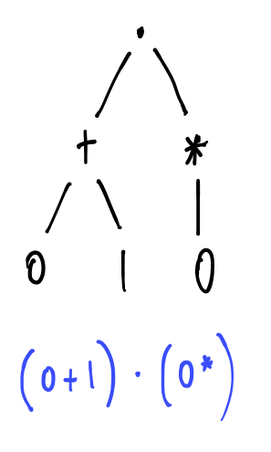
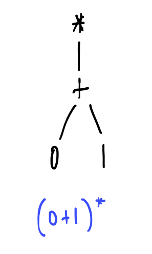
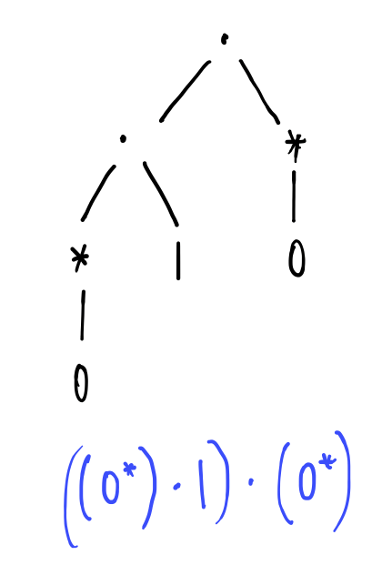
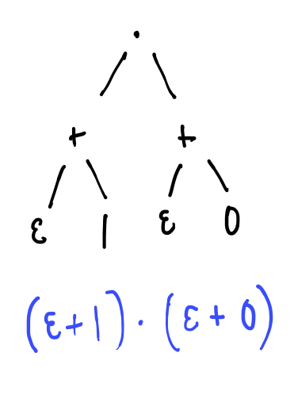

# Regular Expression Syntax

Regular expressions are a language for describing strings using patterns.

## Formal Syntax

You are already familiar with *arithmetic expressions* which are expressions built from numbers and the operators $+$, $-$, and $*$.



The idea is that each regular expression is a device for matching certain shapes of strings.  Informally, the semantics of the language is as follows -- we will make this precise later.
  * $\emptyset$ is a regular expression that matches no strings at all.
  * $\epsilon$ is a regular expression that matches just the empty string.
  * Each letter $a$ is a regular expression that matches the single character $a$.
  * Whenever $$R$$ and $$S$$ are regular expressions, then $$R \cdot S$$ is a regular expression that matches the strings $$uv$$ that can be broken into two consecutive pieces, $$u$$ followed by $$v$$, and $$R$$ matches $$u$$ and $$S$$ matches $$v$$.
  * Whenever $$R$$ and $$S$$ are regular expressions, then $$R + S$$ is a regular expression that matches strings $w$ that are either matched by $$R$$ or are matched by $S$.
  * Whenever $$R$$ is a regular expression, $$R^*$$, pronounced *R star* matches all strings that can be divided into finitely many (possibly 0) consecutive pieces, each of which are matched by $$R$$.

We'll see some examples shortly, but first it's important to be absolutely clear on the syntax.  The following are examples of regular expressions, written in full as abstract syntax trees:

And, informally, what they mean:
* $$(0+1) \cdot{} (0^*)$$ - matches all non-empty strings whose tail consists entirely of zeroes
* $$(0+1)^*$$ - matches all words over $$\{0,1\}$$
* $$((0^*) \cdot{} 1) \cdot{} (0^*)$$ - matches all strings that contain exactly one 1
* $$(\epsilon + 1) \cdot{} (\epsilon + 0)$$ - matches the empty string $\epsilon$, $0$, $1$ or $10$.

However, there are rather too many parentheses involved when we write these syntax trees inline.  To alleviate some pain, let us allow ourselves to omit some of them and resolve any ambiguities by agreeing some conventions:


Finally, let us borrow a trick from arithmetic and agree to suppress the concatenation operator in favour of juxtaposition:


With your agreement then we will start omitting some of the parentheses and concatenation operators when writing the syntax trees inline.  The agreement allows us to write our previous examples more compactly:
* $$(0+1)0^*$$ instead of $$(0+1) \cdot{} (0^*)$$
* $$(0+1)^*$$ instead of $$(0+1)^*$$
* $$0^*10^*$$ instead of $$(0^*) \cdot{} (1 \cdot{} (0^*))$$

Some other examples of regular expressions over $$\{0,1\}$$ (based on Sipser 1.53):
* $$(0+1)^*1(0+1)^*$$ - matches words containing at least one 1
* $$(0+1)^*001(0+1)^*$$ - matches words containing 001 as a substring
* $$1^*(011^*)^*$$ - matches words in which every occurrence of 0 is followed by at least one 1
* $$0 + 1 + (0(0+1)^*0) + (1(0+1)^*1)$$ - matches words that start and end with the same symbol
* $$((0 + 1)(0 + 1))^*$$ - matches words of even length

Remember! By following the conventions we can always unambiguously recover the genuine abstract syntax tree that lies behind these inline expressions. $$0 + 1 + (0(0+1)^*0) + (1(0+1)^*1)$$ is, by our agreed convention, a short-hand for $$((0 + 1) + (0 \cdot (((0+1)^*) \cdot 0))) + (1 \cdot (((0+1)^*) \cdot 1))$$ which is the inlining of the following abstract syntax tree:

  

## Syntax Abuse

There are one or two tricky things about the syntax we presented, which can lead us to situations in which we are using the same symbol to mean more than one thing.  This is traditionally called *an abuse of syntax*.  In our case:
  * We are using $$\emptyset$$ both as a node in a regex syntax tree, and as the symbol we use to write the empty set.  For example, both of the following statements make sense:
    - The regex $$\emptyset + 0^*$$ matches all words that consist entirely of zeroes
    - The set $$\{1, 2\} \cup \emptyset$$ is the same set as $$\{1,2\}$$

  * We are using each letter of the alphabet $$a$$ both as a node in a regex syntax tree, and as a character in an alphabet, and as a string consisting of a single letter.  For example:
    - The regex $$a(a+b+c)^*$$ matches all strings over $$\{a,b,c\}$$ that start with an $$a$$
    - The letters of the alphabet $$\{a,b,c\}$$ are $a$, $b$ and $c$.
    - The strings over the alphabet $$\{a,b,c\}$$ whose length is at most 1 are $\epsilon$, $a$, $b$ and $c$
  
  * We are using $\epsilon$ both as a node in a regex syntax tree and as the symbol we use to write the empty string.  For example:
    - The regex $$\epsilon + 1$$ matches the empty string or the string 1.
    - The string $$\epsilon$$ is the only string of length 0.

Such abuses can make life a bit difficult for you when you are first learning a new language, since you must think twice every time you see one of the overloaded symbols.  However, we will always be sure to use them in a context in which the meaning is clear, and they are worth it in the long-run because carefully chosen syntactic abuses make working with syntax easier once you are used to them.

We're not going to be too pedantic about it, but a useful thing to remember is that the string $aa\epsilon$ is the very same string as $aa$, i.e. $aa\epsilon = aa$ as strings.  However, the regular expression $aa\epsilon$ is *not* the same regular expression as $aa$.  The former is a tree that contains a node labelled $\epsilon$ whereas the second is a tree without any node labelled $\epsilon$.  However, although they are *not the same piece of syntax* (i.e. the same tree), they have the same semantics, in the sense that they match exactly the same strings, namely just the string $aa$.