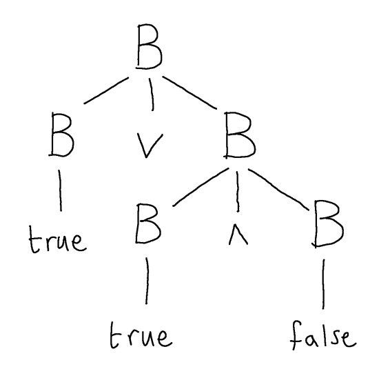
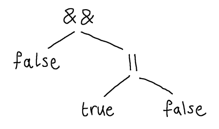

f we were _only_ interested in grammars as a mechanism for describing languages of strings, then there isn't much more to say about the design of grammars.  

However, as programming language designers, we are interested in more, namely how to mechanically and efficiently recognise that a given string is in the language of a certain grammar, and to do something with it, such as evaluating it, or producing machine code or whatever.  That is, we want to _parse_ strings according to the grammar.

There are a lot of different approaches to parsing, but most follow a paradigm in which the structure of the derivation of the string, according to the grammar, guides the way the string is translated (e.g. evaluated, or compiled).  This is called _syntax directed translation_.  

There are two important consequences of adopting syntax directed translation.  

1. One is that we want that the derivation of any string in the language of the grammar to be unique in an appropriate sense - we will say the grammar is _unambiguous_: if there are several ways to derive the same string then the parser won't know which one to choose.  
2. The other is that, when resolving any potential ambiguity, we should design our grammar so that, as much as possible, it mirrors how we want to interpret the string semantically.  

$$
\newcommand{\andop}{\mathrel{\&\!\&}}
\newcommand{\orop}{\mathrel{\|}}
$$

Consider the following grammar for a simple kind of Boolean expressions:

$$
  B \longrightarrow B \andop B \mid B \orop B \mid (B) \mid \mathsf{true} \mid \mathsf{false}
$$

And consider the following three different derivations of the string $\mathsf{true} \orop \mathsf{true} \andop \mathsf{false}$.

Derivation 1:

$$
  \begin{align*}
    & B\\
    \to& B \orop B\\
    \to& B \orop B \andop B\\
    \to& \mathsf{true} \orop B \andop B\\
    \to& \mathsf{true} \orop \mathsf{true} \andop B\\
    \to& \mathsf{true} \orop \mathsf{true} \andop \mathsf{false}
  \end{align*}
$$

Derivation 2:

$$
  \begin{align*}
    & B\\
    \to& B \orop B\\
    \to& \mathsf{true} \orop B\\
    \to& \mathsf{true} \orop B \andop B\\
    \to& \mathsf{true} \orop \mathsf{true} \andop B\\
    \to& \mathsf{true} \orop \mathsf{true} \andop \mathsf{false}
  \end{align*}
$$

Derivation 3:

$$
  \begin{align*}
    & B\\
    \to& B \andop B\\
    \to& B \orop B \andop B\\
    \to& \mathsf{true} \orop B \andop B\\
    \to& \mathsf{true} \orop \mathsf{true} \andop B\\
    \to& \mathsf{true} \orop \mathsf{true} \andop \mathsf{false}
  \end{align*}
$$

All three derive the same string but in different ways.  However, the first two derivations are _essentially the same_, in the sense that they apply the same rules to the same non-terminals, they only differ in the order of the rule applications.  As we already noted, the order of rule applications (where different orders are possible) is not important.  This kind of non-uniqueness of derivation is not important for parsing, because a parser will simply fix a deterministic strategy for which order to apply rules in where there is some choice.

The difference between the third derivation and the first two is more serious, and presents a difficulty for syntax directed translation.  Here there is actually a choice between which rule to apply to a given non-terminal.  In the very first step, with sentential form $B$, the grammar presents us with a choice of applying either the production $$B \longrightarrow B \andop B$$, or the production $$B \longrightarrow B \orop B$$ and, in this case, we happen to know that both will work for the purpose of ultimately deriving $$\mathsf{true} \orop \mathsf{true} \andop \mathsf{false}$$.

This becomes clearer if we associate a look at a kind of order-irrelevant record of each derivation, called the _parse tree_.  

A _parse tree_ is an ordered tree, whose internal vertices are non-terminals, whose leaves are terminals and in which symbols $\alpha_1 \cdots \alpha_n$ are the children of a non-terminal labelled-node $X$ only if $X \longrightarrow \alpha_1\ldots\alpha_n$ is a production rule of the grammar.

We can obtain a parse tree from a derivation as follows.  Suppose we have a derivation:

$$
  S \to u_1 \to u_2 \to \cdots{} \to u_k
$$

Then the corresponding parse tree can be constructed in $k$ steps.  In step 0, construct the root of the tree $S$.  Then, in step $m+1$, suppose the step of the derivation $u_m \to u_{m+1}$ consists in applying a production rule $X \longrightarrow \alpha_1 \ldots \alpha_n$ to the $j^{th}$ symbol (counting left to right) of $u_m$.  Then add new vertices $\alpha_1$, $\ldots$, $\alpha_n$, in order, as new children of the $j^{\text{th}}$ leaf of the tree (counting left to right).

Note: the intermediate steps of this algorithm do not constitute valid parse trees because they may have leaves that are labelled by non-terminals.

For example, following this procedure we obtain the following parse tree corresponding to _both_ derivations 1 and 2 above.

Whereas, the third derivation corresponds to the following parse tree:

