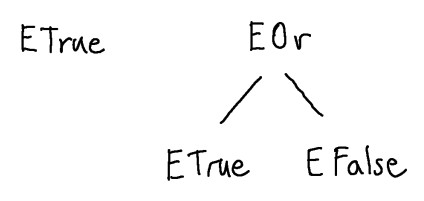
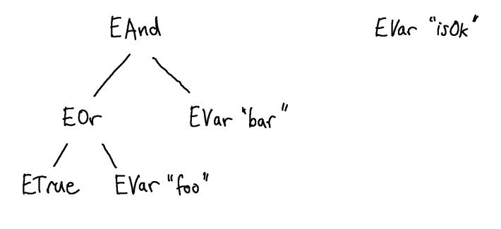
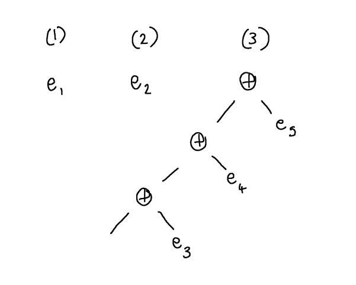
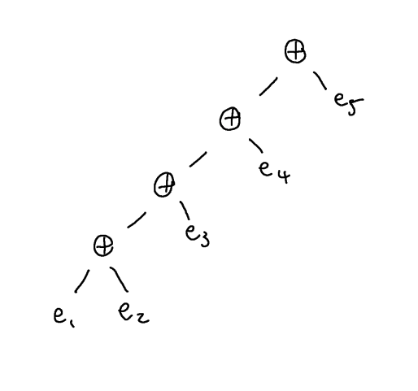
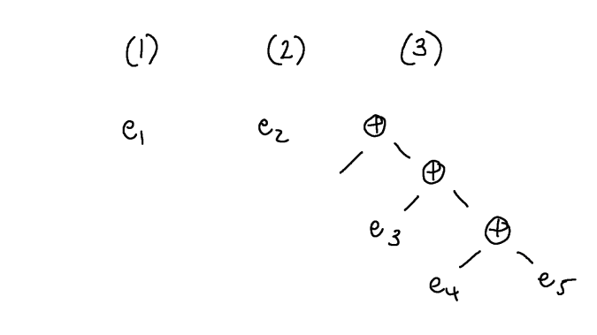
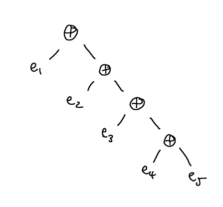

# Abstract Syntax Trees and Parsing

However, it is a bit generous to call the implementation of the previous chapter a parser. Usually we expect that a parser does not only recognise whether a string is in the language or not, but in the former case, it constructs some abstract, internal representation of the piece of syntax in memory.  This is then used in other parts of the language translator (interpreter, compiler etc) to actually effect the translation (e.g. generate code).

Of course, we could just use the string itself as out internal representation.  However, since most of the languages for which we want to parse are more structured, it is convenient to use a representation that makes this structure explicit.  Moreover, the concrete syntax (the string) contains a lot of information which is not essential to understanding the fundamental structure.  A standard approach is to instead use *abstract syntax trees* or ASTs for short.

Our Boolean expressions naturally have a tree structure.  The expression `foo && (true || bar)` can be understood as the tree:


Notice that, in the abstract syntax tree, we have discarded the parentheses that were around the subexpression `true || bar`.  The parentheses serve only to describe the structure that is already present in the tree, namely that the right-hand argument to `&&` is `true || bar`.

The way to think about abstract syntax trees is as follows.  A given node describes some syntactic construct in the language, like an and-expression or a variable `foo`.  If a node has a child, then this child is a component of that syntactic construct.  So, here we have an and-expression with two components, a variable `foo` and another expression `true || bar`.  That expression is itself an or-expression, i.e. the root is `||` and it has two components, the `true` literal and a variable `bar`.

Expressions of all kinds have a very natural tree structure which we are, to some extent, already used to from school mathematics.  However, with understanding of the previous paragraph, we can see that all kinds of program constructs can be naturally endowed with tree structure.  For example, we may represent the following concrete syntax (i.e. string) `while true do {x:= x * n; y:= y - 1}` by the following AST:


In other words, this piece of syntax is a while loop, which has two components, the guard `true` and the body `x:=x*n; y:=y-1`.  The body is itself a sequencing statement which has two components, the first expression in the sequence, `x:=x*n` and the second `y:=y-1`.  Each of these is an assignment statement and assignment statements have two components, the variable being assigned to and the expression whose value should be assigned, etc.

There are no hard and fast rules about how to design your abstract syntax tree data structure, to some extent it will depend on what you want to do with your syntax in the rest of the translator after parsing.  However, a good rule of thumb is that the abstract syntax tree should capture just the essential structure of the piece of syntax you are interested in.  To see what I mean by this, consider the same while loop expressed in the concrete syntax of various programming languages.

```c
    while (true) { 
      x = x * n; 
      y = y - 1; 
    } 
  ```

  ```python
    while true:
      x = x * n
      y = y - 1
  ```

  ```ocaml
    while true do 
      x := !x * n
      y := !y - 1
    done 
  ```

  ```ada
    while true loop
      x := x * n;
      y := y - 1;
    end loop
  ```

Each has its own syntactic peculiarities, some use braces, some parentheses, some use the keyword "do" and some don't.  However, the *essential* information is the same:

  1. It's a while loop.
  2. There is a loop guard (which is just true).
  3. There is a loop body (which assigns x*n to x and then y-1 to y).

  And these three pieces of information are exactly what we get in the abstract syntax tree.

  I mean that this is the essential information in the sense that if you forget what the loops look like in their concrete syntax but I tell you the contents of points 1-3, then you can recreate the concrete syntax in whichever language you are interested in.  For example, if I tell you points 1-3 above, and then ask you to write the loop in C, then you can reconstruct (modulo whitespace and unnecessary bracketing) the first piece of concrete syntax above.  On the other hand, if I omitted any one of 1-3, say 2, then you could not possibly know what the loop looked like when written in C in the original concrete syntax.

## Implementing AST Generation

I'm going to assume you know how to implement a tree data structure in your favourite programming language.  In OCaml, like most functional programming languages, tree data structures are the bread and butter of programming.  Every algebraic data type is really a tree data structure and should be thought of that way.  In OCaml we can define a new datatype `exp` with constructors for each of the possible kinds of nodes we allow in our abstract syntax tree:

```ocaml
  type exp =
    | ETrue
    | EFalse
    | EVar of string
    | EOr of exp * exp
    | EAnd of exp * exp
```

The values of this data structure are, of course, those terms that can be formed from the constructors (and their arguments).  Here are four such values:

```ocaml
  ETrue 
  EOr (ETrue, EFalse) 
  EAnd (EOr (ETrue, EVar "foo"), EVar "bar") 
  EVar "isOk"
```

but generally it is a good idea to think of these terms really as describing trees in which the recursive arguments to a constructor form its children:

  

In fact, when functional programmers write libraries, say a new library for X, they will often think that they are really designing a _language_ for describing X-things (and their principle operations), and the key data type for X-things describes their abstract syntax trees.

Once we have a tree datatype for our abstract syntax, we just need to rework each parsing function so that it produces values of this datatype.

```ocaml
let rec d () : exp =
  match peek () with
  | TkLParen | TkTrue |  TkFalse | TkId _ -> 
      let e1 = c () in d' e1
  | _ -> raise ParseFailure

(* Or associates to the right *)
and d' (e1 : exp) : exp =
  match peek () with
  | TkRParen | TkEnd -> e1
  | TkOr -> 
      eat TkOr; 
      let e2 = c () in
      let es = d' e2 in
        EOr (e1, es)
  | _ -> raise ParseFailure

and c () : exp =
  match peek () with
  | TkLParen | TkTrue | TkFalse | TkId _ -> 
      let e1 = a () in c' e1
  | _ -> raise ParseFailure

(* And associates to the right *)
and c' (e1: exp) : exp =
  match peek () with
  | TkRParen | TkOr | TkEnd -> e1
  | TkAnd -> 
      eat TkAnd; 
      let e2 = a () in 
      let es = c' e2 in
        EAnd (e1, es)
  | _ -> raise ParseFailure

and a () : exp =
  match peek () with
  | TkLParen -> 
      eat TkLParen; 
      let e = d() in 
        eat TkRParen; e
  | TkTrue -> eat TkTrue; ETrue
  | TkFalse -> eat TkFalse; EFalse
  | TkId x -> eat (TkId x); EVar x
  | _ -> raise ParseFailure

let s () : exp =
  match peek () with
  | TkLParen | TkTrue |  TkFalse | TkId _ -> 
      let e = d () in eat TkEnd; e
  | _ -> raise ParseFailure
```

Now each parsing function returns an `exp` that it builds recursively following the structure of the parse.  For example, in the `TkTrue` case of `a()`, we have seen the token `TkTrue` and so we should (eat the token and then) return an AST which consists of the single node `ETrue`.  In the `TkLParen` case of `a()`, we need to eat the left paren, then use `d()` to recursively build an AST `e` for the expression inside the parens, eat the right paren, and finally return the AST we obtained from `d()`.

The two parsing functions $d'$ and $c'$ are a bit more subtle.  They are recognising sequences of binary, infix operator applications, but the strings derived from $D'$ and $C'$ do not correspond to complete expressions because they are missing the first argument of the operator.  For example, a string derivable from $C'$ is "$\andop \ff \andop \tt$".  As we shall see next lecture, this is a common shape for LL(1) production rules, and a simple "fix" is just to pass in this missing first operand as an argument to the parsing function.

## Associativity 

How this extra argument gets combined with the ASTs generated by the parsing function itself is an interesting question and it depends on the _associativity_ of the opreators involved.

<div class="defn" markdown=1>
  The __associativity__ of an operator is the name given to the convention used when inserting implicit parentheses.  An operator $\oplus$ is said to be __left associative__ if a chain $u \oplus v \oplus w$ should be considered syntactically identical to $(u \oplus v) \oplus w$, that is, having the same abstract syntax tree.  An operator $\oplus$ is said to be __right associative__ if a chain $u \oplus v \oplus w$ is considered syntactically identical to $u \oplus (v \oplus w)$.
</div>

Note, this is a syntactic property of operators and is different from the semantic property of _being associative_, which you will have come across in mathematics.  If an operator _is associative_ this means that the value of $(u \oplus v) \oplus w$ is the same as the value of $u \oplus (v \oplus w)$, i.e. they have the same semantics.  In the notation you will learn in part 2 of this unit, we would write $$[\![(u \oplus v) \oplus w]\!] = [\![u \oplus (v \oplus w)]\!]$$ for this.  So, if an operator is associative, then it doesn't really matter whether it associates right or left in the syntax, because no matter how we insert the implicit parentheses the same value will be obtained.  However, even in this case, we still need to make a choice in order to build the AST.

## Implementing left and right association

We build the AST for a sequence of operator applications in the parsing functions associated with rules $D' \longrightarrow C D' \mid \epsilon$ and $C' \longrightarrow A C' \mid \epsilon$.  In each case, we have three ingredients to combine: (1) the AST, say $e_1$, that is passed in as an argument; (2) the AST, say $e_2$, corresponding to the $A$ at the beginning of the rule; and (3) the AST of the rest of the chain, which is obtained by providing an AST as input to the recursive call $c'(\\_)$.

### Left Association

Suppose we want to implement a left associative operator $\oplus$.  Then we can assume that the recursive call will return an AST that is associated to the left.  Since ingredient (3) is a function, we can picture it as a tree that is missing a piece - this will be filled in when we provide the recursive call with an argument.



We want to obtain a complete, left associated syntax tree, which corresponds to inserting parentheses always around subexpressions to the left:



To achieve this, we need to _first_ combine $e_1$ and $e_2$ using the operator, and _then_ supply this combined AST for $e_1 \oplus e_2$ as an argument to the recursive call, so that it gets put in the missing place.

### Right Association

Suppose we want to implement a right associative operator $\oplus$.  Then we can assume that the recursive call will return an AST that is associated to the right.  Since ingredient (3) is a function, we can picture it as a tree that is missing a piece - this will be filled in when we provide the recursive call with an argument.



We want to obtain a complete, right associated syntax tree, which corresponds to inserting parentheses always around subexpressions to the right:



To achieve this, we need to _first_ supply $e_2$ as an argument to the recursive call, so that it gets put in the missing place, and _then_ combine $e_1$ with the tree returned by the recursive call using the operator.

## Precedence

However, there is still one important difference between this formulation and the formulation of the grammar you have seen in the practicals for the While programming language.

In Boolean algebra, a common convention is that conjunction binds tighter than disjunction.  In other words, when we have an expression $x \andop y \orop z$ in which the disjunction operator $\orop$ and the conjunction operator $\andop$ are fighting over who gets their (seemingly) common argument $y$, conjunction holds on (binds) more tightly and wins the struggle, i.e. the expression is resolved as $$(x \andop y) \orop z$$.

In terms of the abstract syntax trees that we want to construct, we therefore want a string like $x \andop y \orop z$ to yield:


Unfortunately, this is a bit difficult to achieve using the above grammar.  The approaches we discussed in the previous lecture allows us to force left association of parentheses for the whole sequence, or to force right association of parentheses for the whole sequence.  In this case, we will want a mixture of association, which depends on the operators involved.  For example, the string $$\tt \andop \ff \orop \tt \andop \ff$$ should, by convention, be equivalent to (yield the same AST as) $$(\tt \andop \ff) \orop (\tt \andop \ff)$$, i.e:


A standard approach to enabling this is to stratify the grammar by the precedence of operators.  The idea is to replace the single non-terminal $B$ for Boolean expressions by two separate non-terminals: say $C$ for conjunctions and $D$ for disjunctions, and then to reformulate the grammar so that conjunctions can be bare (that is, without enclosing parens) inside a disjunction but not vice versa. 

$$
  \begin{array}{rcl}
    D &\longrightarrow& C D' \\
    D' &\longrightarrow& \orop C D \mid \epsilon \\ 
    C &\longrightarrow& A C' \\
    C' &\longrightarrow& \andop A C' \mid \epsilon \\
    A &\longrightarrow& \mathsf{true} \mid \mathsf{false} \mid (D)
  \end{array}
$$

<!-- In this grammar, there is only one parse tree for the string $\mathsf{true} \orop \mathsf{true} \andop \mathsf{false}$, which is:

 -->

If we want an expression that represents a conjunction, one of whose arguments is itself a disjunction, then we must use parentheses explicitly in the string, as in $(\mathsf{true} \orop \mathsf{true}) \andop \mathsf{false}$.

Note: we didn't change the language of the grammar when we made this modification - both grammars describe the same language, which includes the string $\mathsf{true} \orop \mathsf{true} \andop \mathsf{false}$ - we merely tightened up the internal structure so that this string can only be derived from $D$ (i.e. we consider it a disjunction) and _not_ from $C$.  This will make it easier for the implementation of the parser to produce the correct AST, because we want the top node of this AST to be an $\orop$ node (which it makes sense to return from the parsing function for $D$).

In general, if you want to design a grammar for implementation by a predictive parser, then you should first organise any operators you have into a precendence order.  The precedence order is a way of stating which operators bind tighter than others.  For example, in OCaml, we can look in the manual for the following operator precedence table: 

| Operators | Associativity |
| ! ~ | none |
| .() .[] .{} | none |
| # | left |
| application | left |
| - | none |
| ** lsl lsr asr | right |
| * / % mod land lor lxor | left |
| + - | left |
| :: | right |
| @ ^ | right |
| = < > $ & &#124; != | left |
| && | right |
| &#124;&#124; | right |
| , | none |
| <- := | right |
| if | none |
| ; | right |

Operators further up the table have higher precedence than those below them, that is, they bind more tightly to their arguments.  Some operators can have the same precedence - like $+$ and $-$ in OCaml.  That's fine, but binary operators with the same precedence should have the same associativity, and this will disambiguate their usage.

Once you have worked out the order of precedence of your operators, there is a standard approach to fitting them into the grammar.  For each precedence level i.e. row in the table, say $i$, your grammar should have a distinct non-terminal symbol $A_i$, which produces expressions formed from that operator.  If some operators of a higher precedence, say $j > i$, are allowed to be nested (without parenthesisation, since they bind tighter) inside those of level $i$, then the arguments of the operator will be described by $A_j$ in the production rule for $A_i$.

In our example, conjunction binds tighter than disjunction, we have a dedicated non-terminal for each, and the production rule for disjunctions $D$ creates sequences each of whose elements is a conjunction $C$.  