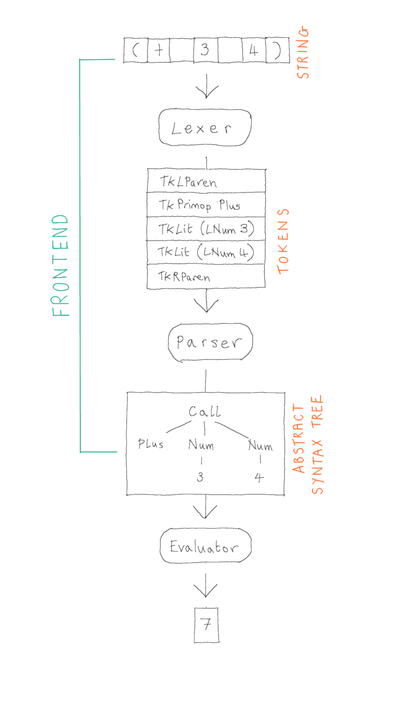

# Language Frontend and the Lexer

There are many software tools that process some kind of programming language.  Compilers and interpreters are perhaps the most obvious, but also program analysis tools (e.g. Facebook Infer, GitHub CodeQL, Google's Go Vet, Amazon CodeGuru),  documentation generators (e.g. Doxygen, Javadoc).  In fact, any software that has to read some kind of non-trivial configuration file (e.g. JSON, XML) needs to be able to process a formal language from a textual input.

Typically, the part of the software that is responsible for reading the text and constructing some internal representation of its structure is called a *frontend*.  There is no one way to organise a front-end but, in practice, most frontends adopt a certain architecture which makes this complicated task a bit easier.

The aim of this lecture is to illustrate this architecture and its first component using the Brischeme interpreter frontend as an example.

# The Brischeme Interpreter

The Brischeme interpreter is a tool for reading Brischeme code and executing it.  The interpreter has three components, the _lexer_, the _parser_ and the _evaluator_.  The lexer and the parser together constitute the frontend: their  responsibility is to take a string of text as input and construct the corresponding internal representation of its structure.



The input to the frontend is some text, a string.  The output is a representation of the structure conveyed by that sequence of characters.  In the case of the Brischeme interpreter it is an Abstract Syntax Tree (AST).  We will discuss ASTs in more detail in Week 4 but, for now, you should just think of an AST as a tree data structure which is convenient as an in-memory representation of the program contained in that input string.

In the Brischeme interpreter, this datatype is defined as follows:
```ocaml
(** A [sexp] is an expression to be evaluated. *)
type sexp =
  | Atom of string
  | Bool of bool
  | Num of int
  | Ident of string
  | Lambda of var list * sexp
  | Call of primop * sexp list
  | App of sexp * sexp list
```

The type `var` is merely a synonym for `string`, so a `var list`, which appears in the constructor for `Lambda` is just a list of strings - the parameter names for the function.  The type `primop` is an enumeration of all the _primitive_ (i.e. provided by the language rather than user-defined) operations:
```ocaml
(** [primop] is an enumeration of the available primitive operations. *)
type primop =
  | Plus
  | Minus
  | Times
  | Divide
  | Eq
  | Less
  | If
  | And
  | Or
  | Not
```

In the picture, the AST shown is the `sexp`{:.ocaml} given by:
```ocaml
  Call (Plus, [Num 3; Num 4])
```
In general, given any value of a variant (algebraic) datatype, we can think of it as a tree whose nodes are labelled by constructors, and a parent has one child for each of its arguments (in this case we implicitly dismantle the list structure).

Another example is the string `"((lambda (x) (* (+ x 1) x)) 3)"` is given as input, then the Brischeme interpreter will construct the following in-memory representation:
```ocaml
  App (
    Lambda (
      ["x"], 
      Call (Times, [(Call (Plus, [Ident "x"; Num 1])); Ident "x"])
    ),
    Num 3
  )
```

## The Lexer

So far, we have been using grammars to define languages under a very convenient assumption: namely that whitespace is ignored for the purpose of deriving strings.  Whitespace is used in the grammar to seperate consecutive elements of the sentential form on the right-hand side of a rule.  For example, in the Brischeme grammar, there is a space between the left parenthesis and the keyword `define` in the first rule for `Form` but, formally, there is no space there in the derived string.  It is only there so that we can read the grammar more easily.  In fact, if we stop ignoring whitespace for a moment, the string `"(define x 3)"` that we derived from the Brischeme grammar in ... is more properly `"(definex3)"`.  

This is a bit of a problem in practice, because whitespace is actually extremely important.  Without whitespace we would not be able to tell that `"(definex3)"` is really a _define form_ at all, it could be a define form (essentially by the derivation sequence of the previous part): 

$$
  \begin{array}{rll}
    \nt{Form} &\to& \nt{SExpr} \\
              &\to& (\ \tm{define}\ \nt{Ident}\ \nt{SExpr}\ ) \\
              &\to& (\ \tm{define}\ \nt{Ident}\ \nt{Num}\ ) \\
              &\to^*& (\ \tm{define}\ \tm{x}\ \tm{3} )
  \end{array}
$$

However, it could also be a function call of the function named by the identifier `definex3` applied to no arguments.  Or it could be a function call of the function named by the identifier `def` to 4 arguments `i`, `ne`, `x` and `3`.  All of these possibilities (and more) are allowed by the grammar we gave in ...  For example:

$$
  \begin{array}{rll}
    \nt{Form} &\to& \nt{SExpr} \\
              &\to& (\ \nt{SExpr}\ \nt{SExpr}^*\ ) \\
              &\to& (\ \nt{Ident}\ \nt{SExpr}^*\ ) \\
              &\to& (\ \nt{Ident}\ \nt{SExpr}\ \nt{SExpr}\ \nt{SExpr}\ \nt{SExpr}\ ) \\
              &\to& (\ \nt{Ident}\ \nt{Ident}\ \nt{Ident}\ \nt{Ident}\ \nt{Num}\ ) \\
              &\to^*& (\ \tm{def}\ \tm{i}\ \tm{ne}\ \tm{x}\ \tm{3}\ )
  \end{array}
$$

Of course, if we are only interested in whether or not the string `"(definex3)"` is in the language or not, there is no problem, both of the above derivations are perfectly good justifications.  However, in practice, we are interested in understanding the _structure_ of the program contained in the string, and here we want to know whether it contains a function call expression or a define form (and we can distinguish between these based on which rules are chosen in the derivation). 

There are two standard ways of fixing this problem:

  1. Integrate whitespace formally into the grammar.
  2. Have a preprocessing step which eliminates the need to consider whitespace (essentially, make good on our assumption that whitespace can be ignored).

Both are viable, but in practice the second is most common.  

An advantage of the first is that we don't need any new technology, we just need to write a more complex grammar to describe our language.  A disadvantage is that we need to write a more complex grammar to describe our language: the grammar will become much more cluttered with the consumption of whitespace, which will infect almost every production rule.

An advantage of the second is that we can actually simplify the grammar of our language (both conceptually, and in a way that can be made precise), but a disadvantage is that we need some new tech, namely the idea of a _Lexer_ (also known as a _Scanner_).

### Lexemes and Tokens

The idea of _lexing_ (also known as _scanning_) is to, in a preprocessing step, identify and classify the smallest meaningful substrings of the input string, taking into account the use of whitespace as a separator.  These smallest meaningful substrings are called _lexemes_.

For example, now taking whitespace into account, the string `"(define foo (+ 2 1))"` consists of 9 lexemes:

| ( | define | foo | ( | + | 2 | 1 | ) | ) | 

Hopefully this illustrates the sense of _smallest_ meaningful substrings.  One can argue that the subsequence `(+ 2 1)` is a meaningful substring, but it is not minimal since we can further break it down into the lexemes `(`, `+`, `2`, `1` and `)`, each of which is (arguably) meaningful in its own right.  On the other hand, the substring `in` should not be considered a meaningful part of `define`.

In fact there is no absolute definition of what constitutes a lexeme, but rather this is a choice made when designing the language, and the description of what the language designer chose (along with how the lexemes are classified) is called the _lexical structure_ of the language.  

{: .defn }
A _lexeme_ is a substring of the input that is deemed a smallest meaningful unit, according to the lexical structure of the language.

For _Brischeme_, the lexemes are the largest substrings not containing whitespace that fall into one of the following classifications (classifications given in bold):

  * The substrings `(`, `)` are the left (**lparen**) and right (**rpraren**) parentheses.
  * The substrings `+`, `-`, `*`, `/`, `<`, `=`, `not`, `and`, `or` are the **primops** (primitive operators).
  * The substring `define` is the keyword **define** and the substring `lambda` is the keyword **lambda**.
  * Any non-empty sequence of digits 0-9, and the substrings `#t` and `#f` are **literals** (number literals and Boolean literals respectively). 
  * Any non-empty substring, not falling into one of the above classes, that: 
      - begins with a lowercase letter of the English alphabet
      - proceeds with letters that are either lower or upper case letters of the English alphabet, the underscore, an exclamation mark or a question mark
  
      is an **ident** (identifier).

{: .defn }
The combination of a lexeme with its classification is called a *token*. 

It is the responsibility of the lexer to transform the original input string -- a sequence of characters -- into a sequence of tokens.  However, for certain of the classifications, there is only one lexeme that has that classification.  For example, the classification **rparen** can only refer to the lexeme `)`.  In such cases, there is no need for the lexer to record the lexeme associated with the classification, since it is uniquely determined.

## Lexer Implementation

The lexer takes as input a string and transforms it into a sequence of tokens according to the lexical structure of the language.

### Token Type

Tokens are defined according to the following datatype:

```ocaml
(** [token] is an enumeration of all possible tokens produced by the lexer *)
type token =
  | TkLit of literal
  | TkIdent of string
  | TkLParen
  | TkRParen
  | TkDefine
  | TkLambda
  | TkPrimOp of primop
  | TkEnd
```

We include in this datatype one token that does not correspond to anything in the lexical structure we gave above -- the end-of-file (EOF) token `TkEnd`.  This will be useful to parsing later.

For the left and right parenthesis tokens, the define and lambda keyword tokens, and the EOF token, there is no need to record the corresponding lexeme.  A `TkLambda` token can only refer to the lexeme `lambda`, so no information is lost by omitting the substring.

For literals we use a single token `TkLit x` where `x` records the kind of literal and its value.  This is made precise by the following type:

```ocaml
(** [lit] is an enumeration of language literals *)
type literal =
  | LBool of bool
  | LNum of int
```

For example, `TkLit (LNum 3)` is the token corresponding to the lexeme `3`.

### Input String State

The lexer will proceed character by character through the input string, considering each character in turn and outputing a token whenever a complete lexeme is discovered.  The implementation is in an imperative style, with the input string and progress through it tracked by the some internal state.

```ocaml
  (* Input string state *)
  let idx = ref 0
  let input = ref ""
```

Here, `input` is a reference (mutable variable) of type `string ref` and it will store the input string which is to be lexed.  The reference `idx` of type `int ref` is used to keep track of how far through the input string we have lexed so far.

To avoid dependence on the particular choice of input string state representation, there is a small API which is used by the rest of the lexer:

```ocaml
(* Simple API for input string state *)

let is_more () : bool = 
  !idx < String.length !input

let peek () : char =
  !input.[!idx]

let drop () =
  idx := !idx + 1

let raise_lex_error exp =
  let c = peek () in
  let msg = Printf.sprintf "LEX ERROR: Expected %s but found %c." exp c in
  failwith msg

let eat (c:char) =
  if peek () = c then drop () else raise_lex_error (String.make 1 c)
```

The behaviour of these functions in the context of the lexer is as follows:

  * `is_more ()` returns `true` just if there is still more input to consider.
  * `peek ()` returns the current character under consideration.
  * `drop ()` discards the current character from the input (once it has been considered).
  * `raise_lex_error exp` aborts the lex with a failure exception.
  * `eat c` discards the current character just if it is `c` and aborts the lex otherwise.

### Character Class Utilities

We also assume we have the following utility functions available for recognising character classes (these are written directly in the implementation, but they could also be imported from external libraries).

  * `is_digit c` returns `true` just if `c` is in the range `0..9` and `false` otherwise.
  * `is_lower c` returns `true` just if `c` is in the range `a..z` and `false` otherwise.
  * `is_upper c` returns `true` just if `c` is in the range `A..Z` and `false` otherwise.
  * `is_wspace c` returns `true` just if `c` is the space character or a newline, and `false` otherwise.
  * `is_punctuation c` returns `true` just if `c` is `!`, `?` or `_`, and `false` otherwise.
  * `is_id_char c` returns `true` just if `c` is lowercase, uppercase, a digit or punctuation, and `false` otherwise.

### Lexer Main Loop

The heart of the lexer is a loop which is responsible for recognising the next lexeme from the input string and outputting it with its classification as a token.  Any intervening whitespace is silently discarded.  

```ocaml
(** 
    [lex s] returns the token list obtained by scanning [s].
    @raises [Failure] if [s] fails to scan.
*)
let lex (s:string) : token list =
  input := s;
  idx := 0;
  let output = ref [] in
  while is_more () do 
    if is_wspace (peek ()) then
      drop ()
    else
      let tk = lex_init () in
      output := tk :: !output
  done;
  List.rev (TkEnd :: !output)
```

The recognising process is contained in the function `lex_init` which is responsible for consuming characters from the input string one-by-one until a complete lexeme is discovered.  For example, when `lex_init` sees that the next character in the input string is `=` then it can drop it and immediately return the token `TkPrimOp Eq`, when it sees the next character of the input string is `<`, it can drop it and immediately return the token `TkPrimOp <`, and so on.

```ocaml
let lex_init () =
  match peek () with
  | '=' -> 
    drop (); 
    TkPrimOp Eq
  | '<' ->
    drop ();
    TkPrimOp Less
  | '+' ->
    drop ();
    TkPrimOp Plus
  | '-' ->
    drop ();
    TkPrimOp Minus
  | '*' ->
    drop ();
    TkPrimOp Times
  | '/' ->
    drop ();
    TkPrimOp Divide
  | '(' ->
    drop ();
    TkLParen
  | ')' ->
    drop ();
    TkRParen
  | '#' -> lex_bool ()
  | c when is_digit c -> lex_number ()
  | c when is_lower c -> lex_kw_or_id ()
  | _ -> raise_lex_error "valid character"
```

However, consider what should happen when the lexer encounters the character `t`.  Here, it depends what comes before.  For example, if the previous character was whitespace or the letter `s`, then this `t` must be part of an identifier.  On the other hand, if the previous character was `#` then this `t` is part of the boolean literal `#t`.  Similarly, what should happen when the lexer encounters `_`.  If it is right at the start of a lexeme, then this is an invalid program, because no lexeme can start with `_`.  However, if the lexer is in the middle of reading an identifier, then the `_` can be consumed and become part of the identifier lexeme.

Thus to carry out the recognition correctly, the implementation must have some memory of what has come before and its behaviour depends on that memory.  We could add some additional internal state to remember, e.g. the _previous_ character that was considered.  However, some consideration reveals that this is really too much information - we don't care whether the previous character was `a` or `b`, and only that it was a valid character for an identifier.  In fact, we can identify three situations we care about:

  * When the current lexeme starts with `#`, which indicates we are trying to lex a boolean literal and so we should allow only the characters `t` and `f` to follow next and abort the whole lex in all other cases.
  * When the current lexeme starts with a digit, which indicates we are trying to lex a number.  Any subsequent digits should form part of the current lexeme, and any other character indicates we have already reached the end of this lexeme.
  * When the current lexeme starts with a lowercase character, which indicates we are trying to lex an identifier or a keyword (`not`, `or`, `lambda` etc.).  In this case, we should continue consuming identifier characters until we meet a non-identifier character, and then we can classify the resulting lexeme as either an identifier or a keyword depending on the content of the string.
  * When there is no previous non-whitespace character, which indicates we are starting a new lexeme.

In this situation, where the behaviour of the program depends on a small number of characterisations of what has happened so far, an elegant approach is to organise the implementation as a _state machine_.  There will be three states, `lex_bool`, `lex_num`, `lex_kw_or_id` and `lex_init` corresponding the three bullets above, respectively.

Each state corresponds to a function in the code of the same name.  We have already seen `lex_init`, the others are implemented as follows:

```ocaml
let lex_bool () : token =
  (* Assumes [peek () = '#'] *)
  drop (); 
  match peek () with
  | 't' -> 
      drop (); 
      TkLit (LBool true);
  | 'f' -> 
      drop ();
      TkLit (LBool false);
  | _ -> 
      raise_lex_error "t or f"

let lex_number () : token  =
  let lexeme = ref "" in
  while is_more () && is_digit (peek ()) do
    let c = peek () in
      drop ();
      lexeme := !lexeme ^ String.make 1 c
  done;
  TkLit (LNum (int_of_string !lexeme))

let lex_kw_or_id () : token =
  let lexeme = ref "" in
  (* assumes the first char is correctly lowercase *)
  while is_more () && is_id_char (peek ()) do
    let c = peek () in
    drop ();
    lexeme := !lexeme ^ String.make 1 c
  done;
  (* Check if the lexeme is a keyword, 
     otherwise it's an identifier. *)
  match !lexeme with
  | "define" -> TkDefine
  | "if"     -> TkPrimOp If
  | "not"    -> TkPrimOp Not
  | "and"    -> TkPrimOp And
  | "or"     -> TkPrimOp Or
  | "lambda" -> TkLambda
  | _        -> TkIdent !lexeme
```