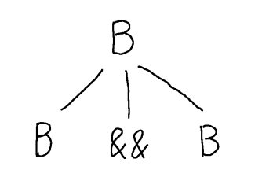
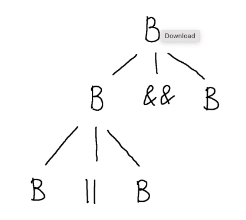
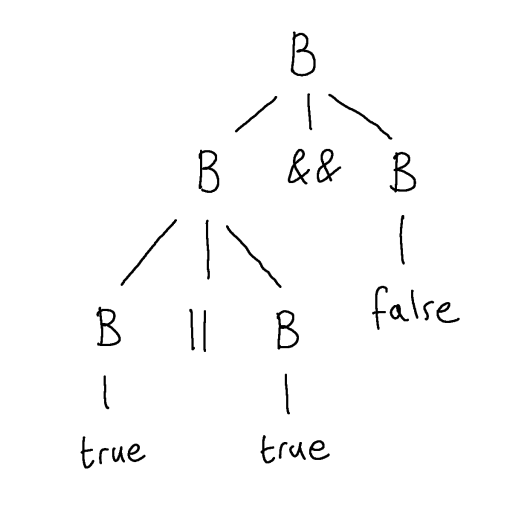
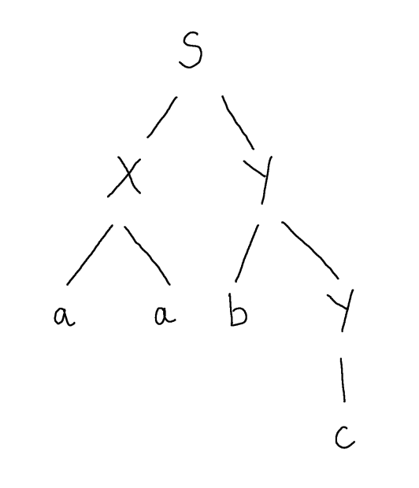
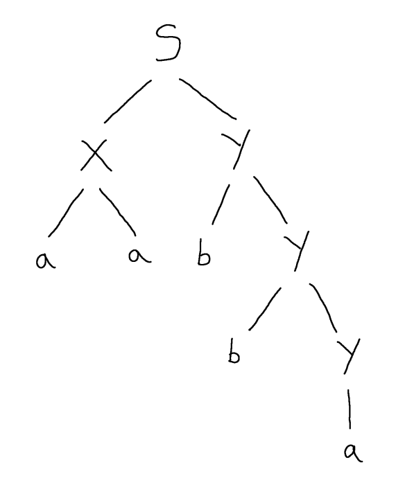
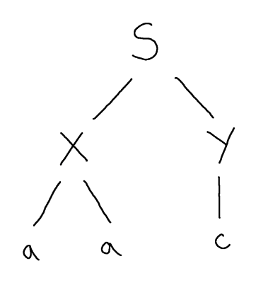
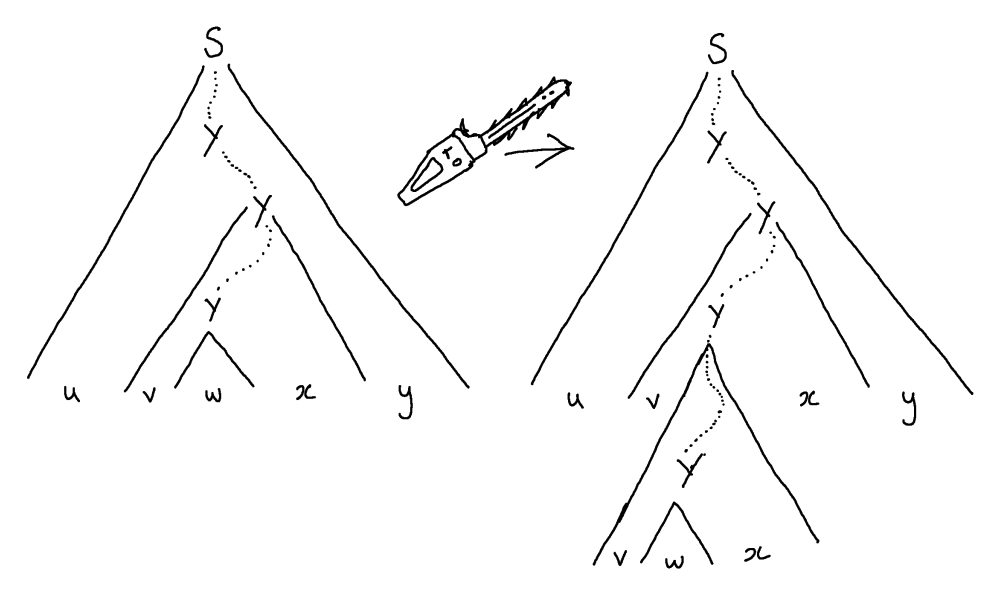
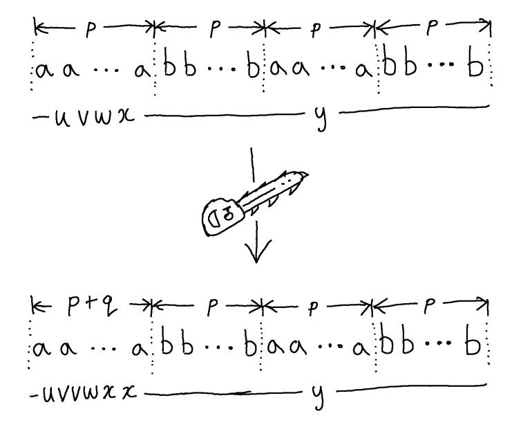

$$
\newcommand{\andop}{\mathrel{\&\!\&}}
\newcommand{\orop}{\mathrel{\|}}
$$

# Limits to the Expressive Power of CFGs
## (NOT ASSESSED)

_This material is not assessed, look at it only because it is interesting._

In this part, I want to look briefly at the limitations of context-free grammars.  Grammars alone are not usually enough to describe the valid programs in a particular programming language.  They cannot, for example, enforce that variables are declared before they are used, or (in general) ensure that programs are well-typed.  In this chapter I aim to convince you of the first of these.

To do this, it will be helpful to introduce a new view on grammar derivations.  If you recall, derivations justify whether a string is in the language described by a certain grammar.

## Parse Trees

I want to start by looking at an alternative mechanism for defining which strings are in the language of a grammar, called a _parse tree_.  Parse trees are a bit less straightforward compared with derivations (they are trees rather than sequences), but they have an advantage in revealing more directly how a particular letter (terminal symbol) was arrived at in the derived string.

{: .defn }
A __parse tree__ is an ordered tree, whose internal vertices are non-terminals, whose leaves are terminals and in which _symbols_ $\alpha_1 \cdots \alpha_n$ are the children of a non-terminal labelled-node $X$ only if $X \longrightarrow \alpha_1\ldots\alpha_n$ is a production rule of the grammar.

Note: in the above definition I am stipulating that each $\alpha_i$ is a single symbol (either a terminal or a non-terminal).

{: .defn }
__Theorem:__ A string $u$ is in the language of a grammar, just if there exists a parse tree whose root is the start symbol of the grammar and whose leaves, read in left-to-right order, spell out $u$.

Consider the following grammar for a simple kind of Boolean expressions:

$$
  B \longrightarrow B \andop B \mid B \orop B \mid (B) \mid \mathsf{true} \mid \mathsf{false}
$$

We can show that $\tt \orop \tt \andop \ff$ is derivable in this grammar, by building a parse tree satisfying the above conditions (i.e. rooted at $B$ and whose leaves spell out the word).  We start by putting down the root of the tree, which is the start symbol (and only nonterminal in this grammar) $B$.

Now, we can choose any production to apply to this $B$.  Suppose we choose $B \longrightarrow B \andop B$.  Rather than making a step by replacing $B$ by its right-hand side, instead we place the right-hand side of the production as the children of $B$.  Each symbol is a child node and the tree is ordered, so the children need to be in the same left-to-right order.



We proceed by choosing any of the nonterminals at the leaves of this tree and adding children in the same way, according to some appropriate production rule.  For example, we can choose the leftmost leaf and add child nodes labelled $B$, $\orop$ and $B$, corresponding to the production $B \longrightarrow B \orop B$.



If, at some point, we run out of nonterminals in the leaves, then we have constructed a _parse tree_ and this parse tree witnesses the membership of the string spelled out in its leaves in the language described by the grammar.



Another example: we can use a parse tree to show that $\tt \andop \ff \orop \ff$ is in the grammar.


## Context-Free Languages Can be Pumped

I now want to develop in you some intuitions about an important characteristic of the languages that are describable by context-free grammars - the _context-free languages_.  

Much of the power of context-free grammars comes from the fact that rules in a grammar can be recursive.  If you didn't have any recursive rules in your grammar, then you can only describe a finite language, which is not very interesting.

The recursive rules in a CFG are, in some ways, quite like recursive procedures in a programming language -- as we saw, for an LL(1) grammar, we implement recursive rules directly as recursive procedures.  However, in a programming language, usually when you have a recursive procedure the recursion is tightly controlled by some input to the procedure and the procedure is forced to terminate when the input has some specified form, the base case.  For example, in a recursive implementation of the factorial function, the recursion will terminate once the input becomes 0.

However, context-free grammars have no mechanism by which we can control their recursive rules.  There isn't any possibility to restrict the number of recursive "calls" (rule applications) when deriving strings.  The consequence is that, if we have a grammar in which you can use a certain number of recursive rule applications to derive some part of your string, then it is possible to use any other number of recursive rule applications to derive longer and longer strings by repeating that part, whether you want that or not.

### What we can learn from a parse tree

To see this, consider I give you the following parse tree, but I _don't_ give you the grammar for which it is a parse tree, and I ask: what other words are derivable (equivalently, for which there is a parse tree) in this (unknown) grammar.



In fact, I can tell you infinitely many additional words that are in the language of this (unknown) grammar.  By looking at the parse tree, I can conclude that $Y \longrightarrow b\ Y$ must be a rule of the grammar and so must $Y \longrightarrow c$. 

If we imagine how the given parse tree was constructed from root to leaves, the first time that nonterminal $Y$ was encountered the rule $Y \longrightarrow b\ Y$ was used, and the second time that nonterminal $Y$ was encountered the rule $Y \longrightarrow c$ was used.  However, it needn't have been that way.  We could have used the former, recursive rule, _again_ the second time we encountered $Y$ and then afterwards used the base case $Y \longrightarrow c$.



Indeed, we could have used the recursive rule 3 times, 4 times or more; in fact any number of times, including zero times:



That's because, unlike a programming language, which can tightly control recursion by using e.g. Boolean conditions or guards to enforce termination, a grammar has no way of enforcing how many times we explore the recursion and each of the infinity of different choices of how many recursive "calls" we make will potentially lead to us deriving a different word.

### What we can learn from a long word generated by a small grammar

Now let us take step further away, think more abstractly.  Suppose I don't give you the grammar (as before), but I also don't give you a parse tree.  I will only give you a word and a few facts about the grammar that the word derives from, namely the number of nonterminals in the grammar and the length of the longest rule.  The length of a rule is just the number of symbols on the right hand side of the rule so, for example, the length of the longest rule in the Boolean expressions grammar above is 3 (all of the first three rules have length 3, and the final two have length 1).

Let's suppose I tell you that the word is $aaabbbaaabbb$ and I tell you that the grammar has 2 nonterminals, and the longest rule has length 3 symbols.  Can you deduce that there are any more words in the language of the grammar, except this one?

We know that there must be infinitely many more words than just this one.  Although we don't have the parse tree for $aaabbbaaabbb$, we can say something about it.  Since the longest rule has three symbols, each node has at most 3 children, i.e, the branching factor of the tree is 3.  A tree with branching factor 3 and height 1 (length of the longest path from root to a leaf) has one leaf, a tree with branching factor 3 and height 2 has at most $3^(2-1) = 3$ leaves, one with height 3 has at most $3^(3-1) = 9$ leaves and so on.  This word is of length 12, so it can only come from a parse tree with height at least 4.  

This means that there is a path from the root to a leaf in the parse tree of length 4 (i.e. consisting of 4 nodes).  One of these nodes, the leaf, is a terminal symbol, but all the others are nonterminals.  However, we know that this grammar has only 2 nonterminals, so in this length 4 path that we know to exist, some non-terminal is repeated.  This can only mean that some recursion has been used in the derivation of $aaabbbaaabbb$.  

Therefore, although this time we don't have it, concretely, in our hand, we could imagine (this is an important word in theory work) carrying out the same kind of tree surgery as we did earlier in which we insert or delete uses of the recursive rule.  

In general, whenever we know of a path in a parse tree from root to leaf in which a nonterminal, say $Y$, is repeated, we can, in principle, look at the final two repetitions (those closest to the leaf) on the path and perform surgery on the tree to derive some different strings.

We can imagine taking a copy of the subtree underneath the second-to-last occurrence of the repeated nonterminal $Y$ and pasting it over the subtree under the last occurrence of $Y$, with the effect that we repeat $Y$ one more time than before.  



Now, let's see how this surgery has affected the word that is derived (the word that is spelled out in the leaves of the tree).  Of course, since we don't literally have the tree in front of us this time, we don't know precisely which word it is.  However, we can say something about its shape.  By finding these last two occurrences of the repeated nonterminal $Y$ in the tree, we can imagine the word split into five pieces $uvwxy$.  The piece $u$ consists of the terminal symbols at the leaves at the start of the word, and $y$ those at the end of the word: these are the prefix and suffix of terminals that derive from $S$ but do not derive from the penultimate or ultimate occurrences of $Y$.  Then $vwx$ is the substring that derives from the penultimate occurrence of $Y$ and, of that string, $w$ consists of the subsubstring derived from the final occurence of $Y$.

After doing our tree surgery, we have obtained a valid parse tree which now spells out $uvvwxxy$, so we know that $uvvwxxy$ is another word in the same language.  We could then take that tree and perform the same surgery again to obtain $uvvvwxxxy$ and again to obtain $uv^4wx^4y$, and so on, obtaining a parse tree for $uv^iwx^iy$ for any $i \in \mathbb{N}$.

## Non-Expressibility of $$\{ ww \mid w \in \{a,b\}\}$$

Now consider the problem of trying to express, in a CFG, that variables must be declared before they are used.  Our grammar would have to enforce that a string like:

```c
  int myVariableName;
  myVariableName = 2;
```

is valid, but a string like:

```c
  myVariableName = 2;
```

without any previous declaration, is not.  The difficulty here is that the name of the variable can typically be of arbitrary length.  So the grammar has to only allow strings where the variable name is repeated: once in an earlier part (at declaration) and again in later parts (at uses) of the string.

In fact, we can formulate a very simple language that shows that repetition of a substring is already extremely problematic for CFGs.  
We will show that the language $$\{ ww \mid w \in \{a,b\}\}$$, where a substring $w$ is repeated once, cannot be expressed by a context-free grammar.

To see this we argue as follows.  Let's call this language $R$ for short.

Let's suppose that $R$ _is_ expressible by a CFG and see that this leads to an impossible situation, i.e. a logical contradiction.  Now, since we supposed that $R$ is expressible by a CFG, there is some CFG that derives exactly the words in $R$ and no others.  Although we don't have it concretely in our hand, it is a CFG, so it consists of some nonterminals and some rules.  We don't know how many nonterminals, there could be 5 or 20 or 600.  Let's just say there are $n$ nonterminals in this CFG that describes $R$ - it's some specific number, we just can't say concretely which one.  Similarly, we don't know how long the rules are in this CFG, the maximum length of the right-hand side of any rule.  Again, it's some specific number, but we don't know it, so let's just say the maximum rule length of this CFG is $k$.

So, whatever $n$ and $k$ turn out to be concretely, we know that in any parse tree of this grammar of height $n+1$ there will be a repeated nonterminal.  Let's work out how long a word we would need to derive to force a parse tree of this height.  Since the maximum rule length is $k$, a parse tree of this grammar branches with at most $k$ children.  So a parse tree of height $n$ can accommodate at most words of length $n^k$ (this is how many leaves it would have if the tree branched $k$ ways at _every_ level, so it provides an _upper bound_ on the word length of height $n$ parse trees for our CFG).  Therefore, a word of length $k^{n+1}$ would require a parse tree of at least height $n+1$.   

Let's call this length $p = k^{n+1}$.  We can find a word of length $p$ in the language $R$, namely $a^pb^pa^pb^p$.  So, no matter what $n$ and $k$ turn out to be, it is a fact that any parse tree for this word must have height _at least_ $n+1$ and therefore contain a path with $n+2$ nodes in it and hence a repeated nonterminal symbol.  There may be several parse trees for this word, so let's take a smallest one (fewest total number of nodes) - this will be important for making sure that we really generate new words when we do our tree surgery.

So, this smallest parse tree, which nevertheless must have height $\geq n+1$, has a repeated nonterminal.  We identify the last two repetitions of any non-terminal on a path, let's say these last two repetitions are some non-terminal $Y$.  Thus we we divide the word $a^pb^pa^pb^p$ into 5 pieces, as in the surgery picture above:

$$
  a^pb^pa^pb^p = uvwxy
$$

Then we can replace the subtree beneath the final occurrence of $Y$ by the subtree under the penultimate occurrence of $Y$ to give a parse tree for $uvvwxxy$ and we will show that this new word is both in the language $R$ and not in the language $R$, which is impossible - a contradiction.  We know it is _in_ the language $R$ because we have just created a parse tree for it.  Now let's see that it is also _not_ in the language $R$.

First, a question: is $uvvwxxy$ actually a different word from $uvwxy$?  So far we have no guarantees about the contents of any of these pieces, it could be that any of $u$, $v$, $w$, $x$ and $y$ may be the empty string.  If $v$ and $w$ are both empty, then $uvvwxxy = uvwxy$ and we wouldn't have a new word at all.

However, it must be that $vw$ is not empty.  That's because we chose a _smallest_ parse tree.  To see this, suppose that $v$ and $w$ were both empty.  Then the subtree under the penultimate occurence of $Y$ is not really contributing anything to the derived word (no terminal symbols in $v$ and $w$).  So, we could have done different tree surgery to replace the subtree under the penultimate occurence of $Y$ by the subtree under the final occurrence of $Y$ and derived the very same word, namely $uwy = uvwxy$.  However, this new parse tree would be strictly smaller than the one we chose, which is impossible since we specifically chose a smallest tree.  Since supposing $v$ and $w$ are empty leads us to this impossible situation where we started from a smallest parse tree for $uvwxy$ and then made it smaller, it must be that our supposition is wrong and, in fact, at least one of $v$ and $w$ is not empty.

Ok, now that is cleared up, we can be sure that $uvvwxxy$ is really a longer string than $uvwxy$.  How much longer?  Since we modified only the final two repetitions of a nonterminal in our original parse tree, the height of the subtree under the penultimate occurrence of $Y$ in that parse tree is at most $n+1$ (there are no further repetitions of nonterminals).  Such a subtree can have at most $p$ leaves, so the length of $vwx$ is at most $p$.

Now that we know its maximum length we can try to understand where $vwx$ occurs inside $a^pb^pa^pb^p$.  This would be interesting to know, because it's this part of the string that we end up repeating after doing our tree surgery.  Since its length is at most $p$, it must occur in one of the following ways:

*  Entirely inside the first prefix of $a$ symbols.  In this case, $uvvwxxy$ is the same but with a strictly longer prefix of $a$ symbols.  If $vw$ is of length, say $q > 0$, then the prefix of $a$ symbols will be of length $p+q$ in the new word.  Hence, it is _not_ of the form $ww$ for any $w$, and thus is _not_ in the language $R$.

    

* Entirely inside the first section of $b$ symbols.  In this case, $uvvwxxy$ is the same but with a strictly longer first section of $b$ symbols, but that is not of the form $ww$ and so cannot be in the language $R$.
* Entirely inside the second section of $a$ symbols, or the second section of $b$ symbols: similar to the above.
* Entirely inside the first half of the string $a^pb^pa^pb^p$ straddling the $a$ and $b$ sections.  In this case, $uvvwxxy$ must be of shape $a^qb^ra^pb^p$ where $q>p$ and $r>p$.  However, a word like this is _not_ of shape $ww$ and hence cannot be in $R$.
* Entirely inside the second half of the word: similar to the previous case.
* Finally, if it is not any of the above cases, the only other possibility is that $vwx$ straddles the middle of the word $a^pb^pa^pb^p$, but then $uvvwxxy$ must be of shape $a^pb^qa^rb^p$ with $q >p$ and $r>p$.  However, it is easy to see that this cannot be of shape $ww$ for any choice of $w$.

Hence, we have shown that, no matter where the $vwx$ substring occurs in $a^pb^pa^pb^p$, when we repeat the $v$ and $x$ parts due to tree surgery, we end up with a word $uvvwxxy$ that is no longer of shape $ww$ and therefore is not in $R$.  However, we do have a parse tree for this word, so it _is_ in $R$.  This is a contradiction.  

Therefore, we must look back over our proof and see that the only supposition we made was that $R$ is expressible by a CFG -- everything followed inevitably from that first assumption.  Since we ended in a contradiction, it can only be that we were wrong to suppose this, so we must conclude that $R$ really is _not_ expressible by a CFG.

