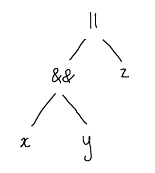
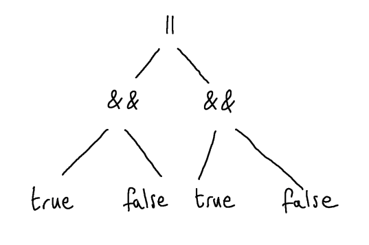
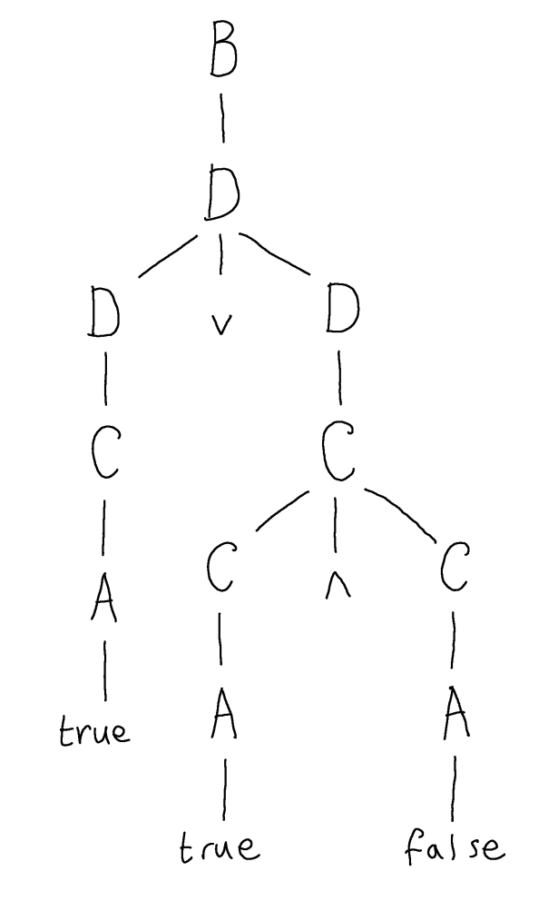

$$
\newcommand{\andop}{\mathrel{\&\!\&}}
\newcommand{\orop}{\mathrel{\|}}
\newcommand{\ff}{\mathsf{false}}
\newcommand{\tt}{\mathsf{true}}
\newcommand{\tm}[1]{\mathsf{#1}}
$$

# Obtaining Grammars Suitable for Predictive Parsing

Now we know how to identify whether or not a grammar is LL(1), and how to implement parsing.  However, typically the most straightforward descriptions of syntax by context-free grammars do not turn out to be LL(1).  Consider, for example, the simple one-line description of Boolean expressions:

$$
  B \longrightarrow B \andop B \mid B \orop B \mid \tt \mid \ff \mid \tm{id} \mid (B)
$$

This is a very direct description of Boolean expressions, but it is not the case that which rule we need to use when parsing a given string is determined uniquely by the combination of the left-most nonterminal in the sentential form and the next letter of the input.

There is no simple recipe to transform a given grammar such as the one above into an LL(1) grammar.  Indeed, not all context-free grammars are equivalent to some LL(1).  Nevertheless, in practice it is often possible to start with an arbitrary CFG and obtain an LL(1) by removing certain problematic features. 

## Left Recursion

Consider the following grammar for possibly empty sequences of assignment statements.

$$
  S \longrightarrow \tm{id} \leftarrow \tm{exp} \mid S \mathrel{;} S \mid \epsilon
$$

Here I use a terminal symbol to represent expressions because their structure is not important to the example.  Now suppose I am trying to generate a given string starting from $S$, is the rule I should use uniquely determined by the first letter of the input?  The first rule starts with a specific terminal symbol, so it looks promising.  However, the second rule is a problem, because the right-hand side of this rule starts with the nonterminal $S$ again.  Consequently, it will _always_ be eligible as a choice whenever the next terminal symbol is in $\first(S)$.

For example, suppose the input string starts $\tm{id}\ \ldots$.   At first sight it might seem like the production $S \longrightarrow \tm{id} \leftarrow \tm{exp}$ is the correct rule to use, and if the complete input string was $\tm{id} \leftarrow \tm{exp}$, then it would be.  However, the input may instead continue as $\tm{id} \leftarrow \tm{exp}; \tm{id} \leftarrow \tm{exp}$.  If this was the case, we should have chosen the rule $S \longrightarrow S;S$ instead.  

This phenomenon, where some nonterminal $X$ has a production in which $X$ is again the first symbol on the right-hand side, is called _left recursion_ and it is typically a problem for obtaining an LL(1) grammar.  That's because the first set of (the RHS of) a left recursive rule for $X$ always contains all of $\first(X)$.

The resolution is to rewrite the relevant productions using only _right recursion_, that is, where the nonterminal $X$ occurs at the end of the right-hand side instead of the start.

Clearly, the grammar above derives strings that are finite sequences of assignment statements punctuated by semicolons:

$$
  \tm{id} \leftarrow \tm{exp}; \tm{id} \leftarrow \tm{exp}; \cdots{} \tm{id} \leftarrow \tm{exp}
$$

We can also derive these sequences using the following productions:

$$
  \begin{array}{rcl}
    S &\longrightarrow& \tm{id} \leftarrow \tm{exp}\tm{;}\ S \mid \epsilon \\
  \end{array}
$$

A useful way to think about the two possible formulations of the grammar is that the former is a description of sequences (in this case, sequences of assignment statements) given in terms of concatenate: the rule $S \longrightarrow S\mathrel{;}S$ of the first grammar allows to build a larger sequence by taking two existing sequences and gluing them together (concatenating) using the semicolon.  The second grammar instead describes sequences in terms of \emph{cons}, the rule $S \longrightarrow \tm{id} \leftarrow \tm{exp} \mathrel{;} S$ allows to build a larger sequence by taking one existing sequence and adding a new head element.

Here's a slightly more complicated example.  Consider again the grammar of Boolean expressions above, which involves two left recursive productions, $B \longrightarrow B \andop B$ and $B \longrightarrow B \orop B$.  These two rules allow us to build longer sequences by _concatenating_ two given sequences using either $\andop$ or $\orop$ respectively.  So, we can reformulate the grammar to instead build the same sequences using an approach based on _consing_ a single element to the head.  Let's start by first factoring out the different kinds of elements that make up these sequences so that the sequence structure is clearer:

$$
  \begin{array}{rcl}
    B &\longrightarrow& A \mid B \andop B \mid B \orop B \\
    A &\longrightarrow& \tt \mid \ff \mid \tm{id} \mid (B)
  \end{array}
$$

Now, if you consider the sentential forms derivable just using $B$-rules, they are all sequences of $A$ punctuated by a mixture of $\andop$ and $\orop$ operators, e.g.

$$
  A \andop A \andop A \orop A \andop A
$$

Moreover, you can observe they are _non-empty_ sequences, there is no $\epsilon$-production available with which to create an empty sequence.  We can reformulate the rules to avoid left recursion as follows:

$$
  \begin{array}{rcl}
    B &\longrightarrow& A \andop B \mid A \orop B \mid A \\
    A &\longrightarrow& \tt \mid \ff \mid \tm{id} \mid (B)
  \end{array}
$$

Here we have a description of these sequences that uses a cons structure, we have two different kinds of cons - one that adds a new $A$ element in the head of the list using $\andop$ and another using $\orop$.  

<!-- 

In an approach to parsing based on syntax-directed translation, the first of these parse trees represents an interpretation of the string $\mathsf{true} \orop \mathsf{true} \andop \mathsf{false}$ as $\mathsf{true} \orop (\mathsf{true} \andop \mathsf{false})$, i.e. with the conjunction $\mathsf{true} \andop \mathsf{false}$ being the second argument of the disjunction.  The second of the parse trees represents an interpretation of the string as $(\mathsf{true} \orop \mathsf{true}) \andop \mathsf{false}$, i.e. with the disjunction being the first argument of the conjunction.

Semantically, which of these is meant makes a big difference!  We expect the first to evaluate to $\mathsf{true}$ but the second should evaluate to $\mathsf{false}$. -->

## Left Factoring

Left recursion has been eliminated from this grammar, but it is still not LL(1).  For example, suppose we want to derive from $B$ and the next letter of the input is $\tt$.  Is the rule to use uniquely determined?  No.  Both of $B \longrightarrow A \andop B$ and $B \longrightarrow A \orop B$ are eligible, and you need to see more of the input to decide which to use.  If the input runs on as, say, $\tt \andop \ff$ then we should use the first, but if the input runs on as, say, $\tt \orop \ff$ then we should use the second.

Fortunately, there is a very simple fix to this problem, which is to factor out the common prefix from these rules.  In both cases we want to derive the first part of the string using $A$, so we reformulate the rules to factor that part out:

$$
  \begin{array}{rcl}
    B &\longrightarrow& A B' \\ 
    B' &\longrightarrow& \andop A B' \mid \orop A B' \mid \epsilon\\
    A &\longrightarrow& \tt \mid \ff \mid \tm{id} \mid (B)
  \end{array}
$$

We can read the single $B$-rule as saying "to derive a Boolean expression, first derive an $A$ then derive the rest $B'$.  In other words, we have factored out the $A$ part.  Unfortunately, this makes the description of the "rest" a bit more unintuitive.  $B'$ now derives sequences of $A$, but they are "headless" because we expect that the head of the sequence is already derived as part of deriving $B$.  For example, $B'$ derives sentential forms such as:

$$
  \orop A \andop A \andop A
$$

However, the benefit is that there is now no choice of rule when deriving from $B$ because there is only one rule.  Indeed, this grammar is now LL(1).

## Precedence

However, there is still one important difference between this formulation and the formulation of the grammar you have seen in the practicals for the While programming language.

In Boolean algebra, a common convention is that conjunction binds tighter than disjunction.  In other words, when we have an expression $x \andop y \orop z$ in which the disjunction operator $\orop$ and the conjunction operator $\andop$ are fighting over who gets their (seemingly) common argument $y$, conjunction holds on (binds) more tightly and wins the struggle, i.e. the expression is resolved as $$(x \andop y) \orop z$$.

In terms of the abstract syntax trees that we want to construct, we therefore want a string like $x \andop y \orop z$ to yield:

Unfortunately, this is a bit difficult to achieve using the above grammar.  The approaches we discussed in the previous lecture allows us to force left association of parentheses for the whole sequence, or to force right association of parentheses for the whole sequence.  In this case, we will want a mixture of association, which depends on the operators involved.  For example, the string $$\tt \andop \ff \orop \tt \andop \ff$$ should, by convention, be equivalent to (yield the same AST as) $$(\tt \andop \ff) \orop (\tt \andop \ff)$$, i.e:

A standard approach to enabling this is to stratify the grammar by the precedence of operators.  The idea is to replace the single non-terminal $B$ for Boolean expressions by two separate non-terminals: say $C$ for conjunctions and $D$ for disjunctions, and then to reformulate the grammar so that conjunctions can be bare (that is, without enclosing parens) inside a disjunction but not vice versa. 

$$
  \begin{array}{rcl}
    D &\longrightarrow& C D' \\
    D' &\longrightarrow& \orop C D \mid \epsilon \\ 
    C &\longrightarrow& A C' \\
    C' &\longrightarrow& \andop A C' \mid \epsilon \\
    A &\longrightarrow& \mathsf{true} \mid \mathsf{false} \mid (D)
  \end{array}
$$

<!-- In this grammar, there is only one parse tree for the string $\mathsf{true} \orop \mathsf{true} \andop \mathsf{false}$, which is:

 -->

If we want an expression that represents a conjunction, one of whose arguments is itself a disjunction, then we must use parentheses explicitly in the string, as in $(\mathsf{true} \orop \mathsf{true}) \andop \mathsf{false}$.

Note: we didn't change the language of the grammar when we made this modification - both grammars describe the same language, which includes the string $\mathsf{true} \orop \mathsf{true} \andop \mathsf{false}$ - we merely tightened up the internal structure so that this string can only be derived from $D$ (i.e. we consider it a disjunction) and _not_ from $C$.  This will make it easier for the implementation of the parser to produce the correct AST, because we want the top node of this AST to be an $\orop$ node (which it makes sense to return from the parsing function for $D$).

In general, if you want to design a grammar for implementation by a predictive parser, then you should first organise any operators you have into a precendence order.  The precedence order is a way of stating which operators bind tighter than others.  For example, in OCaml, we can look in the manual for the following operator precedence table: 

| Operators | Associativity |
| ! ~ | none |
| .() .[] .{} | none |
| # | left |
| application | left |
| - | none |
| ** lsl lsr asr | right |
| * / % mod land lor lxor | left |
| + - | left |
| :: | right |
| @ ^ | right |
| = < > $ & &#124; != | left |
| && | right |
| &#124;&#124; | right |
| , | none |
| <- := | right |
| if | none |
| ; | right |

Operators further up the table have higher precedence than those below them, that is, they bind more tightly to their arguments.  Some operators can have the same precedence - like $+$ and $-$ in OCaml.  That's fine, but binary operators with the same precedence should have the same associativity, and this will disambiguate their usage.

Once you have worked out the order of precedence of your operators, there is a standard approach to fitting them into the grammar.  For each precedence level i.e. row in the table, say $i$, your grammar should have a distinct non-terminal symbol $A_i$, which produces expressions formed from that operator.  If some operators of a higher precedence, say $j > i$, are allowed to be nested (without parenthesisation, since they bind tighter) inside those of level $i$, then the arguments of the operator will be described by $A_j$ in the production rule for $A_i$.

In our example, conjunction binds tighter than disjunction, we have a dedicated non-terminal for each, and the production rule for disjunctions $D$ creates sequences each of whose elements is a conjunction $C$.  

