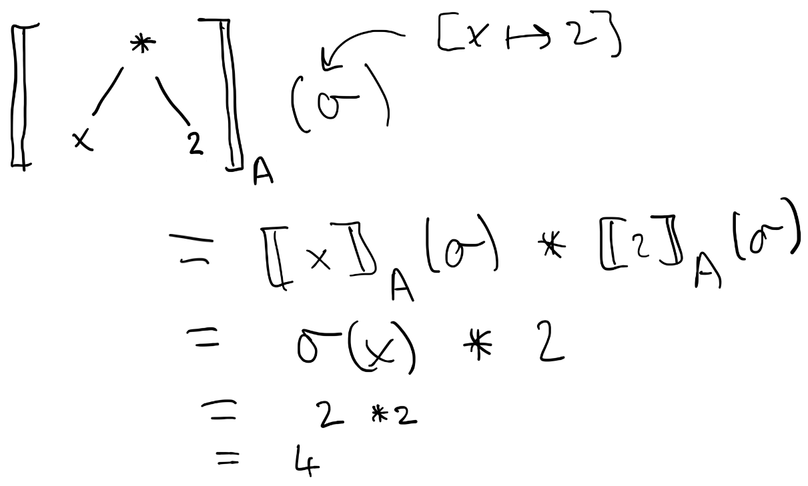

# Denotational Semantics

Denotational semantics is a way of formally giving meaning to programs by relating programs to mathematical objects.
In doing so, we can translate our knowledge of these mathematical objects back onto the programs we are studying.

## Simple Arithmetic Expressions

We will give a denotational semantics to the arithmetic and Boolean expressions for the While language - a toy imperative programming language.
First, however, let us look at a simple subset of arithmetic expressions without variables.

A __simple arithmetic expression__ is an element of the following grammar:

$$
  S \to \underline{n} \mid S \mathbin{\underline{+}} S \mid S \mathbin{\underline{-}} S \mid S \mathbin{\underline{*}} S
$$

where $\underline{n}$ stands for any integer literals (used as terminals).

For the purpose of understanding the expressions generated by this grammar, we will identify them with their abstract syntax tree.
Therefore, we write $S$ to represent the set of all expressions (a.k.a. abstract syntax trees) generated by this grammar.
As we are dealing with trees directly, there is no need for parentheses here.

### Syntax vs. Semantics

Take note of the fact that we are underlining numeric literals and the binary operators of this language.
This is not a stylish whim but to emphasise that these are purely _syntactic terminals_ and _not_ subject to their usual mathematical definitions.
For example, the expressions $\underline{1} \mathbin{\underline{+}} \underline{1}$ and $\underline{2}$ are not the same expression (even if they intuitively "mean" the same thing) as they represent different abstract syntax trees.

### Denotation Function

The denotational semantics for this language will associate simple expressions with integer values - the mathematical objects that we will use to ascribe meaning to expressions. 
This takes the form of a denotation function $\llbracket \cdot \rrbracket_S : S \rightarrow \mathbb{Z}$ that maps simple expressions to the integers.
For the application of this function, we will use the notation $\llbracket e \rrbracket_S \in \mathbb{Z}$ where $e$ is some expression.

The __denotation function for simple arithmetic expressions__ $\llbracket \cdot \rrbracket_S$  is defined by the following set of equations:

$$
\begin{array}{rl}
  \llbracket \underline{n} \rrbracket_S & = n \\

  \llbracket e_1 \mathbin{\underline{+}} e_2 \rrbracket_S & = \llbracket e_1 \rrbracket_S + \llbracket e_2 \rrbracket_S \\

  \llbracket e_1 \mathbin{\underline{-}} e_2 \rrbracket_S & = \llbracket e_1 \rrbracket_S - \llbracket e_2 \rrbracket_S \\

  \llbracket e_1 \mathbin{\underline{*}} e_2 \rrbracket_S & = \llbracket e_1 \rrbracket_S \times \llbracket e_2 \rrbracket_S \\
\end{array}
$$

To be more precise, the denotation function is defined by _recursion_ over the structure of expressions.
That means that it uses the denotation of sub-expressions to build up a denotation for a compound expression.
For example, the denotation of an expression $e_1 \mathbin{\underline{+}} e_2$ is calculated based on the denotation of the sub-expressions $e_1$ and $e_2$.
Sometimes this is referred to as a _compositional_ semantics as the semantics for an expression is defined by composing the semantics of its operators.
Giving definitions by structural recursion in this manner is very common in semantics as it ensure that the function is _well-defined_.
That is, every expression has a unique denotation according to our equations.

The definition can be seen as interpreting (i.e. giving meaning to) underlined syntactic constructs as their usual mathematical definitions.
For example, by applying these equations, we can see that the denotation $\llbracket \underline{1} \mathbin{\underline{+}} \underline{1} \rrbracket_S$ equates to $\llbracket \underline{1}\rrbracket_S + \llbracket \underline{1} \rrbracket_{S}$, which equates to $1 + 1$ (and of course $2$).
This gives us a formal sense in which the expression $\underline{1} \mathbin{\underline{+}} \underline{1}$ and the expression $\underline{2}$ can be said to be _equivalent_ (but not identical).

This may all seem a bit pedantic, and like a lot of unnecessary work, but this simple example highlights the essential ingredients of denotational semantics:

* A collection of mathematical objects that we will use to model programs (e.g. the integers);
* And a recursive function mapping each syntactic constructs to operations over these objects. 

We're now ready to define a denotational semantics for a more interesting language.

## Adding Variables

The next logical step is to add variables to our expression language.
Therefore, we will consider the following grammar of arithmetic expressions:

An __arithmetic expression__ is an element of the following grammar:

$$
  A \to x \mid n \mid A + A \mid A - A \mid A * A
$$

where the new construct $x$ represents a set of program variables $\mathsf{Var}$ treated as terminals.

As before, we will write $A$ to denote the set of arithmetic expressions (a.k.a abstract syntax trees).

To give a satisfactory meaning to these expressions, we clearly must take into account the value of the variables.
Consequently, it is not possible to assign a fixed integer to the expression $x + 1$ as it might change depending on the context, i.e. whether it follows the statement $x \leftarrow 1$ or the statement $x \leftarrow 2$.

### Program State

What we mean by "context" here is quite vague.
Let's make it more precise.
The programs' _state_ is the value assigned to its variables at any given moment.
We can think of the state as the semantic representation of the computer's memory.

A __state__ is a total function from the set $\mathsf{State} = \mathsf{Var} \rightarrow \mathbb{Z}$.
We will write states using the notation $[x_1 \mapsto v_1,\, x_2 \mapsto v_2,\, \cdots]$ to representation the state $\sigma$ such that $\sigma(x_i) = v_i$.
When a variable $x$ is not explicitly mapped to a value by a given state $\sigma$, we will take $\sigma(x)$ to be $0$.

We can now give a denotational semantics to arithmetic expressions.
As the value of these expressions depends on the program state, they will be interpreted as functions from states to integer values --- the denotation function $\llbracket \cdot \rrbracket_A : A \rightarrow (\mathsf{State} \rightarrow \mathbb{Z})$ maps expressions, not to an integer, but to a _function_ from the set of states to integers.
<!-- In other words, expressions are interpreted as integer that depend on the state in which they are evaluated. -->
However, for all intents and purposes, this can be seen as a function with two arguments: the arithmetic expression and the state in which it is evaluated.
We will write $\llbracket e \rrbracket_A(\sigma) \in \mathbb{Z}$ for the application of this function to the expression $e$ and the state $\sigma$.

The __denotation function for arithmetic expressions__  $\llbracket \cdot \rrbracket_A$ is defined recursively by the following equations:

$$
\begin{array}{rl}
  \llbracket x\rrbracket_A(\sigma) &= \sigma(x) \\

  \llbracket n \rrbracket_A(\sigma) & = n \\

  \llbracket e_1 + e_2 \rrbracket_A(\sigma) & = \llbracket e_1 \rrbracket_A(\sigma) + \llbracket e_2 \rrbracket_A(\sigma) \\

  \llbracket e_1 - e_2 \rrbracket_A(\sigma) & = \llbracket e_1 \rrbracket_A(\sigma) - \llbracket e_2 \rrbracket_A(\sigma) \\

  \llbracket e_1 * e_2 \rrbracket_A(\sigma) & = \llbracket e_1 \rrbracket_A(\sigma) \times
  \llbracket e_2 \rrbracket_A(\sigma) \\
\end{array}
$$

The first equation introduced by this definition interprets program variables by their current value, according to the given state.
The other equations are largely unchanged other than the introduction of the state parameter.
Notice that the state is passed to recursive calls without changing.
That is to say, these expressions only _read_ the state rather than modifying it.

Let's work though an example.
The denotation $\llbracket x \mathbin{\underline{*}} \underline{2} \rrbracket_A(\sigma)$ evaluates to $\llbracket x \rrbracket_A(\sigma) * \llbracket \underline{2} \rrbracket_A(\sigma)$, which ultimately is equivalent to $\sigma(x) * 2$.
To evaluate this further, we need to know the value $\sigma$ assigns to $x$.
If we take $\sigma$ to be the state $[x \mapsto 2]$, then the denotation of our expression ultimately evaluates to $4$.

## Boolean Expressions

Finally, we will give a denotational semantics for Boolean expressions.
This will follow the same pattern as for arithmetic expressions, except it will interpret expressions as Boolean values.

The set of __Boolean expressions__ is defined as the elements of the following grammar:

$$
  B \to \tt \mid \ff \mid \mathop{!}B \mid B \andop B \mid B \orop B \mid A = A \mid A \leq A
$$

Then we define a denotation function $\llbracket \cdot \rrbracket_B : B \rightarrow (\mathsf{State} \rightarrow \mathbb{B})$ where $\mathbb{B}$ is the set of Boolean values $\left\lbrace \bot,\, \top \right\rbrace$ following the same pattern of replacing syntactic constructs with semantics counterparts.
As with the denotation of arithmetic expressions, this function maps Boolean expressions to Boolean-valued function over states.
Likewise, this can be thought of as a function with two arguments: a Boolean expression and a state.

The __denotation function for Boolean expressions__ $\llbracket \cdot \rrbracket_B$ is defined by the following equations:

$$
\begin{array}{rl}
  \llbracket \tt \rrbracket_B(\sigma) & = \top\\
  \llbracket \ff \rrbracket_B(\sigma) & = \bot\\
  \llbracket \mathop{!}b \rrbracket_B(\sigma) & = \neg \llbracket b \rrbracket_B(\sigma)\\
  \llbracket b_1 \andop b_2 \rrbracket_B(\sigma) & = \llbracket b_1 \rrbracket_B(\sigma) \wedge \llbracket b_2\rrbracket_B(\sigma)\\
  \llbracket b_1 \orop b_2\rrbracket_B(\sigma) & = \llbracket b_1 \rrbracket_B(\sigma) \vee \llbracket b_2 \rrbracket_B(\sigma)\\
  \llbracket e_1 = e_2 \rrbracket_B(\sigma) & = \llbracket e_1 \rrbracket_A(\sigma) = \llbracket e_2 \rrbracket_A(\sigma)\\
  \llbracket e_1 \leq e_2 \rrbracket_B(\sigma) & = \llbracket e_1 \rrbracket_A(\sigma) \leq \llbracket e_2 \rrbracket_A(\sigma)
\end{array}
$$

This function is also defined by recursion over the structure of the Boolean expressions, replacing syntactic constructs with their mathematical counterpart, and thus is well-defined.
Notice additionally that we are using the denotation function for arithmetic expression in this definition.